# 人力资源的环境搭建  

## vue-element-admin的了解和介绍


**`目标`**: 学习和了解通用的vue后台集成方案**`vue-element-admin`**

[vue-element-admin](https://panjiachen.gitee.io/vue-element-admin-site/zh/) 是一个后台前端解决方案，它基于 [vue](https://github.com/vuejs/vue) 和 [element-ui](https://github.com/ElemeFE/element)实现。它使用了最新的前端技术栈，内置了 i18 国际化解决方案，动态路由，权限验证，提炼了典型的业务模型，提供了丰富的功能组件，它可以帮助你快速搭建企业级中后台产品原型。

  
[vue-element-admin](http://panjiachen.github.io/vue-element-admin) 是一个后台集成方案, 集成了PC项目中很多的业务场景和功能, 尤其在当下SPA的趋势下,我们可以从中获得很多成熟的解决方案.


> [vue-element-admin](http://panjiachen.github.io/vue-element-admin) 有一个成熟的[集成方案](https://github.com/PanJiaChen/vue-element-admin)，里面包含了所有的业务功能和场景,并不适合直接拿来进行二次开发, 但是可以通过该项目中的一个案例来进行学习和使用.


这里是[官网地址](https://panjiachen.gitee.io/vue-element-admin-site/zh/)

这里是[线上demo地址](https://panjiachen.github.io/vue-element-admin/#/dashboard)


> 如果你想查看该项目的具体功能和效果，可以拉取代码，启动进行预览

```bash

$ git clone https://github.com/PanJiaChen/vue-element-admin.git #拉取代码

$ cd vue-element-admin #切换到具体目录下

$ npm run dev #启动开发调试模式 查看package.json文件的scripts可知晓启动命令

```


**注意**：当前项目下载速度如果过慢，可以直接下载代码的压缩包运行

> 集成方案并不适合我们直接拿来进行二次开发，[基础模板](https://github.com/PanJiaChen/vue-admin-template)则是一个更好的选择


基础模板, 包含了基本的 **登录 / 鉴权 / 主页布局** 的一些基础功能模板, 我们可以直接在该模板上进行功能的扩展和项目的二次开发


**本节任务**： 浏览vue-element-admin的文档，了解这个集成方案

  
## 搭建项目前的一些基本准备
  

目标: 介绍搭建一个vue中台项目,需要环境和工具

  
>接下来要做的是一个大型的项目，我们需要更好的环境准备和资源前置，所以提前检查我们的环境和资源


**nodejs环境**

> nodejs是当下前端工程化开发必不可少的环境, 使用 nodejs的**`npm`**功能来管理依赖包

查看node 和 npm的版本


```bash

$ node -v #查看node版本

$ npm -v #查看npm版本

```

**git版本控制**

> git版本控制工具是目前最为流行的分布式版本管理工具,代码的**`提交, 检出, 日志`**, 都需要通过git完成
  
查看git安装版本
  
```bash

$ git --version #查看git安装版本

```
  
**npm淘宝镜像**

> npm是非常重要的npm管理工具,由于npm的服务器位于国外, 所以一般建议 将 npm设置成国内的淘宝镜像


设置淘宝镜像

  

```bash

$ npm config set registry https://registry.npm.taobao.org/ #设置淘宝镜像地址

$ npm config get registry #查看镜像地址

```

  

**vscode编辑器**

  

> vscode编辑器是目前前端开发的编码利器， 以及丰富的插件系统，非常适合开发前端项目

  

vscode编辑器插件 + **`vetur`** + **`eslint`**

  

> vetur是基于 单文件组件开发的支持插件, eslint是 基于代码校验的插件工具

  


除此之外, eslint需要在vscode中进行一些参数的配置

  

```json

{

"eslint.enable": true,

"eslint.run": "onType",

"eslint.options": {

"extensions": [

".js",

".vue",

".jsx",

".tsx"

]

},

"editor.codeActionsOnSave": {

"source.fixAll.eslint": true

}

}

```

  

> 本项目的技术栈 本项目技术栈基于 [ES2015+](http://es6.ruanyifeng.com/)、[vue](https://cn.vuejs.org/index.html)、[vuex](https://vuex.vuejs.org/zh-cn/)、[vue-router](https://router.vuejs.org/zh-cn/) 、[vue-cli](https://github.com/vuejs/vue-cli) 、[axios](https://github.com/axios/axios) 和 [element-ui](https://github.com/ElemeFE/element)

  

**`本节任务`**： 大家检查各自的开发环境和资源，尤其是npm的淘宝镜像额外需要注意

  

## 项目模板启动和目录介绍

  

**`目标`**: 拉取项目的基础模板,并对目录进行介绍

  

> vue-element-admin的基础 模板和我们之前开发的项目一样吗 ？本章节，我们对该项目目录进行一下介绍

  

**git拉取基础项目模板**

  

```bash

$ git clone https://github.com/PanJiaChen/vue-admin-template.git hrsaas #拉取基础模板到hrsaas目录

```

  

**安装项目依赖**（定位到项目目录下）

  

```bash

$ npm install #安装依赖

```

  

**启动项目**

  

```bash

$ npm run dev #启动开发模式的服务

```

  


  

项目运行完毕，浏览器会自动打开基础模板的登录页，如上图

  

**目录结构**

  

本项目已经为你生成了一个基本的开发框架，提供了涵盖中后台开发的各类功能和坑位，下面是整个项目的目录结构。

  

```bash

├── build # 构建相关

├── mock # 项目mock 模拟数据

├── public # 静态资源

│ │── favicon.ico # favicon图标

│ └── index.html # html模板

├── src # 源代码

│ ├── api # 所有请求

│ ├── assets # 主题 字体等静态资源

│ ├── components # 全局公用组件

│ ├── icons # 项目所有 svg icons

│ ├── layout # 全局 layout

│ ├── router # 路由

│ ├── store # 全局 store管理

│ ├── styles # 全局样式

│ ├── utils # 全局公用方法

│ ├── vendor # 公用vendor

│ ├── views # views 所有页面

│ ├── App.vue # 入口页面

│ ├── main.js # 入口文件 加载组件 初始化等

│ └── permission.js # 权限管理

│ └── settings.js # 配置文件

├── tests # 测试

├── .env.xxx # 环境变量配置

├── .eslintrc.js # eslint 配置项

├── .babelrc # babel-loader 配置

├── .travis.yml # 自动化CI配置

├── vue.config.js # vue-cli 配置

├── postcss.config.js # postcss 配置

└── package.json # package.json

```

  

此时,你可能会**眼花缭乱**, 因为生成的目录里面有太多的文件 我们在做项目时 其中最关注的就是**`src`**目录, 里面是所有的源代码和资源, 至于其他目录, 都是对项目的环境和工具的配置

  

**`本节任务`**： 按照操作和讲解步骤，进行拉取代码，安装依赖，运行项目，阅读目录和文件的操作

  

**`本节注意`** 需要注意自己的npm是否已经设置了淘宝镜像

  

## 项目运行机制和代码注释

  

**`目标`**: 了解当前模板的基本运行机制和基础架构

  

> 眼花缭乱的目录和文件到底是怎么工作的？ 我们进行一下最基本的讲解，帮助大家更好的去理解和开发

  

```bash

├── src # 源代码

│ ├── api # 所有请求

│ ├── assets # 主题 字体等静态资源

│ ├── components # 全局公用组件

│ ├── icons # 项目所有 svg icons

│ ├── layout # 全局 layout

│ ├── router # 路由

│ ├── store # 全局 store管理

│ ├── styles # 全局样式

│ ├── utils # 全局公用方法

│ ├── vendor # 公用vendor

│ ├── views # views 所有页面

│ ├── App.vue # 入口页面

│ ├── main.js # 入口文件 加载组件 初始化等

│ └── permission.js # 权限管理

│ └── settings.js # 配置文件

```

  

### main.js

  


  

请注释掉**`mock数据`**的部分，删除src下的**`mock`**文件夹，我们开发的时候用不到模拟数据，如图

  

同时，请注释掉**`vue.config.js`**中的 **before: require('./mock/mock-server.js')**

  

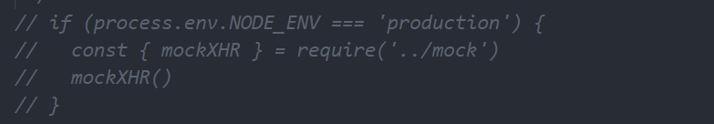

  

### App.vue

  

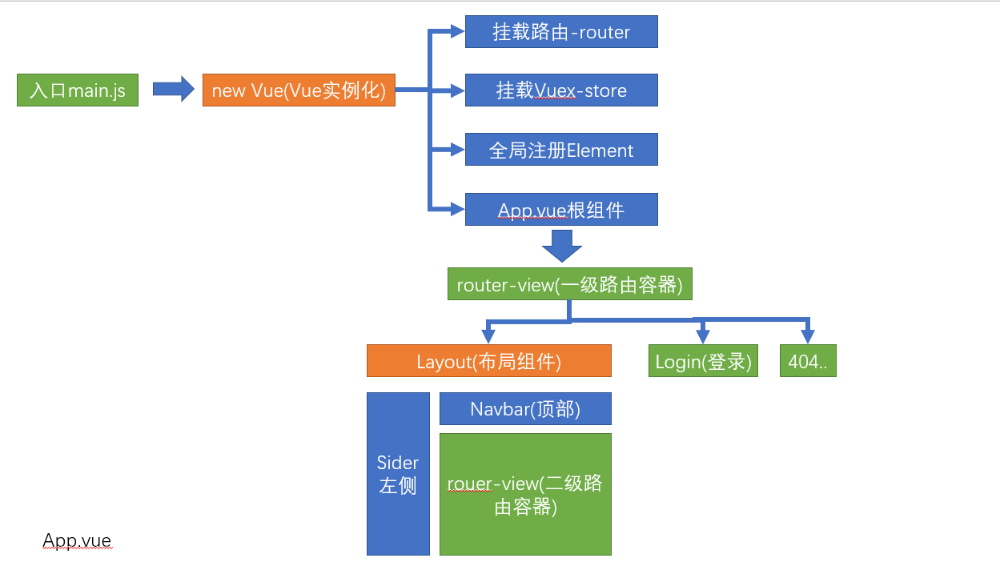

  

### permission.js

  

> src下，除了main.js还有两个文件，**`permission.js`** 和**`settings.js`**

  

**`permission.js`** 是控制页面登录权限的文件， 此处的代码没有经历构建过程会很难理解， 所以先将此处的代码进行注释，等我们构建权限功能时，再从0到1进行构建。

  

**注释代码**

  

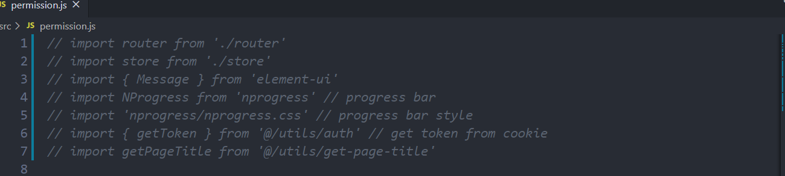

  

> **`settings.js`**则是对于一些项目信息的配置，里面有三个属性 **`title`**(项目名称)，**`fixedHeader`**（固定头部），**`sidebarLogo`**（显示左侧菜单logo）

  

**`settings.js`**中的文件在其他的位置会引用到，所以这里暂时不去对该文件进行变动

  

### Vuex结构
  

> 当前的Vuex结构采用了模块形式进行管理共享状态，其架构如下

  


> 其中app.js模块和settings.js模块，功能已经完备，不需要再进行修改。 user.js模块是我们后期需要重点开发的内容，所以这里我们将user.js里面的内容删除，并且导出一个默认配置

  

```js

export default {

namespaced: true,

state: {},

mutations: {},

actions: {}

}

```

  

同时，由于getters中引用了user中的状态，所以我们将getters中的状态改为

  

```js

const getters = {

sidebar: state => state.app.sidebar,

device: state => state.app.device

}

export default getters

  

```


### scss
> 该项目还使用了[scss](https://www.sass.hk/)作为css的扩展语言，在**`styles`**目录下，我们可以发现scss的相关文件，相关用法 我们[下一小节]() 进行讲解

### icons

> icons的结构如下


  

> 以上就是vue-element-admin的基础和介绍,希望大家在这过程中体会 一个基础的模板运行机制

  

**`本节任务`**： 大家根据目录结构和设计图，对以上的内容进行了解

  

## SCSS处理的了解和使用

[官方文档](https://www.sass.hk/)


> 首先注意,这里的sass和我们的scss是什么关系


sass和scss其实是**`一样的`**css预处理语言，SCSS 是 Sass 3 引入新的语法，其后缀名是分别为 .sass和.scss两种。

SASS版本3.0之前的后缀名为.sass，而版本3.0之后的后缀名.scss。

两者是有不同的，继sass之后scss的编写规范基本和css一致，sass时代是有严格的缩进规范并且没有‘{}’和‘；’。

而scss则和css的规范是一致的。


### 搭建小型测试环境


> 为了方便应用scss，我们可以在vscode中安装一个名为**`easy sass`** 的插件，但是我们只在该项目中工作区中应用该插件，因为在项目中，不需要该插件的辅助，有webpack来做这件事

> 首先我们新建一个文件夹test，然后我们在test下新建一个index.html，并新建一个test.scss

页面结构如下

```html

<!DOCTYPE html>

<html lang="en">

<head>

<meta charset="UTF-8">

<meta name="viewport" content="width=device-width, initial-scale=1.0">

<title>Document</title>

<link rel="stylesheet" href="./test.css">

</head>

<body>

<nav> Scss样式 </nav>

<div id="app">

Hello World

</div>

<div id="content">

<article>

<h1>文章标题</h1>

<p>文章内容 <a href="">百度</a> </p>

</article>

<aside>

侧边栏

</aside>

</div>

</body>

</html>

```


我们使用的**`easy sass`**插件会自动的帮助我们把**`test.scss => test.css`**


### 变量

`sass`使用`$`符号来标识变量

```bash

$highlight-color: #f90

```


上面我们声明了一个 名为**`$highlight-color`**的变量, 我们可以把该变量用在任何位置

  

```bash

#app {

background-color: $highlight-color;

}

```

  

以空格分割的多属性值也可以标识变量

  

```bash

$basic-border: 1px solid black;

```

  

```bash

#app {

background-color: $highlight-color;

border: $basic-border

}

```

  

**变量范围**

  

与`CSS`属性不同，变量可以在`css`规则块定义之外存在。当变量定义在`css`规则块内，那么该变量只能在此规则块内使用。如果它们出现在任何形式的`{...}`块中（如`@media`或者`@font-face`块），情况也是如此：

  

```bash

$nav-color: #F90;

nav {

$width: 100px;

width: $width;

color: $nav-color;

background-color: black

}

  

# 编译后

  

nav {

width: 100px;

color: #F90;

background-color: black;

}

  

```

  

在这段代码中，`$nav-color`这个变量定义在了规则块外边，所以在这个样式表中都可以像 `nav`规则块那样引用它。`$width`这个变量定义在了`nav`的`{ }`规则块内，所以它只能在`nav`规则块 内使用。这意味着是你可以在样式表的其他地方定义和使用`$width`变量，不会对这里造成影响。

  

**嵌套语法**

  

和less一样,scss同样支持**`嵌套型`**的语法

  

```scss

#content {

article {

h1 { color: #1dc08a }

p { font-style: italic; }

}

aside { background-color: #f90 }

}

```

  

转化后

  

```scss

#content article h1 {

color: #1dc08a;

}

  

#content article p {

font-style: italic;

}

  

#content aside {

background-color: #f90;

}

  

```

  

**&父选择器**

  

假如你想针对某个特定子元素 进行设置

  

比如

  

```scss

#content {

article {

h1 { color: #1dc08a }

p { font-style: italic; }

a {

color: blue;

&:hover { color: red }

}

}

aside { background-color: #f90 }

}

```


>学到这里,我们会发现scss和less有很多相似之处,最大的区别就在于声明变量的方式,less采用的是**`@变量名`**, 而scss采用的**`$变量名`**


  

## 建立远程Git仓库并完成初始提交

  

**`目标`** 在[码云](https://gitee.com/)或者[github](https://github.com/)上建立相应的远程仓库,并将代码分支提交

  

**建立远程仓库**

  

> 远程仓库建立只需要在网站上直接操作即可

  

**本地项目提交**

  

**`注意`**: 由于我们之前的项目是直接从 vue-element-admin **`克隆`**而来,里面拥有原来的提交记录,为了避免冲突, 先将原来的**`.git`**文件夹删除掉

  

并且对项目进行git初始化

  

```bash

$ git init #初始化项目

```

  

```bash

$ git add . #将修改添加到暂存

$ git commit -m '人资项目初始化' #将暂存提到本地仓库

```

  

**查看版本日志**

  

```bash

$ git log #查看版本日志

```

  

**推送到远程仓库**

  

推送到远程仓库一般先将**`远程仓库地址`**用本地仓库别名代替

  

```bash

$ git remote add origin <远程仓库地址> #添加远程仓库地址

```

  

> 当我们不清楚自己的仓库对应的origin地址时, 我们可以通过命令查看当前的远程仓库地址

  

```bash

$ git remote -v #查看本地仓库的远程仓库地址映射

```

  

**推送master分支到远程仓库**

  

```bash

$ git push -u origin master #将master分支推送到origin所代表的远程仓库地址

```

  

**`本节任务`**: 同学们 根据以上操作,将拉取下的项目提交到自己的仓库里面

  

## API模块和请求封装模块介绍

### Axios的拦截器介绍
axios的拦截器原理如下
  
![[image-20200811012945409.png]]

**axios拦截器**
- axios作为网络请求的第三方工具, 可以进行请求和响应的拦截
- 模板

```js

// 导出一个axios的实例 而且这个实例要有请求拦截器 响应拦截器

import axios from 'axios'

const service = axios.create() // 创建一个axios的实例

service.interceptors.request.use() // 请求拦截器

service.interceptors.response.use() // 响应拦截器

export default service // 导出axios实例

  

```

1. **通过create创建了一个新的axios实例**

```js

// 创建了一个新的axios实例
//提前引入axios store

const service = axios.create({

baseURL: process.env.VUE_APP_BASE_API, // url = base url + request url

// withCredentials: true, // send cookies when cross-domain requests

timeout: 5000 // 超时时间

})

```


2. **请求拦截器**

请求拦截器主要处理 token的**`统一注入问题`**


```js

// axios的请求拦截器

service.interceptors.request.use(

config => {

// do something before request is sent

  

if (store.getters.token) {

// let each request carry token

// ['X-Token'] is a custom headers key

// please modify it according to the actual situation

config.headers['X-Token'] = getToken()

}

return config

},


error => {

// do something with request error

console.log(error) // for debug

return Promise.reject(error)

}

)

```

  

3. **响应拦截器**

响应拦截器主要处理 返回的**`数据异常`** 和**`数据结构`**问题


```js

// 响应拦截器

service.interceptors.response.use(

response => {

const res = response.data //解构一层data，因为返回的数据会自动封装一层data


// if the custom code is not 20000, it is judged as an error.

if (res.code !== 20000) {

Message({

message: res.message || 'Error',

type: 'error',

duration: 5 * 1000

})

if (res.code === 50008 || res.code === 50012 || res.code === 50014) {

// to re-login

MessageBox.confirm('You have been logged out, you can cancel to stay on this page, or log in again', 'Confirm logout', {

confirmButtonText: 'Re-Login',

cancelButtonText: 'Cancel',

type: 'warning'

}).then(() => {

store.dispatch('user/resetToken').then(() => {

location.reload()

})

})

}

return Promise.reject(new Error(res.message || 'Error'))

} else {

return res

}

},

error => {

console.log('err' + error) // for debug

Message({

message: error.message,

type: 'error',

duration: 5 * 1000

})

return Promise.reject(error)

}

)

```


### api模块的单独封装

我们习惯性的将所有的网络请求 放置在api目录下统一管理,按照模块进行划分


**单独封装代码**

```js

import request from '@/utils/request'

  

export function login(data) {

return request({

url: '/vue-admin-template/user/login',

method: 'post',

data

})

}

  

export function getInfo(token) {

return request({

url: '/vue-admin-template/user/info',

method: 'get',

params: { token }

})

}

  

export function logout() {

return request({

url: '/vue-admin-template/user/logout',

method: 'post'

})

}

  

```

  

上面代码中,使用了封装的request工具,每个接口的请求都单独**`导出`**了一个方法,这样做的好处就是,任何位置需要请求的话,可以直接引用我们导出的请求方法

  
为了后续更好的开发，我们可以先将**user.js**代码的方法设置为空，后续在进行更正


```js

// import request from '@/utils/request'

  

export function login(data) {

  

}

  

export function getInfo(token) {

  

}

  

export function logout() {

  

}

  

```


**提交代码**

  
**`本节任务`**： 将request和用户模块的代码进行清理，理解request和模块封装

  
## 公共资源图片和统一样式

  
**`目标`** 将一些公共的图片和样式资源放入到 规定目录中
  

> 我们已经将整体的基础模块进行了简单的介绍，接下来，我们需要将该项目所用到的图片和样式进行统一的处理

  

**图片资源**

  
> 图片资源在课程资料的图片文件中，我们只需要将**`common`**文件夹拷贝放置到 **`assets`**目录即可

  
**样式**
  

> 样式资源在 资源/样式目录下
  
修改**`variables.scss`**


新增**`common.scss`**
  

我们在**`variables.scss`**添加了一些基础的变量值
  

我们提供了 一份公共的**`common.scss`**样式,里面内置了一部分内容的样式,在开发期间可以帮助我们快速的实现页面样式和布局

  
将两个文件放置到**styles**目录下，然后在**`index.scss`**中引入该样式


```scss

@import './common.scss'; //引入common.scss样式表

```


**提交代码**

**`本节注意`**：注意在scss文件中，通过**@import** 引入其他样式文件，需要注意最后加分号，否则会报错

**`本节任务`** 将公共资源的图片和样式放置到规定位置


# 登录模块
[线上地址](http://ihrm-java.itheima.net/#/login)

本章节，我们将在现有模板的基础上，完成如图的登录模块的功能


## 设置固定的本地访问端口和网站名称


**`目标`**: 设置统一的本地访问端口和网站title


在正式开发业务之前，先将项目的**本地端口**和**网站名称**进行一下调整

  

**本地服务端口**: 在**`vue.config.js`**中进行设置

  
**`vue.config.js`** 就是vue项目相关的编译，配置，打包，启动服务相关的配置文件，它的核心在于**webpack**，但是又不同于webpack，相当于改良版的webpack， [文档地址](https://cli.vuejs.org/zh/)


我们看到上面的 **`process.env.port`**实际上是一个nodejs服务下的环境变量，该变量在哪里设置呢？


在项目下, 我们发现了**`.env.development`**和**`.env.production`**两个文件


development => 开发环境

production => 生产环境

  

当我们运行**npm run dev**进行开发调试的时候,此时会加载执行**`.env.development`**文件内容

  

当我们运行**npm run build:prod**进行生产环境打包的时候,会加载执行**`.env.production`**文件内容

  

所以,如果想要设置开发环境的接口,直接在**`.env.development`**中写入对于port变量的赋值即可

  

```bash

# 设置端口号

port = 8888

```

  

**`本节注意`**:修改服务的配置文件,想要生效的话,必须要重新启动服务，值‘8888’后面不能留有空格

  

**网站名称**

  

网站名称实际在**configureWebpack**选项中的**name**选项,通过阅读代码,我们会发现name实际上来源于src目录下

  

**`settings.js`**文件

  

所以,我们可以将网站名称改成"**`人力资源管理平台`**"


**提交代码**

  

**`本节注意`**:修改服务的配置文件,想要生效的话,必须要重新启动服务，值‘8888’后面不能留有空格

  

**`本节任务`**：完成网站的开发服务端口设置和网站名称设置

  

## 登录页面的基础布局

首先要实现以上的页面效果, 我们可以直接将当前的登录页面进行相应的改造


**设置头部背景**


```vue

<!-- 放置标题图片 @是设置的别名-->

<div class="title-container">

<h3 class="title">


</h3>

</div>

```

  
**`本节注意`**： `@`是我们在vue.config.js中设置的一个路径别名，指定src根目录，这样可以很方便的寻找文件

  
**设置背景图片**
  
```css

/* reset element-ui css */

.login-container {

background-image: url('~@/assets/common/login.jpg'); // 设置背景图片

background-position: center; // 将图片位置设置为充满整个屏幕

}

```


**`本节注意`**： 如需要在样式表中使用**`@`**别名的时候，需要在@前面加上一个**`~`**符号，否则不识别


**设置手机号和密码的字体颜色**


```css

$light_gray: #68b0fe; // 将输入框颜色改成蓝色

```

  

**设置输入表单整体背景色**

  

```css

.el-form-item {

border: 1px solid rgba(255, 255, 255, 0.1);

background: rgba(255, 255, 255, 0.7); // 输入登录表单的背景色

border-radius: 5px;

color: #454545;

}

```

  

**设置错误信息的颜色**

  

```css

.el-form-item__error {

color: #fff

}

```

  

**设置登录按钮的样式**

  

> 需要给el-button 增加一个loginBtn的class样式

  

```css

.loginBtn {

background: #407ffe;

height: 64px;

line-height: 32px;

font-size: 24px;

}

```

  

**修改显示的提示文本和登录文本**

  

```htmL

<div class="tips">

<span style="margin-right:20px;">账号: 13800000002</span>

<span> 密码: 123456</span>

</div>

```

  

经过以上的改动, 我们得到了一个比较完善的登录页面

  


  

> 解释:我们该项目的侧重点在于更多的介绍Vue中台项目所应用的技术,所以对于一些过于细节的样式或者布局,我们采用直接粘贴或者拷贝成型代码的方式,同学们可以通过课下多多练习

  

**提交代码**

  

**`本节注意`**： `@`是我们在vue.config.js中设置的一个路径别名，指定src根目录，这样可以很方便的寻找文件

  

**`本节注意`**： 如需要在样式表中使用**`@`**别名的时候，需要在@前面加上一个**`~`**符号，否则不识别

  

**`本节任务`**： 完成登录首页的基本布局

  

## 登录表单的校验

  

**`目标`**对登录表单进行规则校验

  

> 基础模板已经有了基础校验的代码,所以我们这一章节更多的是修正和完善

  

### **el-form表单校验的先决条件**

  

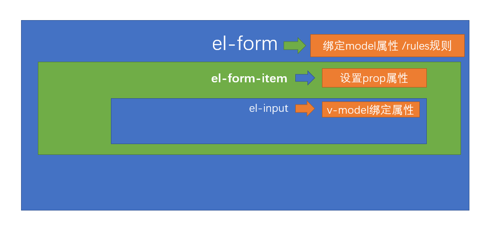

  

### 手机号和密码的校验

  

**字段名对应**

  

> 为什么要对应? 因为基础模板采用的是**`username`**的字段,但是实际接口中采用的是**`mobile`**的字段,为了更方便的写代码,所以我们将**`username`**改成**`mobile`**

  

这里除了字段名，还有我们的规则校验名称，以及prop名称。

  

**英文提示变成中文**

  

基础模板中都是**placeHolder**占位符是英文,要变成中文

  

登录按钮文字同样需要换成中文

  

**校验手机号和校验密码**

  

基础模板中,已经做了校验,我们针对代码进行一些优化

  

新规则：手机号必填，并且进行格式校验，密码必填，长度6-16位之间

  

```js

data() {

// 自定义校验函数

const validateMobile = function(rule, value, callback) {

// 校验value

// if (validMobile(value)) {

// // 如果通过 直接执行callback

// callback()

// } else {

// callback(new Error('手机号格式不正确'))

// }

validMobile(value) ? callback() : callback(new Error('手机号格式不正确'))

}

  

return {

loginForm: {

mobile: '13800000002',

password: '123456'

},

loginRules: {

mobile: [{ required: true, trigger: 'blur', message: '手机号不能为空' }, {

validator: validateMobile, trigger: 'blur'

}],

password: [{ required: true, trigger: 'blur', message: '密码不能为空' }, {

min: 6, max: 16, message: '密码的长度在6-16位之间 ', trigger: 'blur'

}]

},

loading: false,

passwordType: 'password',

redirect: undefined

}

},

```

  

我们在**`utils/validate.js`**方法中增加了一个校验手机号的方法

  

```js

/**

* 校验手机号

* **/

export function validMobile(str) {

return /^1[3-9]\d{9}$/.test(str) // 校验手机号

}

```

  

**`utils/validate.js`**是一个专门存放校验工具方法的文件

  

### 关于修饰符


**关于修饰符**

> 在该页面中，我们发现了事件的几个修饰符 **`@keyup.enter.native`** **`@click.native.prevent`**


@keyup.**`enter`**属于按键修饰符，如果我们想监听在按回车键的时候触发，可以如下编写


```vue

<!-- 只有在 `key` 是 `Enter` 时调用 `vm.submit()` -->

<input v-on:keyup.enter="submit">

```

  

@keyup.enter.**`native`** 表示监听组件的原生事件，比如 keyup就是于input的原生事件，这里写native表示keyup是一个原生事件

  

**`本节任务`**：实现登录用户的手机号和密码校验

  

## Vue-Cli配置跨域代理


### 为什么会出现跨域？
  

当下,最流行的就是**`前后分离`**项目,也就是**`前端项目`**和**`后端接口`**并不在一个域名之下，那么前端项目访问后端接口必然存在**`跨域`**的行为.

  
> 怎么解决这种跨域 ？


**`请注意`**，我们所遇到的这种跨域是位于**开发环境**的，真正部署上线时的跨域是**生产环境**的
  

### 解决开发环境的跨域问题

**开发环境的跨域**

开发环境的跨域，也就是在**`vue-cli脚手架环境`**下开发启动服务时，我们访问接口所遇到的跨域问题，vue-cli为我们在本地**`开启了一个服务`**,可以通过这个服务帮我们**`代理请求`**,解决跨域问题

这就是vue-cli配置**webpack的反向代理**

![[image-20200811022013103.png]]

vue-cli的配置文件即**`vue.config.js`**,这里有我们需要的 [代理选项](https://cli.vuejs.org/zh/config/#devserver-proxy)

```js

module.exports = {

devServer: {

// 代理配置

proxy: {

// 这里的api 表示如果我们的请求地址有/api的时候,就出触发代理机制

// localhost:8888/api/abc => 代理给另一个服务器

// 本地的前端 =》 本地的后端 =》 代理我们向另一个服务器发请求 （行得通）

// 本地的前端 =》 另外一个服务器发请求 （跨域 行不通）

'/api': {

target: 'www.baidu.com', // 我们要代理的地址

changeOrigin: true, // 是否跨域 需要设置此值为true 才可以让本地服务代理我们发出请求

// 路径重写

pathRewrite: {

// 重新路由 localhost:8888/api/login => www.baidu.com/api/login

'^/api': '' // 假设我们想把 localhost:8888/api/login 变成www.baidu.com/login 就需要这么做

}

},

}

}

}

```

  

以上就是我们在vue-cli项目中配置的代理设置

  

> 接下来,我们在代码中将要代理的后端地址变成 [后端接口地址](http://ihrm-java.itheima.net)

  

```js

// 代理跨域的配置

proxy: {

// 当我们的本地的请求 有/api的时候，就会代理我们的请求地址向另外一个服务器发出请求

'/api': {

target: 'http://ihrm-java.itheima.net/', // 跨域请求的地址

changeOrigin: true // 只有这个值为true的情况下 才表示开启跨域

}

}

```

  

**`本节注意`**：我们并没有进行**`pathRewrite`**,因为后端接口就是**`ihrm-java.itheima.net/api`**这种格式,所以不需要重写

  

**`vue.config.js`**的改动如果要生效,需要进行重启服务

  

同时，还需要注意的是，我们同时需要注释掉 mock的加载，因为mock-server会导致代理服务的异常

  

```js

// before: require('./mock/mock-server.js'), // 注释mock-server加载

```

  

**生产环境的跨域**

  

生产环境表示我们已经开发完成项目，将项目部署到了服务器上,这时已经没有了vue-cli脚手架的**`辅助`**了，我们只是把打包好的**`html+js+css`**交付运维人员，放到**`Nginx`**服务器而已,所以此时需要借助**`Nginx`**的反向代理来进行

  

```bash

server{


# 监听9099端口

listen 9099;

# 本地的域名是localhost

server_name localhost;

#凡是localhost:9099/api这个样子的，都转发到真正的服务端地址http://baidu.com

location ^~ /api {

proxy_pass http://baidu.com;

}

}

```

  

**`注意`**:这里的操作一般由运维人员完成,需要前端进行操作,这里我们进行一下简单了解

  

更多正向代理和反向代理知识,请阅读这篇文章[Nginx反向代理](https://www.cnblogs.com/ysocean/p/9392908.html)

  

**提交代码**

  

**`本节注意`**：我们并没有进行**`pathRewrite`**,因为后端接口就是**`ihrm-java.itheima.net/api`**这种格式,所以不需要重写

  

**`本节任务`**： 配置vue-cli的反向代理，实现后端接口的跨域访问

  

## 封装单独的登录接口

  
**`目标`** 在单独请求模块中,单独封装登录接口

> 完成登录模块之后，我们需要对登录接口进行封装

首先，查阅接口文档中的登录接口

> 基础模板已经有了原来的登录代码,我们只需要进行简单的改造即可

```js

export function login(data) {

// 返回一个axios对象 => promise // 返回了一个promise对象

return request({

url: '/sys/login', // 因为所有的接口都要跨域 表示所有的接口要带 /api

method: 'post',

data

})

}

```

  

如图

**提交代码**

  

**`本节任务`**：封装单独的登录接口

  

## 封装Vuex的登录Action并处理token

  

**`目标`**在vuex中封装登录的action,并处理token

  
> 在这个小节中，我们将在vuex中加入对于用户的登录的处理


### 在Vuex中对token进行管理


> 组件直接和接口打交道，这并没有什么问题，但是对于用户token这一高频使用的**`钥匙`**，我们需要让vuex来介入，将用户的token状态共享，更方便的读取


**实现store/modules/user.js基本配置**


```js

// 状态

const state = {}

// 修改状态

const mutations = {}

// 执行异步

const actions = {}

export default {

namespaced: true,

state,

mutations,

actions

}

  

```


**设置token的共享状态**


```js

const state = {

token: null

}

```
  

> 我们需要知道,**`钥匙`**不能每次都通过登录获取,我们可以将token放置到本地的缓存中
 
  

在**`utils/auth.js`**中,基础模板已经为我们提供了**`获取token`**,**`设置token`**,**`删除token`**的方法,可以直接使用

  
只需要将存储的key放置成特定值即可

```js

import Cookies from 'js-cookie'

  

const TokenKey = 'hrsaas-ihrm-token' // 设定一个独一无二的key

  

export function getToken() {

return Cookies.get(TokenKey)

}

  

export function setToken(token) {

return Cookies.set(TokenKey, token)

}

  

export function removeToken() {

return Cookies.remove(TokenKey)

}

  

```

  

**初始化token状态** - **`store/modules/user.js`**

  

```js

import { getToken, setToken, removeToken } from '@/utils/auth'

// 状态

// 初始化的时候从缓存中读取状态 并赋值到初始化的状态上

// Vuex的持久化 如何实现 ？ Vuex和前端缓存相结合

const state = {

token: getToken() // 设置token初始状态 token持久化 => 放到缓存中

}

```

  

**提供修改token的mutations**

  

```js

// 修改状态

const mutations = {

// 设置token

setToken(state, token) {

state.token = token // 设置token 只是修改state的数据 123 =》 1234

// vuex变化 => 缓存数据

setToken(token) // vuex和 缓存数据的同步

},

// 删除缓存

removeToken(state) {

state.token = null // 删除vuex的token

removeToken() // 先清除 vuex 再清除缓存 vuex和 缓存数据的同步

}

}

```

  

### 封装登录的Action

  

**封装登录的action**

  

> 登录action要做的事情,**`调用登录接口`**,**`成功后设置token到vuex`**,**`失败则返回失败`**

  

```js

// 执行异步

const actions = {

// 定义login action 也需要参数 调用action时 传递过来的参数

async login(context, data) {

const result = await login(data) // 实际上就是一个promise result就是执行的结果

// axios默认给数据加了一层data

if (result.data.success) {

// 表示登录接口调用成功 也就是意味着你的用户名和密码是正确的

// 现在有用户token

// actions 修改state 必须通过mutations

context.commit('setToken', result.data.data)

}

}

}

```


> 上述代码中,我们使用了**`async/await`**语法,如果用**`then`**语法也是可以的


```js

// 为什么async/await 不用返回new Promise,因为 async函数本身就是 Promise,promise的值返回的值

login(context, data) {

return new Promise(function(resolve) {

login(data).then(result => {

if (result.data.success) {

context.commit('setToken', result.data.data) // 提交mutations设置token

resolve() // 表示执行成功了

}

})

})

}

```


> 以上两种写法都是OK的,我们在项目研发过程中,尽可能的采用前一种

除此之外，为了更好的让其他模块和组件更好的获取token数据，我们可以在**`store/getters.js`**中将token值作为公共的访问属性放出

```js

const getters = {

sidebar: state => state.app.sidebar,

device: state => state.app.device,

token: state => state.user.token // 在根级的getters上 开发子模块的属性给别人看 给别人用

}

export default getters

```


## request中环境变量和异常的处理

**`目标`**设置request环境变量和异常处理

### 区分axios在不同环境中的请求基础地址

> 为什么会有环境变量之分? 如图


> 从上图可以看出，开发环境实际上就是在自己的本地开发或者要求不那么高的环境，但是一旦进入生产，就是**`真实的数据`**。 拿银行作比喻，如果你在开发环境拿生产环境的接口做测试，银行系统就会发生很大的风险。


前端主要区分两个环境,**`开发环境`**,**`生产环境`**

**环境变量**

```bash

$ process.env.NODE_ENV # 当为production时为生产环境 为development时为开发环境

```


**环境文件**


我们可以在**`.env.development`**和**`.env.production`**定义变量，变量自动就为当前环境的值

  

基础模板在以上文件定义了变量**`VUE_APP_BASE_API`**，该变量可以作为axios请求的**`baseURL`**

  

我们会发现,在模板中,两个值分别为**`/dev-api`**和**`/prod-api`**

  

但是我们的开发环境代理是**`/api`**，所以可以统一下

  

```bash

# 开发环境的基础地址和代理对应

VUE_APP_BASE_API = '/api'

```

  

```bash

# 这里配置了/api,意味着需要在Nginx服务器上为该服务配置 nginx的反向代理对应/prod-api的地址

VUE_APP_BASE_API = '/prod-api'

```

  

**`本节注意`**：我们这里生产环境和开发环境设置了不同的值，后续我们还会在生产环境部署的时候，去配置该值所对应的反向代理，反向代理指向哪个地址，完全由我们自己决定，不会和开发环境冲突

  

**在request中设置baseUrl**

  

```js

const service = axios.create({

// 如果执行 npm run dev 值为 /api 正确 /api 这个代理只是给开发环境配置的代理

// 如果执行 npm run build 值为 /prod-api 没关系 运维应该在上线的时候 给你配置上 /prod-api的代理

baseURL: process.env.VUE_APP_BASE_API, // 设置axios请求的基础的基础地址

timeout: 5000 // 定义5秒超时

}) // 创建一个axios的实例

```

  

### 处理axios的响应拦截器


> 并且,人资项目的接口,如果执行失败,只是设置了**`success`**为**`false`**，并没有reject，我们需要一并处理下

处理逻辑如图


![[image-20200812020656210.png]]
  

```js

// 响应拦截器

service.interceptors.response.use(response => {

// axios默认加了一层data

const { success, message, data } = response.data

// 要根据success的成功与否决定下面的操作

if (success) {

return data

} else {

// 业务已经错误了 还能进then ? 不能 ！ 应该进catch

Message.error(message) // 提示错误消息

return Promise.reject(new Error(message))

}

}, error => {

Message.error(error.message) // 提示错误信息

return Promise.reject(error) // 返回执行错误 让当前的执行链跳出成功 直接进入 catch

})

```

  

> 既然在request中已经默认去除了一层data的外衣，所以我们也将上节login的action进行一下改动

  

**处理登录的返回结构问题**

  

```js

async login(context, data) {

// 经过响应拦截器的处理之后 这里的result实际上就是 token

const result = await login(data) // 实际上就是一个promise result就是执行的结果

// axios默认给数据加了一层data

// 表示登录接口调用成功 也就是意味着你的用户名和密码是正确的

// 现在有用户token

// actions 修改state 必须通过mutations

context.commit('setToken', result)

}

```

  

**提交代码**

  

**`本节任务`**： 完成request环境变量和异常的处理

  

## 登录页面调用登录action,处理异常

  

**`目标`** 调用vuex中的登录action,并跳转到主页

  

> 按照如图的业务逻辑，把剩下的内容在登录页面引入

  


  

**引入actions辅助函数**

  

```js

import { mapActions } from 'vuex' // 引入vuex的辅助函数

```

  

**引入action方法**

  

> 此处，我们采用直接引入模块action的方式，后面我们采用分模块的引用方式

  

```js

methods: {

...mapActions(['user/login'])

}

```

  

**调用登录**

  

```js

this.$refs.loginForm.validate(async isOK => {

if (isOK) {

try {

this.loading = true

// 只有校验通过了 我们才去调用action

await this['user/login'](this.loginForm)

// 应该登录成功之后

// async标记的函数实际上一个promise对象

// await下面的代码 都是成功执行的代码

this.$router.push('/')

} catch (error) {

console.log(error)

} finally {

// 不论执行try 还是catch 都去关闭转圈

this.loading = false

}

}

})

```

  

**提交代码**

  

**`本节注意`**：我们调用的是Vuex中子模块的action，该模块我们进行了namespaced: true，所以引用aciton时需要带上**`user/`**, 并且在使用该方法时，直接使用 **`this['user/login']`**, 使用this.user/login 语法是错误的

  

**`本节任务`**：登录页面调用登录action，处理异常

# 主页模块
## 主页的token拦截处理

**`目标`**：根据token处理主页的访问权限问题

### 权限拦截的流程图


> 我们已经完成了登录的过程，并且存储了token，但是此时主页并没有因为token的有无而被控制访问权限


接下来我们需要实现以下如下的流程图

  


  

> 在基础框架阶段，我们已经知道**`src/permission.js`**是专门处理路由权限的，所以我们在这里处理

  

### 流程图转化代码

  

**流程图转化的代码**

  

```js

// 权限拦截 导航守卫 路由守卫 router

import router from '@/router' // 引入路由实例

import store from '@/store' // 引入vuex store实例

import NProgress from 'nprogress' // 引入一份进度条插件

import 'nprogress/nprogress.css' // 引入进度条样式

  

const whiteList = ['/login', '/404'] // 定义白名单 所有不受权限控制的页面

// 路由的前置守卫

router.beforeEach(function(to, from, next) {

NProgress.start() // 开启进度条

// 首先判断有无token

if (store.getters.token) {

// 如果有token 继续判断是不是去登录页

if (to.path === '/login') {

// 表示去的是登录页

next('/') // 跳到主页

} else {

next() // 直接放行

}

} else {

// 如果没有token

if (whiteList.indexOf(to.path) > -1) {

// 如果找到了 表示在在名单里面

next()

} else {

next('/login') // 跳到登录页

}

}

NProgress.done() // 手动强制关闭一次 为了解决 手动切换地址时 进度条的不关闭的问题

})

// 后置守卫

router.afterEach(function() {

NProgress.done() // 关闭进度条

})

  

```

  

> 在导航守卫的位置，我们添加了NProgress的插件，可以完成进入时的进度条效果

  

**提交代码**

  

**`本节任务`**：完成主页中根据有无token，进行页面访问的处理

  

## 主页的左侧导航样式

  

**`目标`**设置左侧的导航样式


> 主页的布局组件位置**`src/layout`**

  

**主页布局架构**
  


**左侧导航组件的样式文件**`styles/siderbar.scss`

  

**设置背景渐变色**

  

```css

.sidebar-container {

background: -webkit-linear-gradient(bottom, #3d6df8, #5b8cff);

}

```

  

**设置左侧导航背景图片**

  

```scss

.scrollbar-wrapper {

background: url('~@/assets/common/leftnavBg.png') no-repeat 0 100%;

}

```

  

**`注意`**：在scss中，如果我们想要使用**`@`**别名，需要在前面加上一个**`~`**才可以

  

**设置菜单选中颜色**

  

```bash

.el-menu {

border: none;

height: 100%;

width: 100% !important;

a{

li{

.svg-icon{

color: #fff;

font-size: 18px;

vertical-align: middle;

.icon{

color:#fff;

}

}

span{

color: #fff;

}

&:hover{

.svg-icon{

color: #43a7fe

}

span{

color: #43a7fe;

}

}

}

}

}

```

  

**`注意`**：因为我们后期没有二级菜单，所以这里暂时不用对二级菜单的样式进行控制

  

**显示左侧logo图片** **`src/setttings.js`**

  

```js

module.exports = {

  

title: '人力资源管理平台',

  

/**

* @type {boolean} true | false

* @description Whether fix the header

*/

fixedHeader: false,

  

/**

* @type {boolean} true | false

* @description Whether show the logo in sidebar

*/

sidebarLogo: true // 显示logo

}

  

```

  

**设置头部图片结构** **`src/layout/components/Sidebar/Logo.vue`**

  

```vue

<div class="sidebar-logo-container" :class="{'collapse':collapse}">

<transition name="sidebarLogoFade">

<router-link key="collapse" class="sidebar-logo-link" to="/">


</router-link>

</transition>

</div>

```

  

**设置大图和小图的样式**

  

```scss

&.collapse {

.sidebar-logo {

margin-right: 0px;

width: 32px;

height: 32px;

}

}

// 小图样式

```

  

```scss

.sidebar-logo {

width: 140px;

vertical-align: middle;

margin-right: 12px;

}

// 大图样式

```

  

**去除logo的背景色**


  

**提交代码**

  

**`本节任务`**： 完成主页的左侧导航样式

  

**`本节注意`**：我们该项目中没有二级显示菜单，所以二级菜单的样式并没有做过多处理，同学们不必在意

  

## 设置头部内容的布局和样式

  

**`目标`**设置头部内容的布局和样式

  

> 我们需要把页面设置成如图样式

  

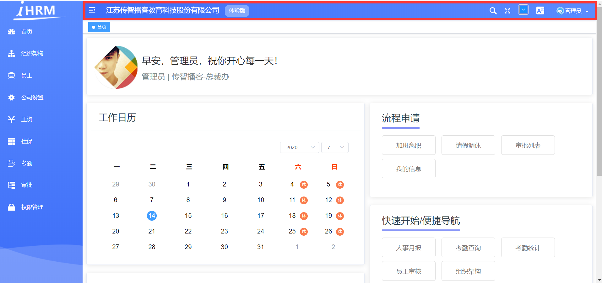

  

**头部组件位置** **`layout/components/Navbar.vue`**

  

**添加公司名称**，**注释面包屑**

  

```html

<div class="app-breadcrumb">

江苏传智播客教育科技股份有限公司

<span class="breadBtn">体验版</span>

</div>

<!-- <breadcrumb class="breadcrumb-container" /> -->

  

```

  

**公司样式**

  

```scss

.app-breadcrumb {

display: inline-block;

font-size: 18px;

line-height: 50px;

margin-left: 10px;

color: #ffffff;

cursor: text;

.breadBtn {

background: #84a9fe;

font-size: 14px;

padding: 0 10px;

display: inline-block;

height: 30px;

line-height: 30px;

border-radius: 10px;

margin-left: 15px;

}

}

```

  

**头部背景渐变色**

  

```scss

.navbar {

background-image: -webkit-linear-gradient(left, #3d6df8, #5b8cff);

}

```

  

**汉堡组件图标颜色** **`src/components/Hamburger/index.vue`**

  

**`注意`**这里的图标我们使用了**`svg`**，设置颜色需要使用svg标签的**`fill属性`**

  

> 设置svg图标为白色

  

```vue

<svg

:class="{'is-active':isActive}"

class="hamburger"

viewBox="0 0 1024 1024"

xmlns="http://www.w3.org/2000/svg"

width="64"

height="64"

fill="#fff"

>

```

  

**右侧下拉菜单设置**

  

> 将下拉菜单调节成**`首页/项目地址/退出登录`**

  

```vue

<div class="right-menu">

<el-dropdown class="avatar-container" trigger="click">

<div class="avatar-wrapper">


<span class="name">管理员</span>

<i class="el-icon-caret-bottom" style="color:#fff" />

</div>

<el-dropdown-menu slot="dropdown" class="user-dropdown">

<router-link to="/">

<el-dropdown-item>

首页

</el-dropdown-item>

</router-link>

<a target="_blank" href="https://gitee.com/shuiruohanyu/hrsaas53">

<el-dropdown-item>项目地址</el-dropdown-item>

</a>

<el-dropdown-item divided @click.native="logout">

<span style="display:block;">退出登录</span>

</el-dropdown-item>

</el-dropdown-menu>

</el-dropdown>

</div>

```

  

**头像和下拉菜单样式**

  

```css

.user-avatar {

cursor: pointer;

width: 30px;

height: 30px;

border-radius: 15px;

vertical-align: middle;

  

}

.name {

color: #fff;

vertical-align: middle;

margin-left:5px;

}

.user-dropdown {

color: #fff;

}

```

  

用户名和头像我们先用了假数据进行，下小章节，会进行这份数据的获取

  

**最终效果**

  

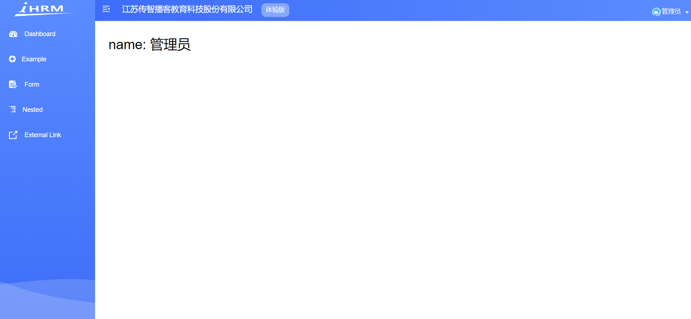

  

**提交代码**

  

## 获取用户资料接口和token注入

  

**`目标`** 封装获取用户资料的资料信息

  

> 上小节中，我们完成了头部菜单的基本布局，但是用户的头像和名称并没有，我们需要通过接口调用的方式获取当前用户的资料信息

  

**获取用户资料接口**

  

在**`src/api/user.js`**中封装获取用户资料的方法

  

```js

/**

* 获取用户的基本资料

*

* **/

export function getUserInfo() {

return request({

url: '/sys/profile',

method: 'post'

})

}

```

  

> 我们忽略了一个问题！我们的headers参数并没有在这里传入，为什么呢

  

headers中的**Authorization**相当于我们**开门**（**调用接口**）时**`钥匙(token)`**，我们在打开任何带安全权限的门的时候都需要**`钥匙(token)`** 如图

  


  

每次在接口中携带**`钥匙（token）`**很麻烦，所以我们可以在axios拦截器中统一注入token

  


  

**统一注入token** **`src/utils/request.js`**

  

```js

service.interceptors.request.use(config => {

// 在这个位置需要统一的去注入token

if (store.getters.token) {

// 如果token存在 注入token

config.headers['Authorization'] = `Bearer ${store.getters.token}`

}

return config // 必须返回配置

}, error => {

return Promise.reject(error)

})

```

  

**`本节任务`**： 完成获取用户资料接口和token注入

  

## 封装获取用户资料的action并共享用户状态

  

**`目标`**： 在用户的vuex模块中封装获取用户资料的action，并设置相关状态

  

> 用户状态会在后续的开发中，频繁用到，所以我们将用户状态同样的封装到action中

  


  

**封装获取用户资料action** **`action`** **`src/store/modules/user.js`**

  

```js

import { login, getUserInfo } from '@/api/user'

// 获取用户资料action

async getUserInfo (context) {

const result = await getUserInfo() // 获取返回值

context.commit('setUserInfo', result) // 将整个的个人信息设置到用户的vuex数据中

return result // 这里为什么要返回 为后面埋下伏笔

}

```

  

> 同时，配套的我们还进行了关于用户状态的mutations方法的设计

  

**初始化state** **`state`**

  

```js

const state = {

token: getToken(), // 设置token初始状态 token持久化 => 放到缓存中

userInfo: {} // 定义一个空的对象 不是null 因为后边我要开发userInfo的属性给别人用 userInfo.name

}

```

  

> userInfo为什么我们不设置为null，而是设置为 {}

  

因为我们会在**`getters`**中引用userinfo的变量，如果设置为null，则会引起异常和报错

  

**设置和删除用户资料** **`mutations`**

  

```js

// 设置用户信息

setUserInfo(state, userInfo) {

state.userInfo = { ...userInfo } // 用 浅拷贝的方式去赋值对象 因为这样数据更新之后，才会触发组件的更新

},

// 删除用户信息

reomveUserInfo(state) {

state.userInfo = {}

}

```

  

> 同学们，我们将所有的资料设置到了**userInfo**这个对象中，如果想要取其中一个值，我们还可以在getters中建立相应的映射

  

因为我们要做映射，如果初始值为null，一旦引用了getters，就会报错

  

**建立用户名的映射** **`src/store/getters.js`**

  

```js

const getters = {

sidebar: state => state.app.sidebar,

device: state => state.app.device,

token: state => state.user.token,

name: state => state.user.userInfo.username // 建立用户名称的映射

}

export default getters

  

```

  

到现在为止，我们将用户资料的**action => mutation => state => getters** 都设置好了， 那么我们应该在什么位置来调用这个action呢 ？

  

> 别着急，先提交代码，下个小节，我们来揭晓答案

  

**提交代码**

  

**`本节任务`**封装获取用户资料的action并共享用户状态

  

## 权限拦截处调用获取资料action

  

**`目标`**在权限拦截处调用aciton

  

### 权限拦截器调用action

  

> 在上小节中，我们完成了用户资料的整个流程，那么这个action在哪里调用呢？

  

用户资料有个硬性要求，**`必须有token`**才可以获取，那么我们就可以在确定有token的位置去获取用户资料

  


  

> 由上图可以看出，一旦确定我们进行了放行，就可以获取用户资料

  


  

**调用action** **`src/permission.js`**

  

```js

if(!store.state.user.userInfo.userId) {

await store.dispatch('user/getUserInfo')

}

```

  

如果我们觉得获取用户id的方式写了太多层级，可以在vuex中的getters中设置一个映射 **`src/store/getters.js`**

  

```js

userId: state => state.user.userInfo.userId // 建立用户id的映射

```

  

代码就变成了

  

```js

if (!store.getters.userId) {

// 如果没有id这个值 才会调用 vuex的获取资料的action

await store.dispatch('user/getUserInfo')

// 为什么要写await 因为我们想获取完资料再去放行

}

```

  

此时，我们可以通过dev-tools工具在控制台清楚的看到数据已经获取

  


  

> 最后一步，只需要将头部菜单中的名称换成真实的用户名即可

  

### 获取头像接口合并数据

  

**头像怎么办？**

  

> 我们发现头像并不在接口的返回体中（接口原因），我们可以通过另一个接口来获取头像，并把头像合并到当前的资料中

  

**封装获取用户信息接口** **`src/api/user.js`**

  

```js

/** *

*

* 获取用户的基本信息 现在写它 完全是为了显示头像

* **/

export function getUserDetailById(id) {

return request({

url: `/sys/user/${id}`

})

}

```

  

> 这个接口需要用户的userId，在前一个接口处，我们已经获取到了，所以可以直接在后面的内容去衔接

  

```js

import { login, getUserInfo, getUserDetailById } from '@/api/user'

// 获取用户资料action

async getUserInfo(context) {

const result = await getUserInfo() // result就是用户的基本资料

const baseInfo = await getUserDetailById(result.userId) // 为了获取头像

const baseResult = { ...result, ...baseInfo } // 将两个接口结果合并

// 此时已经获取到了用户的基本资料 迫不得已 为了头像再次调用一个接口

context.commit('setUserInfo', baseResult) // 提交mutations

// 加一个点睛之笔 这里这一步，暂时用不到，但是请注意，这给我们后边会留下伏笔

return baseResult

}

```

  

> 为了更好地获取头像，同样可以把头像放于getters中

  

```js

staffPhoto: state => state.user.userInfo.staffPhoto // 建立用户头像的映射

```

  

此时，我们的头像和名称已经获取到了，可以直接将之前的假数据换成真正的头像和名称

  

**用户名** **`layout/components/Navbar.vue`**

  

```js

...mapGetters([

'sidebar',

'name',

'staffPhoto'

])


<span class="name">{{ name }}</span>

  

```

  

> 通过设置，用户名已经显示，头像依然没有显示，这是因为虽然有地址，但是地址来源是私有云，目前已经失效，所以需要额外处理下图片的异常

  


  

至于处理图片的异常，我们在下一节中，可采用自定义指令的形式来进行处理

  

**`本节任务`**：实现权限拦截处调用获取资料action

  

## 自定义指令-解决异常图片情况

  

**`目标`**： 通过自定义指令的形式解决异常图片的处理

  

### 自定义指令

  

注册自定义指令

  

```js

Vue.directive('指令名称', {

// 会在当前指令作用的dom元素 插入之后执行

// options 里面是指令的表达式

inserted: function (dom,options) {

}

})

```

  

> 自定义指令可以采用统一的文件来管理 **`src/directives/index.js`**,这个文件负责管理所有的自定义指令

  

首先定义第一个自定义指令 **`v-imagerror`**

  

```js

export const imagerror = {

// 指令对象 会在当前的dom元素插入到节点之后执行

inserted(dom, options) {

// options是 指令中的变量的解释 其中有一个属性叫做 value

// dom 表示当前指令作用的dom对象

// dom认为此时就是图片

// 当图片有地址 但是地址没有加载成功的时候 会报错 会触发图片的一个事件 => onerror

dom.onerror = function() {

// 当图片出现异常的时候 会将指令配置的默认图片设置为该图片的内容

// dom可以注册error事件

dom.src = options.value // 这里不能写死

}

}

}

  

```

  

### 在main.js完成自定义指令全局注册

  

然后，在**`main.js`**中完成对于该文件中所有指令的全局注册

  

```js

import * as directives from '@/directives'

// 注册自定义指令

// 遍历所有的导出的指令对象 完成自定义全局注册

Object.keys(directives).forEach(key => {

// 注册自定义指令

Vue.directive(key, directives[key])

})

```

  

针对上面的引入语法 **`import * as 变量`** 得到的是一个对象**`{ 变量1：对象1，变量2： 对象2 ... }`**, 所以可以采用对象遍历的方法进行处理

  

指令注册成功，可以在**`navbar.vue`**中直接使用了

  

```vue


```

  

```js

data() {

return {

defaultImg: require('@/assets/common/head.jpg')

}

},

```

  

**`本节任务`**：实现一个自定义指令，解决图片加载异常的问题

  

## 实现登出功能

  

**`目标`**：实现用户的登出操作

  

> 登出仅仅是跳到登录页吗？

  

不，当然不是，我们要处理如下

  


  

同样的，登出功能，我们在vuex中的用户模块中实现对应的**action**

  

**登出action** **`src/store/modules/user.js`**

  

```js

// 登出的action

logout(context) {

// 删除token

context.commit('removeToken') // 不仅仅删除了vuex中的 还删除了缓存中的

// 删除用户资料

context.commit('removeUserInfo') // 删除用户信息

}

```

  

**头部菜单调用action** **`src/layout/components/Navbar.vue`**

  

```js

async logout() {

await this.$store.dispatch('user/logout') // 这里不论写不写 await 登出方法都是同步的

this.$router.push(`/login`) // 跳到登录

}

```

  

**`注意`**我们这里也可以采用vuex中的模块化引入辅助函数

  

```js

import { mapGetters, createNamespacedHelpers } from 'vuex'

const { mapActions } = createNamespacedHelpers('user') // 这是的mapAction直接对应模块下的action辅助函数

methods: {

...mapActions(['lgout']),

}

```

  

以上代码，实际上直接对user模块下的action进行了引用，

  

**提交代码**

  

**`本节任务`**： 实现登出功能

  

## Token失效的主动介入

  

**`目标`**： 处理当token失效时业务

  

### 主动介入token处理的业务逻辑

  

> 开门的钥匙不是一直有效的，如果一直有效，会有安全风险，所以我们尝试在客户端进行一下token的时间检查

  

具体业务图如下

  


  

### 流程图转化代码

  

**流程图转化代码** **`src/utils/auth.js`**

  

```js

const timeKey = 'hrsaas-timestamp-key' // 设置一个独一无二的key

  

// 获取时间戳

export function getTimeStamp() {

return Cookies.get(timeKey)

}

// 设置时间戳

export function setTimeStamp() {

Cookies.set(timeKey, Date.now())

}

  
  
  
  

```

  

**`src/utils/request.js`**

  

```js

import axios from 'axios'

import store from '@/store'

import router from '@/router'

import { Message } from 'element-ui'

import { getTimeStamp } from '@/utils/auth'

const TimeOut = 3600 // 定义超时时间

  

const service = axios.create({

// 当执行 npm run dev => .evn.development => /api => 跨域代理

baseURL: process.env.VUE_APP_BASE_API, // npm run dev => /api npm run build => /prod-api

timeout: 5000 // 设置超时时间

})

// 请求拦截器

service.interceptors.request.use(config => {

// config 是请求的配置信息

// 注入token

if (store.getters.token) {

// 只有在有token的情况下 才有必要去检查时间戳是否超时

if (IsCheckTimeOut()) {

// 如果它为true表示 过期了

// token没用了 因为超时了

store.dispatch('user/logout') // 登出操作

// 跳转到登录页

router.push('/login')

return Promise.reject(new Error('token超时了'))

}

config.headers['Authorization'] = `Bearer ${store.getters.token}`

}

return config // 必须要返回的

}, error => {

return Promise.reject(error)

})

// 响应拦截器

service.interceptors.response.use(response => {

// axios默认加了一层data

const { success, message, data } = response.data

// 要根据success的成功与否决定下面的操作

if (success) {

return data

} else {

// 业务已经错误了 还能进then ? 不能 ！ 应该进catch

Message.error(message) // 提示错误消息

return Promise.reject(new Error(message))

}

}, error => {

Message.error(error.message) // 提示错误信息

return Promise.reject(error) // 返回执行错误 让当前的执行链跳出成功 直接进入 catch

})

// 是否超时

// 超时逻辑 (当前时间 - 缓存中的时间) 是否大于 时间差

function IsCheckTimeOut() {

var currentTime = Date.now() // 当前时间戳

var timeStamp = getTimeStamp() // 缓存时间戳

return (currentTime - timeStamp) / 1000 > TimeOut

}

export default service

  

```

  

**`本节注意`**：我们在调用登录接口的时候 一定是没有token的，所以token检查不会影响登录接口的调用

  

> 同理，在登录的时候，如果登录成功，我们应该设置时间戳

  

```js

// 定义login action 也需要参数 调用action时 传递过来的参数

// async 标记的函数其实就是一个异步函数 -> 本质是还是 一个promise

async login(context, data) {

// 经过响应拦截器的处理之后 这里的result实际上就是 token

const result = await login(data) // 实际上就是一个promise result就是执行的结果

// axios默认给数据加了一层data

// 表示登录接口调用成功 也就是意味着你的用户名和密码是正确的

// 现在有用户token

// actions 修改state 必须通过mutations

context.commit('setToken', result)

// 写入时间戳

setTimeStamp() // 将当前的最新时间写入缓存

}

```

  

**提交代码**

  

> 有主动处理就有被动处理，也就是后端告诉我们超时了，我们被迫做出反应，如果后端接口没有做处理，主动介入就是一种简单的方式

  

**`本节任务`**：完成token超时的主动介入

  

## Token失效的被动处理

  

**`目标`**： 实现token失效的被动处理

  

> 除了token的主动介入之外，我们还可以对token进行被动的处理，如图

  


  

token超时的错误码是**`10002`**

  

**代码实现** **`src/utils/request.js`**

  

```js

error => {

// error 信息 里面 response的对象

if (error.response && error.response.data && error.response.data.code === 10002) {

// 当等于10002的时候 表示 后端告诉我token超时了

store.dispatch('user/logout') // 登出action 删除token

router.push('/login')

} else {

Message.error(error.message) // 提示错误信息

}

return Promise.reject(error)

}

```

  

> 无论是主动介入还是被动处理，这些操作都是为了更好地处理token，减少错误异常的可能性

  

**`本节任务`** Token失效的被动处理

  

## 总结

  

本章节我们一步步实现了如下的效果

  


  

实际的业务走向

  


  

实际上，我们的主页功能有一个重要的**`角色权限`**功能还没有完成，此功能等到我们完成基本业务之后再进行展开

  

中台大型后端平台的深入是一个**`抽丝剥茧`**的过程，循序渐进的明白每一步的操作是非常关键的。
# 路由模块
## 路由页面整理


**`目标`** 删除基础模板中附带的多余页面

  

> 基础模板帮我们提前内置了一些页面，本章节我们进行一下整理


> 为什么要拆成若干个路由模块呢？

  

因为复杂中台项目的页面众多，不可能把所有的业务都集中在一个文件上进行管理和维护，并且还有最重要的，前端的页面中主要分为两部分，一部分是所有人都可以访问的， 一部分是只有有权限的人才可以访问的，拆分多个模块便于更好的控制

**静态路由和动态路由**

**`注意`**这里的动态路由并不是 **路由传参**的动态路由

  

了解完成路由设计之后，我们对当前的路由进行一下整理


**删除多余的静态路由表** **`src/router/index.js`**

```js

/**

* constantRoutes

* a base page that does not have permission requirements

* all roles can be accessed

*/

export const constantRoutes = [

{

path: '/login',

component: () => import('@/views/login/index'),

hidden: true

},

  

{

path: '/404',

component: () => import('@/views/404'),

hidden: true

},

  

{

path: '/',

component: Layout,

redirect: '/dashboard',

children: [{

path: 'dashboard',

name: 'Dashboard',

component: () => import('@/views/dashboard/index'),

meta: { title: 'Dashboard', icon: 'dashboard' }

}]

},

  

// 404 page must be placed at the end !!!

{ path: '*', redirect: '/404', hidden: true }

]

```

  

> 上面代码，我们只对登录页/404/主页进行了保留

  

并且我们发现，删除了其他页面之后，左侧导航菜单的数据也只剩下了首页

 

**这是因为左侧导航菜单的数据来源于路由信息**

  

**删除多余的路由组件**

  

> 只保留以上三个路由组件的内容，后续慢慢增加

  

同样的在api目录下，存在多余的api-table.js 一并删除

  

**提交代码**

  

**`本节任务`**：完成业务路由页面的整理

  

## 业务模块页面的快速搭建

  

**`目标`**： 快速搭建人资项目的常规业务模块

  

### 新建模块的页面和路由文件


接下来，我们可以将人力资源需要做的模块快速搭建相应的页面和路由


```bash

├── dashboard # 首页

├── login # 登录

├── 404 # 404

├── departments # 组织架构

├── employees # 员工

├── setting # 公司设置

├── salarys # 工资

├── social # 社保

├── attendances # 考勤

├── approvals # 审批

├── permission # 权限管理

```

  

根据上图中的结构，在views目录下，建立对应的目录，给每个模块新建一个**`index.vue`**，作为每个模块的主页

  

**快速新建文件夹**

  

```bash

$ mkdir departments employees setting salarys social attendances approvals permission

```

  

每个模块的内容，可以先按照标准的模板建立，如

  

**员工**

  

```vue

<template>

<div class="dashboard-container">

<div class="app-container">

<h2>

员工

</h2>

</div>

</div>

</template>

  

<script>

export default {

  

}

</script>

  

<style>

  

</style>

  

```

  

> 根据以上的标准建立好对应页面之后，接下来建立每个模块的路由规则

  

路由模块目录结构

  

```bash

├── router # 路由目录

├── index.js # 路由主文件

├── modules # 模块目录

├── departments.js # 组织架构

├── employees.js # 员工

├── setting.js # 公司设置

├── salarys.js # 工资

├── social.js # 社保

├── attendances.js # 考勤

├── approvals.js # 审批

├── permission.js # 权限管理

```

  

快速创建命令

  

```bash

$ touch departments.js employees.js setting.js salarys.js salarys.js social.js attendances.js approvals.js permission.js

```

  

### 设置每个模块的路由规则

  

>每个模块导出的内容表示该模块下的路由规则

  

如员工 **employees.js**

  

```js

// 导出属于员工的路由规则

import Layout from '@/layout'

// { path: '', component: '' }

// 每个子模块 其实 都是外层是layout 组件位于layout的二级路由里面

export default {

path: '/employees', // 路径

name: 'employees', // 给路由规则加一个name

component: Layout, // 组件

// 配置二级路的路由表

children: [{

path: '', // 这里当二级路由的path什么都不写的时候 表示该路由为当前二级路由的默认路由

component: () => import('@/views/employees'),

// 路由元信息 其实就是存储数据的对象 我们可以在这里放置一些信息

meta: {

title: '员工管理' // meta属性的里面的属性 随意定义 但是这里为什么要用title呢， 因为左侧导航会读取我们的路由里的meta里面的title作为显示菜单名称

}

}]

}

  

// 当你的访问地址 是 /employees的时候 layout组件会显示 此时 你的二级路由的默认组件 也会显示

  
  

```

  

> 上述代码中，我们用到了meta属性，该属性为一个对象，里面可放置自定义属性，主要用于读取一些配置和参数，并且值得**`注意`**的是：我们的meta写了二级默认路由上面，而不是一级路由，因为当存在二级路由的时候，访问当前路由信息访问的就是**`二级默认路由`**

  

大家针对上述的设计，对上面的模块进行快速的搭建

  

**提交代码**

  

**`本节任务`**：完成其他模块的页面和路由的快速搭建

  

## 静态路由和动态路由临时合并，形成左侧菜单

  

**`目标`**： 将静态路由和动态路由的路由表进行临时合并

  

> 什么叫临时合并？

  

在第一个小节中，我们讲过了，动态路由是需要权限进行访问的，但是权限的动态路由访问是很复杂的，我们稍后在进行讲解，所以为了更好地看到效果，我们可以先将 静态路由和动态路由进行合并

  

**路由主文件** **`src/router/index.js`**

  

```js

// 引入多个模块的规则

import approvalsRouter from './modules/approvals'

import departmentsRouter from './modules/departments'

import employeesRouter from './modules/employees'

import permissionRouter from './modules/permission'

import attendancesRouter from './modules/attendances'

import salarysRouter from './modules/salarys'

import settingRouter from './modules/setting'

import socialRouter from './modules/social'

  

// 动态路由

export const asyncRoutes = [

approvalsRouter,

departmentsRouter,

employeesRouter,

permissionRouter,

attendancesRouter,

salarysRouter,

settingRouter,

socialRouter

]

const createRouter = () => new Router({

// mode: 'history', // require service support

scrollBehavior: () => ({ y: 0 }), // 管理滚动行为 如果出现滚动 切换就让 让页面回到顶部

routes: [...constantRoutes, ...asyncRoutes] // 临时合并所有的路由

})

```

  

> 通过上面的操作，我们将静态路由和动态路由进行了合并

  


  

当我们合并权限完成，我们惊奇的发现页面效果已经左侧的导航菜单 =》 路由页面

  

这是之前基础模板中对于左侧导航菜单的封装

  


  

**提交代码**

  

**`本节任务`**： 将静态路由和动态路由临时合并，形成左侧菜单

  

## 左侧菜单的显示逻辑，设置菜单图标

  

**`目标`** 解析左侧菜单的显示逻辑， 设置左侧导航菜单的图标内容

  

> 上小节中，我们集成了路由，菜单就显示内容了，这是为什么 ？

  

**阅读左侧菜单代码**

  

> 我们发现如图的逻辑

  

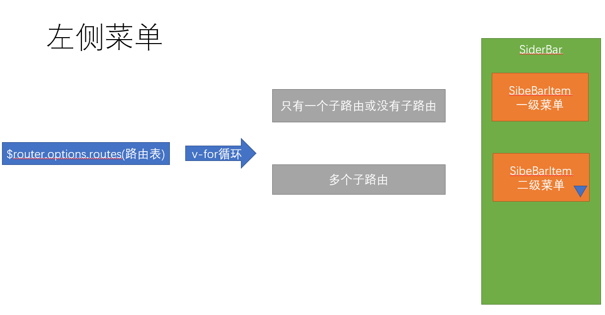

  
  
  

由于，该项目不需要二级菜单的显示，所以对代码进行一下处理，只保留一级菜单路由

  

**`src/layout/components/Sidebar/SidebarItem.vue`**

  

```vue

<template>

<div v-if="!item.hidden">

<template v-if="hasOneShowingChild(item.children,item) && (!onlyOneChild.children||onlyOneChild.noShowingChildren)&&!item.alwaysShow">

<app-link v-if="onlyOneChild.meta" :to="resolvePath(onlyOneChild.path)">

<el-menu-item :index="resolvePath(onlyOneChild.path)" :class="{'submenu-title-noDropdown':!isNest}">

<item :icon="onlyOneChild.meta.icon||(item.meta&&item.meta.icon)" :title="onlyOneChild.meta.title" />

</el-menu-item>

</app-link>

</template>

<!-- <el-submenu v-else ref="subMenu" :index="resolvePath(item.path)" popper-append-to-body>

<template slot="title">

<item v-if="item.meta" :icon="item.meta && item.meta.icon" :title="item.meta.title" />

</template>

<sidebar-item

v-for="child in item.children"

:key="child.path"

:is-nest="true"

:item="child"

:base-path="resolvePath(child.path)"

class="nest-menu"

/>

</el-submenu> -->

</div>

</template>

```

  

**`本节注意`**：通过代码发现，当路由中的属性**`hidden`**为true时，表示该路由不显示在左侧菜单中

  

> 与此同时，我们发现左侧菜单并不协调，是因为缺少图标。在本项目中，我们的图标采用了SVG的组件

  

左侧菜单的图标实际上读取的是meta属性的icon，这个icon需要我们提前放置在**`src/icons/svg`**目录下

  

> 该资源已经在菜单svg目录中提供，请将该目录下的所有svg放到**`src/icons/svg`**目录下

  

具体的icon名称可参考[线上地址](https://panjiachen.github.io/vue-element-admin/#/icon/index)

  
  
  

functional为true，表示该组件为一个函数式组件

  

函数式组件： 没有data状态，没有响应式数据，只会接收props属性， 没有this， 他就是一个函数

  

**模块对应icon**

  

```bash

├── dashboard # dashboard

├── departments # tree

├── employees # people

├── setting # setting

├── salarys # money

├── social # table

├── attendances # skill

├── approvals # tree-table

├── permission # lock

```

  


  

按照对应的icon设置图标

  

**`本节任务：`** 理解左侧菜单的生成逻辑，并设置左侧菜单的图标
# 组织架构
## 组织架构树形结构布局


**`目标`**：使用element-UI组件布局组织架构的基本布局

### 认识组织架构

[组织架构产品prd]([http://czpm.itcast.cn/ihrm/#g=1&p=%E7%BB%84%E7%BB%87%E6%9E%B6%E6%9E%84](http://czpm.itcast.cn/ihrm/#g=1&p=组织架构))

  

> 一个企业的组织架构是该企业的灵魂，组织架构多常采用树形金字塔式结构，本章节，我们布局出页面的基本结构


  

### 实现组织架构的头部内容


首先实现头部的结构，采用element的**行列布局**


```vue

<el-card class="tree-card">

<!-- 用了一个行列布局 -->

<el-row type="flex" justify="space-between" align="middle" style="height: 40px">

<el-col>

<span>江苏传智播客教育科技股份有限公司</span>

</el-col>

<el-col :span="4">

<el-row type="flex" justify="end">

<!-- 两个内容 -->

<el-col>负责人</el-col>

<el-col>

<!-- 下拉菜单 element -->

<el-dropdown>

<span>

操作<i class="el-icon-arrow-down" />

</span>

<!-- 下拉菜单 -->

<el-dropdown-menu slot="dropdown">

<el-dropdown-item>添加子部门</el-dropdown-item>

</el-dropdown-menu>

</el-dropdown>

</el-col>

</el-row>

</el-col>

</el-row>

</el-card>

```

  

**样式**

  

```css

<style scoped>

.tree-card {

padding: 30px 140px;

font-size:14px;

}

</style>

  

```

  


  

### 树形组件认识

  

接下来，实现树形的结构，采用element的**[tree组件](https://element.eleme.cn/#/zh-CN/component/tree)**， 如图效果

  


  

> 树形组件属性

  

| 参数 | 说明 | 类型 | 可选值 | 默认值 |

| :----------------- | :--------------------------------------------------- | :------ | :----- | :----- |

| default-expand-all | 是否默认展开所有节点 | boolean | — | — |

| data | 展示数据 | array | — | — |

| node-key | 每个树节点用来作为唯一标识的属性，整棵树应该是唯一的 | String | — | — |

| props | 配置选项，具体看下表 | object | — | — |

  

**props属性**

  

| 参数 | 说明 | 类型 | 可选值 | 默认值 |

| :------- | :------------------------------------------------------- | :---------------------------- | :----- | :----- |

| label | 指定节点标签为节点对象的某个属性值 | string, function(data, node) | — | — |

| children | 指定子树为节点对象的某个属性值 | string | — | — |

| disabled | 指定节点选择框是否禁用为节点对象的某个属性值 | boolean, function(data, node) | — | — |

| isLeaf | 指定节点是否为叶子节点，仅在指定了 lazy 属性的情况下生效 | boolean, function(data, node) | — | — |

  

**data**是组成树形数据的关键，如下的数据便能构建树形数据

  

```json

[{

label: '一级 1',

children: [{

label: '二级 1-1',

children: [{

label: '三级 1-1-1'

}]

}]

}, {

label: '一级 2',

children: [{

label: '二级 2-1',

children: [{

label: '三级 2-1-1'

}]

}, {

label: '二级 2-2',

children: [{

label: '三级 2-2-1'

}]

}]

}, {

label: '一级 3',

children: [{

label: '二级 3-1',

children: [{

label: '三级 3-1-1'

}]

}, {

label: '二级 3-2',

children: [{

label: '三级 3-2-1'

}]

}]

}]

```

  


  

### 实现树形的静态组织架构

  

由此，我们首先实现静态数据的组织架构

  

```vue

<!--放置一个属性 这里的props和我们之前学习的父传子 的props没关系-->

<el-tree :data="departs" :props="defaultProps" />

export default {

data() {

return {

defaultProps: {

label: 'name'

},

departs: [{ name: '总裁办', children: [{ name: '董事会' }] },

{ name: '行政部' }, { name: '人事部' }]

}

}

}

```

  

> 接下来，对每个层级节点增加显示内容，此时需要用到tree的插槽

  

```vue

<el-tree :data="departs" :props="defaultProps" :default-expand-all="true">

<!-- 传入内容 插槽内容 会循环多次 有多少节点 就循环多少次 -->

<!-- 作用域插槽 slot-scope="obj" 接收传递给插槽的数据 data 每个节点的数据对象-->

<el-row slot-scope="{ data }" type="flex" justify="space-between" align="middle" style="height: 40px; width: 100%">

<el-col>

<!-- 左侧内容 -->

<span>{{ data.name }}</span>

</el-col>

<el-col :span="4">

<el-row type="flex" justify="end">

<el-col>{{ data.manager }}</el-col>

<el-col>

<!-- 放置下拉菜单 -->

<el-dropdown>

<!-- 内容 -->

<span>操作

<i class="el-icon-arrow-down" />

</span>

<!-- 具名插槽 -->

<el-dropdown-menu slot="dropdown">

<!-- 下拉选项 -->

<el-dropdown-item>添加子部门</el-dropdown-item>

<el-dropdown-item>编辑部门</el-dropdown-item>

<el-dropdown-item>删除部门</el-dropdown-item>

  

</el-dropdown-menu>

</el-dropdown>

</el-col>

</el-row>

  

<!-- 右侧内容 -->

</el-col>

</el-row> </el-tree>

<script>

export default {

data() {

return {

departs: [{ name: '总裁办', manager: '曹操', children: [{ name: '董事会', manager: '曹丕' }] },

{ name: '行政部', manager: '刘备' },

{ name: '人事部', manager: '孙权' }],

defaultProps: {

label: 'name' // 表示 从这个属性显示内容

}

}

}

}

</script>

```

  

最终形成静态结构效果

  


  

**提交代码**

  

**`本节任务`**：完成树形结构的显示

  

## 将树形的操作内容单独抽提成组件

**`目标`**： 将树形的操作内容单独抽提成组件

  

### 封装单独的树操作栏组件

  

> 通过第一个章节，我们发现，树形的顶级内容实际和子节点的内容是一致的，此时可以将该部分抽提成一个组件，节省代码

  

组件 **`src/views/departments/components/tree-tools.vue`**

  

```vue

<template>

<el-row type="flex" justify="space-between" align="middle" style="height: 40px;width: 100%">

<el-col>

<!-- 名称应该变成 对应的节点中的name -->

<span>{{ treeNode.name }}</span>

</el-col>

<el-col :span="4">

<el-row type="flex" justify="end">

<!-- 两个内容 -->

<el-col>{{ treeNode.manager }}</el-col>

<el-col>

<!-- 下拉菜单 element -->

<el-dropdown>

<span>

操作<i class="el-icon-arrow-down" />

</span>

<!-- 下拉菜单 -->

<el-dropdown-menu slot="dropdown">

<el-dropdown-item>添加子部门</el-dropdown-item>

<el-dropdown-item>编辑部门</el-dropdown-item>

<el-dropdown-item>删除部门</el-dropdown-item>

</el-dropdown-menu>

</el-dropdown>

</el-col>

</el-row>

</el-col>

</el-row>

</template>

  

<script>

// 该组件需要对外开放属性 外部需要提供一个对象 对象里需要有name manager

export default {

// props可以用数组来接收数据 也可以用对象来接收

// props: { props属性: { 配置选项 } }

props: {

// 定义一个props属性

treeNode: {

type: Object, // 对象类型

required: true // 要求对方使用您的组件的时候 必须传treeNode属性 如果不传 就会报错

}

}

}

</script>

  
  

```

  

### 在组织架构中应用操作栏组件

  

接下来，在**`src/views/departments/index.vue`**进行代码的简化

  

```vue

<template>

<div class="dashboard-container">

<div class="app-container">

<!-- 实现页面的基本布局 -->

<el-card class="tree-card">

<!-- 用了一个行列布局 -->

<!-- 缺少treeNode -->

<tree-tools :tree-node="company" />

<!--放置一个属性 这里的props和我们之前学习的父传子 的props没关系-->

<el-tree :data="departs" :props="defaultProps" default-expand-all>

<!-- 说明el-tree里面的这个内容 就是插槽内容 => 填坑内容 => 有多少个节点循环多少次 -->

<!-- scope-scope 是 tree组件传给每个节点的插槽的内容的数据 -->

<!-- 顺序一定是 执行slot-scope的赋值 才去执行 props的传值 -->

<tree-tools slot-scope="{ data }" :tree-node="data" />

</el-tree>

</el-card>

</div>

</div>

</template>

  

```

  

上面代码中，company变量需要在data中定义

  

```js

company: { name: '江苏传智播客教育科技股份有限公司', manager: '负责人' },

```

  

同时，由于在两个位置都使用了该组件，但是放置在最上层的组件是不需要显示 **`删除部门`**和**`编辑部门`**的

  

所以，增加一个新的属性 **`isRoot（是否根节点）`**进行控制

  

```js

props: {

treeNode: {

required: true, // 设置当前数据为必填

type: Object // 类型是Object

},

isRoot: {

type: Boolean,

default: false

}

}

<tree-tools :tree-node="company" :is-root="true" />

```

  

组件中， 根据isRoot判断显示

  

```vue

<!-- 编辑部门和删除部门只会在子节点上显示 -->

<el-dropdown-item v-if="!isRoot">编辑部门</el-dropdown-item>

<el-dropdown-item v-if="!isRoot">删除部门</el-dropdown-item>

```

  

> 通过封装，代码看上去更加紧凑，简洁，这就是封装的魅力

  

**提交代码**

  

**`本节任务`**：将树形内容单独抽提组件

  

## 获取组织架构数据，并进行树形处理

  

**`目标`**获取真实的组织架构数据，并将其转化成树形数据显示在页面上

  

### 封装API接口，获取组织架构数据

  

> 现在基本的静态结构已经形成，接下来需要获取真实的数据

  

首先，**封装获取组织架构的请求** **`src/api/departments.js`**

  

```js

/** *

*

* 获取组织架构数据

* **/

export function getDepartments() {

return request({

url: '/company/department'

})

}

  

```

  

在钩子函数中调用接口

  

```js

import TreeTools from './components/tree-tools'

import { getDepartments } from '@/api/departments'

export default {

components: {

TreeTools

},

data() {

return {

company: { }, // 就是头部的数据结构

departs: [],

defaultProps: {

label: 'name' // 表示 从这个属性显示内容

}

}

},

created() {

this.getDepartments() // 调用自身的方法

},

methods: {

async getDepartments() {

const result = await getDepartments()

this.company = { name: result.companyName, manager: '负责人' }

this.departs = result.depts // 需要将其转化成树形结构

console.log(result)

}

}

}

```

  

### 将数组数据转化成树形结构

  

然后，我们需要将列表型的数据，转化成树形数据，这里需要用到**递归算法**

  

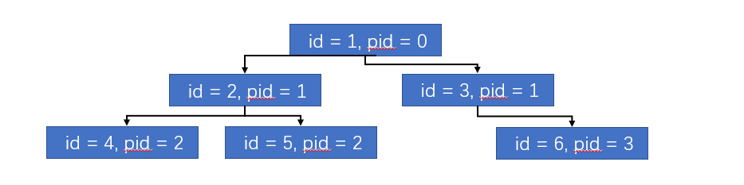

  

封装一个工具方法，**`src/utils/index.js`**

  

```js

/** *

*

* 将列表型的数据转化成树形数据 => 递归算法 => 自身调用自身 => 一定条件不能一样， 否则就会死循环

* 遍历树形 有一个重点 要先找一个头儿

* ***/

export function tranListToTreeData(list, rootValue) {

var arr = []

list.forEach(item => {

if (item.pid === rootValue) {

// 找到之后 就要去找 item 下面有没有子节点

const children = tranListToTreeData(list, item.id)

if (children.length) {

// 如果children的长度大于0 说明找到了子节点

item.children = children

}

arr.push(item) // 将内容加入到数组中

}

})

return arr

}

```

  

调用转化方法，转化树形结构

  

```js

this.company = { name: result.companyName, manager: '负责人' } // 这里定义一个空串 因为 它是根 所有的子节点的数据pid 都是 ""

this.departs = transListToTreeData(result.depts, '')

```

  

这样一来，树形数据就有了，下一章节，就可以针对部门进行操作

  

**提交代码**

  

**`本节任务`** 获取组织架构数据，并进行树形处理

  

## 删除部门功能实现

  

**`目标`**实现操作功能的删除功能

  

### 封装删除接口，注册下拉菜单事件

  

首先，封装删除功能模块 **`src/api/departments.js`**

  

```js

/** *

* 根据id根据部门 接口是根据restful的规则设计的 删除 delete 新增 post 修改put 获取 get

* **/

export function delDepartments(id) {

return request({

url: `/company/department/${id}`,

method: 'delete'

})

}

```

  

然后，在tree-tools组件中，监听下拉菜单的点击事件 **`src/views/departments/index.vue`**

  

```vue

<el-dropdown @command="operateDepts">

<span>

操作<i class="el-icon-arrow-down" />

</span>

<!-- 下拉菜单 -->

<el-dropdown-menu slot="dropdown">

<el-dropdown-item command="add">添加子部门</el-dropdown-item>

<!-- 编辑部门和删除部门只会在子节点上显示 -->

<el-dropdown-item v-if="!isRoot" command="edit">编辑部门</el-dropdown-item>

<el-dropdown-item v-if="!isRoot" command="del">删除部门</el-dropdown-item>

</el-dropdown-menu>

</el-dropdown>

```

  

>dropdown下拉菜单的监听事件command

  

```js

// 操作节点调用的方法

operateDepts(type) {

if (type === 'add') {

// 添加子部门的操作

} else if (type === 'edit') {

// 编辑部门的操作

} else {

// 删除操作

}

}

```

  

### 调用删除接口，通知父组件更新数据

  

> 删除之前，提示用户是否删除，然后调用删除接口

  

```js

// 操作节点调用的方法

operateDepts(type) {

if (type === 'add') {

// 添加子部门的操作

} else if (type === 'edit') {

// 编辑部门的操作

} else {

// 删除操作

this.$confirm('确定要删除该部门吗').then(() => {

// 如果点击了确定就会进入then

return delDepartments(this.treeNode.id) // 返回promise对象

}).then(() => {

// 如果删除成功了 就会进入这里

})

}

}

```

  

> 上面代码中，我们已经成功删除了员工数据，但是怎么通知父组件进行更新呢

  

在前面的课程中，我们已经学习过可以通过自定义事件**`this.$emit`**的方式来进行

  

```js

// 如果删除成功了 就会进入这里

this.$emit('delDepts') // 触发自定义事件

this.$message.success('删除部门成功')

```

  

父组件监听事件 **`src/views/department/index.vue`**

  

```vue

<tree-tools slot-scope="obj" :tree-node="obj.data" @delDepts="getDepartments" />

```

  

**提交代码**

  

**`本节任务`**：删除部门功能实现

  

## 新增部门功能-建立组件

  

**`目标`**：实现新增部门功能的组件建立

  

### 封装新增接口，新建组件中的弹层结构

  

首先， 封装新增部门的api模块 **`src/api/departments.js`**

  

```js

/**

* 新增部门接口

*

* ****/

export function addDepartments(data) {

return request({

url: '/company/department',

method: 'post',

data

})

}

  

```

  

然后，我们需要构建一个新增部门的窗体组件 **`src/views/department/components/add-dept.vue`**

  

其中的交互设计如下

  

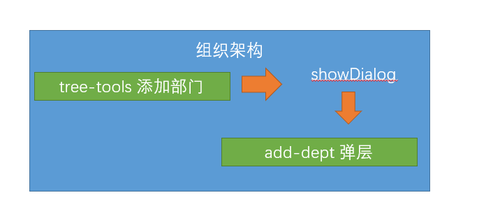

  

[设计要求]([http://czpm.itcast.cn/ihrm/#g=1&p=%E7%BB%84%E7%BB%87%E6%9E%B6%E6%9E%84](http://czpm.itcast.cn/ihrm/#g=1&p=组织架构))

  

```vue

<template>

<!-- 新增部门的弹层 -->

<el-dialog title="新增部门">

<!-- 表单组件 el-form label-width设置label的宽度 -->

<!-- 匿名插槽 -->

<el-form label-width="120px">

<el-form-item label="部门名称">

<el-input style="width:80%" placeholder="1-50个字符" />

</el-form-item>

<el-form-item label="部门编码">

<el-input style="width:80%" placeholder="1-50个字符" />

</el-form-item>

<el-form-item label="部门负责人">

<el-select style="width:80%" placeholder="请选择" />

</el-form-item>

<el-form-item label="部门介绍">

<el-input style="width:80%" placeholder="1-300个字符" type="textarea" :rows="3" />

</el-form-item>

</el-form>

<!-- el-dialog有专门放置底部操作栏的 插槽 具名插槽 -->

<el-row slot="footer" type="flex" justify="center">

<!-- 列被分为24 -->

<el-col :span="6">

<el-button type="primary" size="small">确定</el-button>

<el-button size="small">取消</el-button>

</el-col>

</el-row>

</el-dialog>

</template>

```

  

### 点击新增子部门显示弹层组件

  

然后，我们需要用属性控制组件的显示或者隐藏

  

```js

// 需要传入一个props变量来控制 显示或者隐藏

props: {

showDialog: {

type: Boolean,

default: false

}

}

```

  

```vue

<el-dialog title="新增部门" :visible="showDialog">

```

  

在**`departments/index.vue`** 中引入该组件

  

```js

import AddDept from './components/add-dept' // 引入新增部门组件

export default {

components: { AddDept }

}

```

  

定义控制窗体显示的变量**`showDialog`**

  

```js

data() {

return {

showDialog: false // 显示窗体

}

},

<!-- 放置新增弹层组件 -->

<add-dept :show-dialog="showDialog" />

```

  

当点击新增部门时，弹出组件

  

> 注意，点击新增时tree-tools组件，所以这里，我们依然需要子组件调用父组件

  

**子组件触发新增事件**· **`src/views/departments/tree-tools.vue`**

  

```js

if (type === 'add') {

// 添加子部门的操作

// 告诉父组件 显示弹层

this.$emit('addDepts', this.treeNode) // 为何传出treeNode 因为是添加子部门 需要当前部门的数据

}

```

  

**父组件监听事件**

  

```vue

<tree-tools slot-scope="obj" :tree-node="obj.data" @delDepts="getDepartments" @addDepts="addDepts" />

  

```

  

**方法中弹出层,记录在哪个节点下添加子部门**

  

```js

addDepts(node) {

this.showDialog = true // 显示弹层

// 因为node是当前的点击的部门， 此时这个部门应该记录下来,

this.node = node

}

```

  

**提交代码**

  


  

**`本节任务`**：新增部门功能-建立组件

  

## 完成新增部门的规则校验

  

**`目标`** 完成新增部门功能的规则校验和数据提交部分

  

### 完成新增表单的基本校验条件

  

部门名称（name）：必填 1-50个字符 / 同级部门中禁止出现重复部门

  

部门编码（code）：必填 1-50个字符 / 部门编码在整个模块中都不允许重复

  

部门负责人（manager）：必填

  

部门介绍 ( introduce)：必填 1-300个字符

  

> 定义数据结构

  

```js

formData: {

name: '', // 部门名称

code: '', // 部门编码

manager: '', // 部门管理者

introduce: '' // 部门介绍

},

```

  

> 完成表单校验需要的前置条件

   

* el-form配置model和rules属性

* el-form-item配置prop属性

* 表单进行v-model双向绑定

  

### 配置新增表单的基本校验规则

  

> 根据这些要求，校验规则

  

```js

data() {

return {

// 定义表单数据

formData: {

name: '', // 部门名称

code: '', // 部门编码

manager: '', // 部门管理者

introduce: '' // 部门介绍

},

// 定义校验规则

rules: {

name: [{ required: true, message: '部门名称不能为空', trigger: 'blur' },

{ min: 1, max: 50, message: '部门名称要求1-50个字符', trigger: 'blur' }],

code: [{ required: true, message: '部门编码不能为空', trigger: 'blur' },

{ min: 1, max: 50, message: '部门编码要求1-50个字符', trigger: 'blur' }],

manager: [{ required: true, message: '部门负责人不能为空', trigger: 'blur' }],

introduce: [{ required: true, message: '部门介绍不能为空', trigger: 'blur' },

{ trigger: 'blur', min: 1, max: 300, message: '部门介绍要求1-50个字符' }]

}

}

}

```

  

### 部门名称和部门编码的自定义校验

  

**`注意`**：部门名称和部门编码的规则 有两条我们需要通过**`自定义校验函数validator`**来实现

  

> 首先，在校验名称和编码时，要获取最新的组织架构，这也是我们这里trigger采用blur的原因，因为change对于访问的频率过高，我们需要控制访问频率

  

```js

// 首先获取最新的组织架构数据

const { depts } = await getDepartments()

```

  

> 部门名称不能和**`同级别`**的重复，这里注意，我们需要找到所有同级别的数据，进行校验，所以还需要另一个参数pid

  

```js

props: {

// 用来控制窗体是否显示或者隐藏

showDialog: {

type: Boolean,

default: false

},

// 当前操作的节点

treeNode: {

type: Object,

default: null

}

},

<add-dept :show-dialog="showDialog" :tree-node="node" />

```

  

根据当前部门id，找到所有子部门相关的数据，判断是否重复

  

```js

// 现在定义一个函数 这个函数的目的是 去找 同级部门下 是否有重复的部门名称

const checkNameRepeat = async(rule, value, callback) => {

// 先要获取最新的组织架构数据

const { depts } = await getDepartments()

// depts是所有的部门数据

// 如何去找技术部所有的子节点

const isRepeat = depts.filter(item => item.pid === this.treeNode.id).some(item => item.name === value)

isRepeat ? callback(new Error(`同级部门下已经有${value}的部门了`)) : callback()

}

```

  

检查部门编码的过程同理

  

```js

// 检查编码重复

const checkCodeRepeat = async(rule, value, callback) => {

// 先要获取最新的组织架构数据

const { depts } = await getDepartments()

const isRepeat = depts.some(item => item.code === value && value) // 这里加一个 value不为空 因为我们的部门有可能没有code

isRepeat ? callback(new Error(`组织架构中已经有部门使用${value}编码`)) : callback()

}

```

  

在规则中定义

  

```json

// 定义校验规则

rules: {

name: [{ required: true, message: '部门名称不能为空', trigger: 'blur' },

{ min: 1, max: 50, message: '部门名称要求1-50个字符', trigger: 'blur' }, {

trigger: 'blur',

validator: checkNameRepeat // 自定义函数的形式校验

}],

code: [{ required: true, message: '部门编码不能为空', trigger: 'blur' },

{ min: 1, max: 50, message: '部门编码要求1-50个字符', trigger: 'blur' }, {

trigger: 'blur',

validator: checkCodeRepeat

}],

manager: [{ required: true, message: '部门负责人不能为空', trigger: 'blur' }],

introduce: [{ required: true, message: '部门介绍不能为空', trigger: 'blur' },

{ trigger: 'blur', min: 1, max: 300, message: '部门介绍要求1-50个字符' }]

}

```

  

### 处理首部内容的pid数据

  

**`需要注意`**：在最根级的**`tree-tools`**组件中，由于treenode属性中没有id，id便是undefined，但是通过undefined进行等值判断是寻找不到对应的根节点的， 所以在传值时，我们将id属性设置为 **`“”`**

  

**`src/views/departments/index.vue`**

  

```js

async getDepartments() {

const result = await getDepartments()

this.departs = transListToTreeData(result.depts, '')

this.company = { name: result.companyName, manager: '负责人', id: '' }

},

```

  

**提交代码**

  

**`本节任务`**：完成新增部门的规则校验

  

## 新增部门功能-部门负责人数据

  

**`目标`**：获取新增表单中的部门负责人下拉数据

  

> 在上节的表单中，部门负责人是下拉数据，我们应该从**`员工接口`**中获取该数据

  

首先，封装获取简单员工列表的模块 **`src/api/employees.js`**

  

```js

import request from '@/utils/request'

  

/**

* 获取员工的简单列表

* **/

export function getEmployeeSimple() {

return request({

url: '/sys/user/simple'

})

}

  

```

  

然后，在**`add-dept.vue`**中的select聚焦事件**`focus`**中调用该接口，因为我们要获取实时的最新数据

  

```vue

<el-select v-model="formData.manager" style="width:80%" placeholder="请选择" @focus="getEmployeeSimple">

<!-- 需要循环生成选项 这里做一下简单的处理 显示的是用户名 存的也是用户名-->

<el-option v-for="item in peoples" :key="item.id" :label="item.username" :value="item.username" />

</el-select>

```

  

获取员工列表

  

```js

import { getEmployeeSimple } from '@/api/employees'

methods: {

// 获取员工简单列表数据

async getEmployeeSimple() {

this.peoples = await getEmployeeSimple()

}

}

peoples: [] // 接收获取的员工简单列表的数据

  

```

  

**提交代码**

  

**`本节任务`**：新增部门功能-部门负责人数据

  

## 新增功能-提交-取消-关闭

  

**`目标`**： 完成新增模块的提交-取消-关闭等功能

  

### 校验通过，调用新增接口

  

> 当点击新增页面的确定按钮时，我们需要完成对表单的整体校验，如果校验成功，进行提交

  

首先，在点击确定时，校验表单

  

**给el-form定义一个ref属性**

  

```vue

<el-form ref="deptForm" :model="formData" :rules="rules" label-width="120px">

```

  

```js

// 点击确定时触发

btnOK() {

this.$refs.deptForm.validate(isOK => {

if (isOK) {

// 表示可以提交了

}

})

}

```

  

然后，在校验通过时，调用新增接口

  

> 因为是添加子部门，所以我们需要将新增的部门pid设置成当前部门的id，新增的部门就成了自己的子部门

  

```js

// 点击确定时触发

btnOK() {

this.$refs.deptForm.validate(async isOK => {

if (isOK) {

// 表示可以提交了

await addDepartments({ ...this.formData, pid: this.treeNode.id }) // 调用新增接口 添加父部门的id

}

})

}

```

  

同样，在新增成功之后，调用告诉父组件，重新拉取数据

  

```js

this.$emit('addDepts')

```

  

父组件

  

```vue

<add-dept :show-dialog="showDialog" :tree-node="node" @addDepts="getDepartments" />

  

```

  

**`本节注意`**：同学们可能会疑惑，我们**`tree-tools.vue`** 和**`add-dept.vue`**两个组件都触发了addDepts事件，不冲突吗？

  

这里，我们触发的自定义事件都是组件自身的，他们之间没有任何关系，只是名字相同而已，大家不要混淆

  

### 利用sync修饰符关闭新增弹层

  

> 这里我们学习一个新的技巧，**`sync修饰符`**

  

按照常规，想要让父组件更新**`showDialog`**的话，需要这样做

  

```js

// 子组件

this.$emit('changedialog', false) //触发事件

// 父组件

<child @changedialog="method" :showDialog="showDialog" />

method(value) {

this.showDialog = value

}

```

  

> 但是，vuejs为我们提供了**`sync修饰符`**，它提供了一种简写模式 也就是

  

```js

// 子组件 update:固定写法 (update:props名称, 值)

this.$emit('update:showDialog', false) //触发事件

// 父组件 sync修饰符

<child :showDialog.sync="showDialog" />

  

```

  

只要用sync修饰，就可以省略父组件的监听和方法，直接将值赋值给showDialog

  

**取消按钮和关闭**

  

```js

// 点击确定时触发

btnOK() {

this.$refs.deptForm.validate(async isOK => {

if (isOK) {

// 表示可以提交了

await addDepartments({ ...this.formData, pid: this.treeNode.id }) // 调用新增接口 添加父部门的id

this.$emit('addDepts') // 告诉父组件 新增数据成功 重新拉取数据

// update:props名称

this.$emit('update:showDialog', false)

}

})

}

```

  

### 取消时重置数据和校验

  

```js

btnCancel() {

this.$refs.deptForm.resetFields() // 重置校验字段

this.$emit('update:showDialog', false) // 关闭

}

```

  

需要在el-dialog中监听其close事件

  

```vue

<el-dialog title="新增部门" :visible="showDialog" @close="btnCancel">

```

  

**`本节任务`** 新增功能-提交-取消-关闭

  

## 编辑部门功能实现数据回写

  

**`目标`**：实现编辑部门的功能

  

### 点击编辑弹出层，记录当前节点

  

> 编辑部门功能实际上和新增窗体采用的是一个组件，只不过我们需要将新增场景变成编辑场景

  

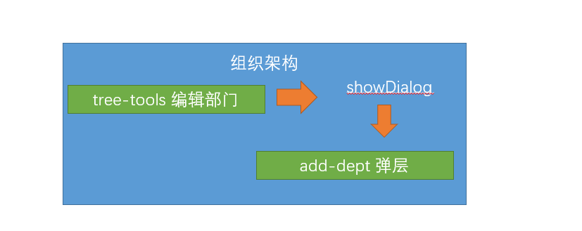

  

首先点击编辑部门时， 调用**父组件编辑方法** **`tree-tools.vue`**

  

```js

this.$emit('editDepts', this.treeNode)

```

  

**父组件弹层，赋值当前编辑节点**

  

```vue

<tree-tools slot-scope="obj" :tree-node="obj.data" @delDepts="getDepartments" @editDepts="editDepts" />

  

// 编辑部门节点

editDepts(node) {

// 首先打开弹层

this.showDialog = true

this.node = node // 赋值操作的节点

}

```

  

### 父组件调用子组件的获取详情方法

  

> 编辑时，我们需要获取点击部门的信息

  

**封装获取部门信息的模块** **`src/api/departments.js`**

  

```js

/** *

* 获取部门详情

* ***/

export function getDepartDetail(id) {

return request({

url: `/company/department/${id}`

})

}

  

```

  

> 在什么时候获取部门详情?

  

我们可以在调用**编辑方法** **`editDepts`**中通过**`ref`**调用**`add-dept.vue`**的实例方法

  

```js

// 获取部门详情

async getDepartDetail(id) {

this.formData = await getDepartDetail(id)

}

```

  

```js

// 点击编辑触发的父组件的方法

editDepts(node) {

this.showDialog = true // 显示新增组件弹层

this.node = node // 存储传递过来的node数据

// 我们需要在这个位置 调用子组件的方法

// 父组件 调用子组件的方法

this.$refs.addDept.getDepartDetail(node.id) // 直接调用子组件中的方法 传入一个id

}

```

  

### 根据计算属性显示控制标题

  

> 需要根据当前的场景区分显示的标题

  

计算属性

  

> 如何判断新增还是编辑

  

```js

computed: {

showTitle() {

return this.formData.id ? '编辑部门' : '新增子部门'

}

},

```

  

同时发现，el-form中的resetFields不能重置非表单中的数据，所以在取消的位置需要强制加上 重置数据

  

```js

btnCancel() {

// 重置数据 因为resetFields 只能重置 表单上的数据 非表单上的 比如 编辑中id 不能重置

this.formData = {

name: '',

code: '',

manager: '',

introduce: ''

}

// 关闭弹层

this.$emit('update:showDialog', false)

// 清除之前的校验 可以重置数据 只能重置 定义在data中的数据

this.$refs.deptForm.resetFields()

}

```

  
  
  

## 同时支持编辑和新增场景

  

### 封装编辑接口，保存区分场景

  

> 接下来，需要在点击确定时，同时支持新增部门和编辑部门两个场景，我们可以根据formData是否有id进行区分

  

**封装编辑部门接口** **`src/api/departments.js`**

  

```js

/**

* 编辑部门

*

* ***/

export function updateDepartments(data) {

return request({

url: `/company/department/${data.id}`,

method: 'put',

data

})

}

```

  

> 点击确定时，进行场景区分

  

```js

// 点击确定时触发

btnOK() {

this.$refs.deptForm.validate(async isOK => {

if (isOK) {

// 要分清楚现在是编辑还是新增

if (this.formData.id) {

// 编辑模式 调用编辑接口

await updateDepartments(this.formData)

} else {

// 新增模式

await addDepartments({ ...this.formData, pid: this.treeNode.id }) // 调用新增接口 添加父部门的id

}

// 表示可以提交了

this.$emit('addDepts') // 告诉父组件 新增数据成功 重新拉取数据

// update:props名称

this.$emit('update:showDialog', false)

}

})

},

```

  

### 校验规则支持编辑场景下的校验

  

>除此之外，我们发现原来的校验规则实际和编辑部门有些冲突，所以需要进一步处理

  

```js

// 现在定义一个函数 这个函数的目的是 去找 同级部门下 是否有重复的部门名称

const checkNameRepeat = async(rule, value, callback) => {

// 先要获取最新的组织架构数据

const { depts } = await getDepartments()

// 检查重复规则 需要支持两种 新增模式 / 编辑模式

// depts是所有的部门数据

// 如何去找技术部所有的子节点

let isRepeat = false

if (this.formData.id) {

// 有id就是编辑模式

// 编辑 张三 => 校验规则 除了我之外 同级部门下 不能有叫张三的

isRepeat = depts.filter(item => item.id !== this.formData.id && item.pid === this.treeNode.pid).some(item => item.name === value)

} else {

// 没id就是新增模式

isRepeat = depts.filter(item => item.pid === this.treeNode.id).some(item => item.name === value)

}

  

isRepeat ? callback(new Error(`同级部门下已经有${value}的部门了`)) : callback()

}

// 检查编码重复

const checkCodeRepeat = async(rule, value, callback) => {

// 先要获取最新的组织架构数据

// 检查重复规则 需要支持两种 新增模式 / 编辑模式

const { depts } = await getDepartments()

let isRepeat = false

if (this.formData.id) {

// 编辑模式 因为编辑模式下 不能算自己

isRepeat = depts.some(item => item.id !== this.formData.id && item.code === value && value)

} else {

// 新增模式

isRepeat = depts.some(item => item.code === value && value) // 这里加一个 value不为空 因为我们的部门有可能没有code

}

  

isRepeat ? callback(new Error(`组织架构中已经有部门使用${value}编码`)) : callback()

}

```

  

>至此，整个组织架构， 我们完成了，组织架构读取 / 新增部门 / 删除部门 / 编辑部门

  

如图

  


  

**提交代码**

  

**`本节任务`**编辑部门功能实现

  

## 给数据获取添加加载进度条

  

**`目标`** 给当前组织架构添加加载进度条

  

由于获取数据的延迟性，为了更好的体验，可以给页面增加一个Loading进度条，采用element的指令解决方案即可

  

**定义loading变量**

  

```js

loading: false // 用来控制进度弹层的显示和隐藏

```

  

**赋值变量给指令**

  

```vue

<div v-loading="loading" class="dashboard-container">

```

  

**获取方法前后设置变量**

  

```js

async getDepartments() {

this.loading = true

const result = await getDepartments()

this.departs = transListToTreeData(result.depts, '')

this.company = { name: result.companyName, manager: '负责人', id: '' }

this.loading = false

}

```
# 公司和角色
## 建立公司角色页面的基本结构

  

**`目标`**建立公司页面的基本结构

  


  


  

根据以上的结构，我们采用element-ui的组件实现

  

**`src/views/setting/index.vue`**

  

```vue

<template>

<div class="dashboard-container">

<div class="app-container">

<el-card>

<el-tabs>

<!-- 放置页签 -->

<el-tab-pane label="角色管理">

<!-- 新增角色按钮 -->

<el-row style="height:60px">

<el-button

icon="el-icon-plus"

size="small"

type="primary"

>新增角色</el-button>

</el-row>

<!-- 表格 -->

<el-table border="">

<el-table-column label="序号" width="120" />

<el-table-column label="角色名称" width="240" />

<el-table-column label="描述" />

<el-table-column label="操作">

<el-button size="small" type="success">分配权限</el-button>

<el-button size="small" type="primary">编辑</el-button>

<el-button size="small" type="danger">删除</el-button>

</el-table-column>

</el-table>

<!-- 分页组件 -->

<el-row type="flex" justify="center" align="middle" style="height: 60px">

<!-- 分页组件 -->

<el-pagination layout="prev,pager,next" />

</el-row>

</el-tab-pane>

<el-tab-pane label="公司信息">

<el-alert

title="对公司名称、公司地址、营业执照、公司地区的更新，将使得公司资料被重新审核，请谨慎修改"

type="info"

show-icon

:closable="false"

/>

<el-form label-width="120px" style="margin-top:50px">

<el-form-item label="公司名称">

<el-input disabled style="width:400px" />

</el-form-item>

<el-form-item label="公司地址">

<el-input disabled style="width:400px" />

</el-form-item>

<el-form-item label="邮箱">

<el-input disabled style="width:400px" />

</el-form-item>

<el-form-item label="备注">

<el-input type="textarea" :rows="3" disabled style="width:400px" />

</el-form-item>

</el-form>

</el-tab-pane>

  

</el-tabs>

</el-card>

</div>

</div>

</template>

```

  

**提交代码**

  

**`本节任务`**建立公司页面的基本结构

  

## 读取公司角色信息

  

**`目标`**： 封装公司角色请求，读取公司角色信息

  

### 读取角色列表数据

  

首先，封装读取角色的信息的请求 **`src/api/setting.js`**

  

```js

/**

* 获取角色列表

* ***/

export function getRoleList(params) {

return request({

url: '/sys/role',

params

})

}

```

  

> params是查询参数，里面需要携带分页信息

  

然后，在页面中调用接口获取数据，绑定表格数据 **`src/views/setting/index.vue`**

  

```js

import { getRoleList } from '@/api/setting'

export default {

data() {

return {

list: [], // 承接数组

page: {

// 放置页码及相关数据

page: 1,

pagesize: 10,

total: 0 // 记录总数

}

}

},

created() {

this.getRoleList() // 获取角色列表

},

methods: {

async getRoleList() {

const { total, rows } = await getRoleList(this.page)

this.page.total = total

this.list = rows

},

changePage(newPage) {

// newPage是当前点击的页码

this.page.page = newPage // 将当前页码赋值给当前的最新页码

this.getRoleList()

}

}

}

```

  

**绑定表格数据**

  

```vue

<el-table border="" :data="list">

<el-table-column align="center" type="index" label="序号" width="120" />

<el-table-column align="center" prop="name" label="名称" width="240" />

<el-table-column align="center" prop="description" label="描述" />

<el-table-column align="center" label="操作">

<el-button size="small" type="success">分配权限</el-button>

<el-button size="small" type="primary">编辑</el-button>

<el-button size="small" type="danger">删除</el-button>

</el-table-column>

  

</el-table>

```

  

**绑定分页数据**

  

```vue

<!-- 放置分页组件 -->

<el-row type="flex" justify="center" align="middle" style="height:60px">

<el-pagination

:current-page="page.page"

:page-size="page.pagesize"

:total="page.total"

layout="prev, pager, next"

@current-change="changePage"

/>

</el-row>

```

  

### 读取公司信息数据

  

> 第二个tab页，我们同样需要读取数据

  

封装读取公司信息的api **`src/api/setting.js`**

  

```js

/**

* 获取公司信息

* **/

export function getCompanyInfo(companyId) {

return request({

url: `/company/${companyId}`

})

}

```

  

**绑定公司表单数据**

  

```vue

<el-form label-width="120px" style="margin-top:50px">

<el-form-item label="公司名称">

<el-input v-model="formData.name" disabled style="width:400px" />

</el-form-item>

<el-form-item label="公司地址">

<el-input v-model="formData.companyAddress" disabled style="width:400px" />

</el-form-item>

<el-form-item label="邮箱">

<el-input v-model="formData.mailbox" disabled style="width:400px" />

</el-form-item>

<el-form-item label="备注">

<el-input v-model="formData.remarks" type="textarea" :rows="3" disabled style="width:400px" />

</el-form-item>

</el-form>

```

  

> 请求中的companyId来自哪里？它来自我们登录成功之后的用户资料，所以我们需要在该组件中使用vuex数据

  

**`src/store/getters.js`**

  

```vue

companyId: state => state.user.userInfo.companyId // 建立对于user模块的companyId的快捷访问

computed: {

...mapGetters(['companyId'])

},

```

  

**初始化时调用接口**

  

```js

// 获取的公司的信息

async getCompanyInfo() {

this.formData = await getCompanyInfo(this.companyId)

}

created() {

this.getRoleList() // 获取角色列表

this.getCompanyInfo()

},

```

  

**提交代码**

  

**`本节任务`**读取公司角色信息

  

## 删除角色功能

  

**`目标`** 实现删除角色的功能

  

**封装删除角色的api**

  

```js

/** **

* 删除角色

*

* ****/

export function deleteRole(id) {

return request({

url: `/sys/role/${id}`,

method: 'delete'

})

}

```

  

**删除功能实现**

  

```js

async deleteRole(id) {

// 提示

try {

await this.$confirm('确认删除该角色吗')

// 只有点击了确定 才能进入到下方

await deleteRole(id) // 调用删除接口

this.getRoleList() // 重新加载数据

this.$message.success('删除角色成功')

} catch (error) {

console.log(error)

}

}

```

  

**删除按钮注册事件**

  

```vue

<!-- 作用域插槽 -->

<template slot-scope="{ row }">

<el-button size="small" type="success">分配权限</el-button>

<el-button size="small" type="primary">编辑</el-button>

<el-button size="small" type="danger" @click="deleteRole(row.id)">删除</el-button>

</template>

```

  

**提交代码**

  

## 编辑角色功能

  

**`目标`**： 实现编辑角色的功能

  

### 封装编辑接口，新建编辑弹层

  

**封装编辑角色的功能api**

  

```js

/** *

* 修改角色

* ***/

export function updateRole(data) {

return request({

url: `/sys/role/${data.id}`,

data,

method: 'put'

})

}

/**

* 获取角色详情

* **/

export function getRoleDetail(id) {

return request({

url: `/sys/role/${id}`

})

}

```

  

**定义编辑弹层数据**

  

```js

showDialog: false,

// 专门接收新增或者编辑的编辑的表单数据

roleForm: {},

rules: {

name: [{ required: true, message: '角色名称不能为空', trigger: 'blur' }]

},

```

  

**编辑弹层结构**

  

```vue

<el-dialog title="编辑弹层" :visible="showDialog" @close="btnCancel">

<el-form ref="roleForm" :model="roleForm" :rules="rules" label-width="120px">

<el-form-item label="角色名称" prop="name">

<el-input v-model="roleForm.name" />

</el-form-item>

<el-form-item label="角色描述">

<el-input v-model="roleForm.description" />

</el-form-item>

</el-form>

<!-- 底部 -->

<el-row slot="footer" type="flex" justify="center">

<el-col :span="6">

<el-button size="small" @click="btnCancel">取消</el-button>

<el-button size="small" type="primary" @click="btnOK">确定</el-button>

</el-col>

</el-row>

</el-dialog>

```

  

### 实现编辑功能，为新增功能留口

  

**编辑功能实现（为新增功能留口）**

  

```js

async editRole(id) {

this.roleForm = await getRoleDetail(id)

this.showDialog = true // 为了不出现闪烁的问题 先获取数据 再弹出层

},

async btnOK() {

try {

await this.$refs.roleForm.validate()

// 只有校验通过的情况下 才会执行await的下方内容

// roleForm这个对象有id就是编辑 没有id就是新增

if (this.roleForm.id) {

await updateRole(this.roleForm)

} else {

// 新增业务

}

// 重新拉取数据

this.getRoleList()

this.$message.success('操作成功')

this.showDialog = false

} catch (error) {

console.log(error)

}

},

```

  

**编辑按钮注册事件**

  

```vue

<el-button size="small" type="primary" @click="editRole(row.id)">编辑</el-button>

```

  

**提交代码**

  

## 新增角色功能

  

**`目标`**实现新增角色功能

  

**封装新增角色功能api**

  

```js

  

/** *

* 新增角色

* ***/

export function addRole(data) {

return request({

url: '/sys/role',

data,

method: 'post'

})

}

  

```

  

**新增功能实现和编辑功能合并（处理关闭）**

  

```js

async btnOK() {

try {

await this.$refs.roleForm.validate()

// 只有校验通过的情况下 才会执行await的下方内容

// roleForm这个对象有id就是编辑 没有id就是新增

if (this.roleForm.id) {

await updateRole(this.roleForm)

} else {

// 新增业务

await addRole(this.roleForm)

}

// 重新拉取数据

this.getRoleList()

this.$message.success('操作成功')

this.showDialog = false // 关闭弹层 => 触发el-dialog的事件close事件

} catch (error) {

console.log(error)

}

},

btnCancel() {

this.roleForm = {

name: '',

description: ''

}

// 移除校验

this.$refs.roleForm.resetFields()

this.showDialog = false

}

```

  

**新增按钮注册事件**

  

```vue

<el-button type="primary" size="small" @click="showDialog = true">新增角色</el-button>

```

  

**提交代码**

  

**`本节任务`** 新增角色功能

  

## 总结

  


  

我们完成了公司中角色管理的部分，但是并没有完成分配权限的部分，该部门会在权限设计和管理的部门重点提及
# 员工管理
## 封装一个通用的工具栏

**`目标`**：封装一个通用的工具栏供大家使用

### 通用工具栏的组件结构

> 在后续的业务开发中，经常会用到一个类似下图的工具栏，作为公共组件，进行一下封装


组件 **`src/components/PageTools/index.vue`**

```vue
<template>
  <el-card class="page-tools">
    <el-row type="flex" justify="space-between" align="middle">
      <el-col>
        <div  v-if="showBefore" class="before">
          <i class="el-icon-info" />
          <!-- 定义前面得插槽 -->
          <slot name="before" />
        </div>
      </el-col>
      <el-col>
        <el-row type="flex" justify="end">
           <!-- 定义后面的插槽 -->
           <slot name="after" />
        </el-row>
      </el-col>
    </el-row>
  </el-card>
</template>

<script>
export default {
  props: {
    showBefore: {
      type: Boolean,
      default: false
    }

  }
}
</script>

<style lang='scss'>
 .page-tools {
    margin: 10px 0;
    .before {
      line-height: 34px;
    i {
      margin-right: 5px;
      color: #409eff;
    }
    display: inline-block;
    padding: 0px 10px;
    border-radius: 3px;
    border: 1px solid rgba(145, 213, 255, 1);
    background: rgba(230, 247, 255, 1);
  }
 }
</style>

```

### 组件统一注册

> 为了方便所有的页面都可以不用引用该组件，可以进行全局注册

提供注册入口 **`src/componets/index.js`**

```js
// 该文件负责所有的公共的组件的全局注册   Vue.use
import PageTools from './PageTools'
export default {
  install(Vue) {
    //  注册全局的通用栏组件对象
    Vue.component('PageTools', PageTools)
  }
}

```

> 在入口处进行注册 **`src/main.js`**

```js
import Component from '@/components'
Vue.use(Component) // 注册自己的插件
```

**提交代码**

**`本节任务`**： 封装一个通用的工具栏

## 员工列表页面的基本布局和结构

**`目标`**：实现员工列表页面的基本布局和结构

**结构代码** **`src/employees/index.vue`**

```vue
<template>
  <div class="dashboard-container">
    <div class="app-container">
      <page-tools :show-before="true">
        <span slot="before">共166条记录</span>
        <template slot="after">
          <el-button size="small" type="warning">导入</el-button>
          <el-button size="small" type="danger">导出</el-button>
          <el-button size="small" type="primary">新增员工</el-button>
        </template>
      </page-tools>
      <!-- 放置表格和分页 -->
      <el-card>
        <el-table border>
          <el-table-column label="序号" sortable="" />
          <el-table-column label="姓名" sortable="" />
          <el-table-column label="工号" sortable="" />
          <el-table-column label="聘用形式" sortable="" />
          <el-table-column label="部门" sortable="" />
          <el-table-column label="入职时间" sortable="" />
          <el-table-column label="账户状态" sortable="" />
          <el-table-column label="操作" sortable="" fixed="right" width="280">
            <template>
              <el-button type="text" size="small">查看</el-button>
              <el-button type="text" size="small">转正</el-button>
              <el-button type="text" size="small">调岗</el-button>
              <el-button type="text" size="small">离职</el-button>
              <el-button type="text" size="small">角色</el-button>
              <el-button type="text" size="small">删除</el-button>
            </template>
          </el-table-column>
        </el-table>
        <!-- 分页组件 --> 
        <el-row type="flex" justify="center" align="middle" style="height: 60px">
          <el-pagination layout="prev, pager, next" />
        </el-row>
      </el-card>
    </div>
  </div>
</template>
```

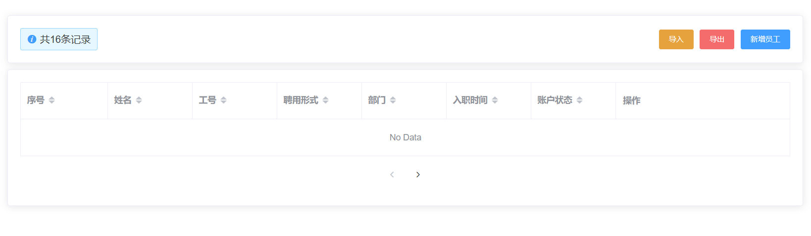

**提交代码**

**`本节任务`**：员工列表页面的基本布局和结构

## 员工列表数据请求和分页加载

**`目标`**实现员工数据的加载和分页请求

首先，封装员工的加载请求 **`src/api/employees.js`**

```js
/**
 * 获取员工的综合列表数据
 * ***/
export function getEmployeeList(params) {
  return request({
    url: '/sys/user',
    params
  })
}

```

然后，实现加载数据和分页的逻辑

```js
import { getEmployeeList } from '@/api/employees'
export default {
  data() {
    return {
      loading: false,
      list: [], // 接数据的
      page: {
        page: 1, // 当前页码
        size: 10,
        total: 0 // 总数
      }

    }
  },
  created() {
    this.getEmployeeList()
  },
  methods: {
    changePage(newPage) {
      this.page.page = newPage
      this.getEmployeeList()
    },
    async getEmployeeList() {
      this.loading = true
      const { total, rows } = await getEmployeeList(this.page)
      this.page.total = total
      this.list = rows
      this.loading = false
    }
  }
}
```

**绑定表格**

```vue
      <el-card v-loading="loading">
        <el-table border :data="list">
          <el-table-column label="序号" sortable="" type="index" />
          <el-table-column label="姓名" sortable="" prop="username" />
          <el-table-column label="工号" sortable="" prop="workNumber" />
          <el-table-column label="聘用形式" sortable="" prop="formOfEmployment" />
          <el-table-column label="部门" sortable="" prop="departmentName" />
          <el-table-column label="入职时间" sortable="" prop="timeOfEntry" />
          <el-table-column label="账户状态" sortable="" prop="enableState" />
          <el-table-column label="操作" sortable="" fixed="right" width="280">
            <template>
              <el-button type="text" size="small">查看</el-button>
              <el-button type="text" size="small">转正</el-button>
              <el-button type="text" size="small">调岗</el-button>
              <el-button type="text" size="small">离职</el-button>
              <el-button type="text" size="small">角色</el-button>
              <el-button type="text" size="small">删除</el-button>
            </template>
          </el-table-column>
        </el-table>
        <!-- 分页组件 -->
        <el-row type="flex" justify="center" align="middle" style="height: 60px">
          <el-pagination
            layout="prev, pager, next"
            :page-size="page.size"
            :current-page="page.page"
            :total="page.total"
            @current-change="changePage"
          />
        </el-row>
      </el-card>
```

**提交代码**

**`本节任务`**员工列表数据请求和分页加载

## 员工列表中的数据进行格式化

**`目标`**：将列表中的内容进行格式化

### 利用列格式化属性处理聘用形式


> 上小节中，列表中的**聘用形式**/**入职时间**和**账户状态**需要进行显示内容的处理

那么聘用形式中**1**代表什么含义，这实际上是我们需要的枚举数据，该数据的存放文件位于我们提供的**`资源/枚举`**中，可以将枚举下的文件夹放于**`src/api`**文件夹下

针对**聘用形式**，可以使用**el-table-column**的**formatter**属性进行设置

```js
  import    EmployeeEnum from '@/api/constant/employees'
 <!-- 格式化聘用形式 -->
    <el-table-column label="聘用形式" sortable :formatter="formatEmployment" />
   // 格式化聘用形式
    formatEmployment(row, column, cellValue, index) {
      // 要去找 1所对应的值
      const obj = EmployeeEnum.hireType.find(item => item.id === cellValue)
      return obj ? obj.value : '未知'
    }
```

### 过滤器解决时间格式的处理

针对入职时间，我们可以采用**作用域插槽**进行处理

```vue
 <el-table-column label="入职时间" sortable prop="timeOfEntry">
            <template slot-scope="obj">
              {{
                obj.row.timeOfEntry | 过滤器
              }}
            </template>
  </el-table-column>
```

> 问题来了，过滤器从哪里呢？

在**`资源/过滤器`**中，我们提供了若干工具方法，我们可以将其转化成过滤器，首先将其拷贝到**`src`**

在**`main.js`**中将工具方法转化成过滤器

```js
import * as filters from '@/filters' // 引入工具类
// 注册全局的过滤器
Object.keys(filters).forEach(key => {
  // 注册过滤器
  Vue.filter(key, filters[key])
})
```

> 好了，现在可以愉快的用过滤器的方式使用工具类的方法了

```vue
       <el-table-column label="入职时间" sortable="" align="center">
            <!-- 作用域插槽 -->
            <template slot-scope="{ row }">{{ row.timeOfEntry | formatDate }}</template>
       </el-table-column>
```

最后一项，账户状态，可以用开关组件switch进行显示

```vue
 <el-table-column label="账户状态" align="center" sortable="" prop="enableState">
            <template slot-scope="{ row }">
              <!-- 根据当前状态来确定 是否打开开关 -->
              <el-switch :value="row.enableState === 1" />
            </template>
    </el-table-column>
```

**提交代码**

**`本节任务`** 员工列表中的数据进行格式化

## 删除员工功能

**`目标`**实现删除员工的功能

首先封装 删除员工的请求

```js
/**
 * 删除员工接口
 * ****/

export function delEmployee(id) {
  return request({
    url: `/sys/user/${id}`,
    method: 'delete'
  })
}
```

**删除功能**

```vue
 <template slot-scope="{ row }">
              <el-button type="text" size="small">查看</el-button>
              <el-button type="text" size="small">转正</el-button>
              <el-button type="text" size="small">调岗</el-button>
              <el-button type="text" size="small">离职</el-button>
              <el-button type="text" size="small">角色</el-button>
              <el-button type="text" size="small" @click="deleteEmployee(row.id)">删除</el-button>
            </template> 
    // 删除员工
    async deleteEmployee(id) {
      try {
        await this.$confirm('您确定删除该员工吗')
        await delEmployee(id)
        this.getEmployeeList()
        this.$message.success('删
除员工成功')
      } catch (error) {
        console.log(error)
      }
    }
```

**提交代码**

**`本节任务`**： 删除员工功能

## 新增员工功能-弹层-校验-部门

**`目标`**：实现新增员工的功能

### 新建员工弹层组件

> 当我们点击新增员工时，我们需要一个类似的弹层

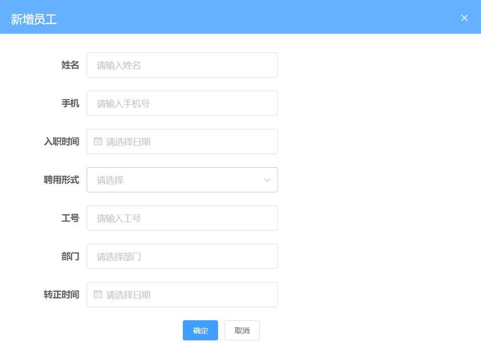

类似**`组织架构`**的组件，同样新建一个弹层组件 **`src/views/employees/components/add-employee.vue`**

```vue
<template>
  <el-dialog title="新增员工" :visible="showDialog">
    <!-- 表单 -->
    <el-form label-width="120px">
      <el-form-item label="姓名">
        <el-input style="width:50%" placeholder="请输入姓名" />
      </el-form-item>
      <el-form-item label="手机">
        <el-input style="width:50%" placeholder="请输入手机号" />
      </el-form-item>
      <el-form-item label="入职时间">
        <el-date-picker style="width:50%" placeholder="请选择入职时间" />
      </el-form-item>
      <el-form-item label="聘用形式">
        <el-select style="width:50%" placeholder="请选择" />
      </el-form-item>
      <el-form-item label="工号">
        <el-input style="width:50%" placeholder="请输入工号" />
      </el-form-item>
      <el-form-item label="部门">
        <el-input style="width:50%" placeholder="请选择部门" />
      </el-form-item>
      <el-form-item label="转正时间">
        <el-date-picker style="width:50%" placeholder="请选择转正时间" />
      </el-form-item>
    </el-form>
    <!-- footer插槽 -->
    <template v-slot:footer>
      <el-row type="flex" justify="center">
        <el-col :span="6">
          <el-button size="small">取消</el-button>
          <el-button type="primary" size="small">确定</el-button>
        </el-col>
      </el-row>
    </template>
  </el-dialog>
</template>

<script>
export default {
  props: {
    showDialog: {
      type: Boolean,
      default: false
    }
  }
}
</script>

<style>

</style>

```

### 引用弹出层，点击弹出

父组件中引用，弹出层

```vue
import AddDemployee from './components/add-employee'
<!-- 放置新增组件 -->
 <add-employee :show-dialog.sync="showDialog" />
```


```vue
<!-- 放置新增组件 -->
 <add-employee :show-dialog.sync="showDialog" />

 <el-button icon="plus" type="primary" size="small" @click="showDialog = true">新增员工</el-button>

```

### 新增员工的表单校验

**封装新增员工**api **`src/api/employees.js`**

```js
/** **
 *  新增员工的接口
 * **/
export function addEmployee(data) {
  return request({
    method: 'post',
    url: '/sys/user',
    data
  })
}

```

针对员工属性，添加校验规则

```js
import EmployeeEnum from '@/api/constant/employees'

  data() {
    return {
      EmployeeEnum, // 在data中定义数据
      // 表单数据
      treeData: [], // 定义数组接收树形数据
      showTree: false, // 控制树形的显示或者隐藏
      loading: false, // 控制树的显示或者隐藏进度条
      formData: {
        username: '',
        mobile: '',
        formOfEmployment: '',
        workNumber: '',
        departmentName: '',
        timeOfEntry: '',
        correctionTime: ''
      },
      rules: {
        username: [{ required: true, message: '用户姓名不能为空', trigger: 'blur' }, {
          min: 1, max: 4, message: '用户姓名为1-4位'
        }],
        mobile: [{ required: true, message: '手机号不能为空', trigger: 'blur' }, {
          pattern: /^1[3-9]\d{9}$/, message: '手机号格式不正确', trigger: 'blur'
        }],
        formOfEmployment: [{ required: true, message: '聘用形式不能为空', trigger: 'blur' }],
        workNumber: [{ required: true, message: '工号不能为空', trigger: 'blur' }],
        departmentName: [{ required: true, message: '部门不能为空', trigger: 'change' }],
        timeOfEntry: [{ required: true, message: '入职时间', trigger: 'blur' }]
      }
    }
  }
```

绑定数据和规则校验

```vue
    <el-form :model="formData" :rules="rules" label-width="120px">
      <el-form-item label="姓名" prop="username">
        <el-input v-model="formData.username" style="width:50%" placeholder="请输入姓名" />
      </el-form-item>
      <el-form-item label="手机" prop="mobile">
        <el-input v-model="formData.mobile" style="width:50%" placeholder="请输入手机号" />
      </el-form-item>
      <el-form-item label="入职时间" prop="timeOfEntry">
        <el-date-picker v-model="formData.timeOfEntry" style="width:50%" placeholder="请选择日期" />
      </el-form-item>
      <el-form-item label="聘用形式" prop="formOfEmployment">
        <el-select v-model="formData.formOfEmployment" style="width:50%" placeholder="请选择" />
      </el-form-item>
      <el-form-item label="工号" prop="workNumber">
        <el-input v-model="formData.workNumber" style="width:50%" placeholder="请输入工号" />
      </el-form-item>
      <el-form-item label="部门" prop="departmentName">
        <el-input v-model="formData.departmentName" style="width:50%" placeholder="请选择部门" />
      </el-form-item>
      <el-form-item label="转正时间" prop="correctionTime">
        <el-date-picker v-model="formData.correctionTime" style="width:50%" placeholder="请选择日期" />
      </el-form-item>
    </el-form>
```

### 加载部门数据转化树形

**聘用形式和选择部门的处理**

>  员工的部门是从树形部门中选择一个部门

**获取部门数据，转化树形**

```js
import { getDepartments } from '@/api/departments'
import { transListToTreeData } from '@/utils'
  data () {
      return {
             // 表单数据
       treeData: [], // 定义数组接收树形数据
       showTree: false, // 控制树形的显示或者隐藏
       loading: false, // 控制树的显示或者隐藏进度条
      }
  },
  methods: {
      async getDepartments() {
      this.showTree = true
      this.loading = true
      const { depts } = await getDepartments()
      // depts是数组 但不是树形
      this.treeData = transListToTreeData(depts, '')
      this.loading = false
    },
  }
```

### 点击部门赋值表单数据

**选择部门，赋值表单数据**

```vue
<el-form-item label="部门" prop="departmentName">
        <el-input v-model="formData.departmentName" style="width:50%" placeholder="请选择部门" @focus="getDepartments" />
        <!-- 放置一个tree组件 -->
        <el-tree
          v-if="showTree"
          v-loading="loading"
          :data="treeData"
          default-expand-all=""
          :props="{ label: 'name' }"
          @node-click="selectNode"
        />
      </el-form-item>
```


**点击部门时触发**

```js
    selectNode(node) {
      this.formData.departmentName = node.name
      this.showTree = false
    }
```

**聘用形式**

```vue
    <el-form-item label="聘用形式" prop="formOfEmployment">
        <el-select v-model="formData.formOfEmployment" style="width:50%" placeholder="请选择">
          <!-- 遍历只能遍历组件的数据 -->
          <el-option v-for="item in EmployeeEnum.hireType" :key="item.id" :label="item.value" :value="item.id" />
        </el-select>
      </el-form-item>
```


## 新增员工功能-确定-取消

**调用新增接口**

```js
    // 点击确定时 校验整个表单
    async btnOK() {
      try {
        await this.$refs.addEmployee.validate()
        // 调用新增接口
        await addEmployee(this.formData) // 新增员工
        // 告诉父组件更新数据
        // this.$parent 可以直接调用到父组件的实例 实际上就是父组件this
        // this.$emit
        this.$parent.getEmployeeList()
        this.$parent.showDialog = false
      } catch (error) {
        console.log(error)
      }
    },
    btnCancel() {
      // 重置原来的数据
      this.formData = {
        username: '',
        mobile: '',
        formOfEmployment: '',
        workNumber: '',
        departmentName: '',
        timeOfEntry: '',
        correctionTime: ''
      }
      this.$refs.addEmployee.resetFields() // 重置校验结果
      this.$emit('update:showDialog', false)
    }
```

> 新增员工的功能和组织架构的功能极其类似，这里不做过多阐述

**提交代码**

**`本节任务`** 新增员工功能和弹层

## 员工导入组件封装

**`目标`**：封装一个导入excel数据的文件


首先封装一个类似的组件，首先需要注意的是，类似功能，vue-element-admin已经提供了，我们只需要改造即可 [代码地址](https://github.com/PanJiaChen/vue-element-admin/blob/master/src/components/UploadExcel/index.vue)

> 类似功能性的组件，我们只需要会使用和封装即可 

excel导入功能需要使用npm包**`xlsx`**，所以需要安装**`xlsx`**插件

```bash
$ npm i xlsx
```

> 将vue-element-admin提供的导入功能新建一个组件，位置： **`src/components/UploadExcel`**

**注册全局的导入excel组件**

```js
import PageTools from './PageTools'
import UploadExcel from './UploadExcel'
export default {
  install(Vue) {
    Vue.component('PageTools', PageTools) // 注册工具栏组件
    Vue.component('UploadExcel', UploadExcel) // 注册导入excel组件
  }
}
```

**修改样式和布局**

```vue
<template>
 <div class="upload-excel">
    <div class="btn-upload">
      <el-button :loading="loading" size="mini" type="primary" @click="handleUpload">
        点击上传
      </el-button>
    </div>

    <input ref="excel-upload-input" class="excel-upload-input" type="file" accept=".xlsx, .xls" @change="handleClick">
    <div class="drop" @drop="handleDrop" @dragover="handleDragover" @dragenter="handleDragover">
      <i class="el-icon-upload" />
      <span>将文件拖到此处</span>
    </div>
  </div>
</template>
<style scoped lang="scss">
.upload-excel {
  display: flex;
  justify-content: center;
   margin-top: 100px;
   .excel-upload-input{
       display: none;
        z-index: -9999;
     }
   .btn-upload , .drop{
      border: 1px dashed #bbb;
      width: 350px;
      height: 160px;
      text-align: center;
      line-height: 160px;
   }
   .drop{
       line-height: 80px;
       color: #bbb;
      i {
        font-size: 60px;
        display: block;
      }
   }
}
</style>
```

**提交代码**

**`本节任务`**：员工导入组件封装

## 员工的导入

**`目标`**：实现员工的导入

### 建立公共导入的页面路由

**新建一个公共的导入页面，挂载路由** **`src/router/index.js`**

```js
{
    path: '/import',
    component: Layout,
    hidden: true, // 隐藏在左侧菜单中
    children: [{
      path: '', // 二级路由path什么都不写 表示二级默认路由
      component: () => import('@/views/import')
    }]
  },
```

**创建import路由组件** **`src/views/import/index.vue`**

```vue
<template>
  <!-- 公共导入组件 --> 
  <upload-excel :on-success="success" />
</template>

```

### 分析excel导入代码，封装接口

> 封装导入员工的api接口  

```js
/** *
 *  封装一个导入员工的接口
 *
 * ***/

export function importEmployee(data) {
  return request({
    url: '/sys/user/batch',
    method: 'post',
    data
  })
}
```

### 实现excel导入

**获取导入的excel数据, 导入excel接口**

```js
    async  success({ header, results }) {
      // 如果是导入员工
        const userRelations = {
          '入职日期': 'timeOfEntry',
          '手机号': 'mobile',
          '姓名': 'username',
          '转正日期': 'correctionTime',
          '工号': 'workNumber'
        }
        const arr = []
       results.forEach(item => {
          const userInfo = {}
          Object.keys(item).forEach(key => {
            userInfo[userRelations[key]] = item[key]
          })
         arr.push(userInfo) 
        })
        await importEmployee(arr) // 调用导入接口
        this.$router.back()
    }
```

> 为了让这个页面可以服务更多的导入功能，我们可以在页面中用参数来判断，是否是导入员工

```js
 data() {
    return {
      type: this.$route.query.type
    }
  },
```

当excel中有日期格式的时候，实际转化的值为一个数字，我们需要一个方法进行转化

```js
    formatDate(numb, format) {
      const time = new Date((numb - 1) * 24 * 3600000 + 1)
      time.setYear(time.getFullYear() - 70)
      const year = time.getFullYear() + ''
      const month = time.getMonth() + 1 + ''
      const date = time.getDate() - 1 + ''
      if (format && format.length === 1) {
        return year + format + month + format + date
      }
      return year + (month < 10 ? '0' + month : month) + (date < 10 ? '0' + date : date)
    }
```

> 需要注意，**`导入的手机号不能和之前的存在的手机号重复`**

**逻辑判断** 

```js
 async  success({ header, results }) {
      if (this.type === 'user') {
        const userRelations = {
          '入职日期': 'timeOfEntry',
          '手机号': 'mobile',
          '姓名': 'username',
          '转正日期': 'correctionTime',
          '工号': 'workNumber'
        }
        const arr = []
        // 遍历所有的数组
        results.forEach(item => {
        // 需要将每一个条数据里面的中文都换成英文
          const userInfo = {}
          Object.keys(item).forEach(key => {
          // key是当前的中文名 找到对应的英文名
            if (userRelations[key] === 'timeOfEntry' || userRelations[key] === 'correctionTime') {
              userInfo[userRelations[key]] = new Date(this.formatDate(item[key], '/')) // 只有这样, 才能入库
              return
            }
            userInfo[userRelations[key]] = item[key]
          })
          // 最终userInfo变成了全是英文
          arr.push(userInfo)
        })
        await importEmployee(arr)
        this.$message.success('导入成功')
      }
      this.$router.back() // 回到上一页
    },
    formatDate(numb, format) {
      const time = new Date((numb - 1) * 24 * 3600000 + 1)
      time.setYear(time.getFullYear() - 70)
      const year = time.getFullYear() + ''
      const month = time.getMonth() + 1 + ''
      const date = time.getDate() - 1 + ''
      if (format && format.length === 1) {
        return year + format + month + format + date
      }
      return year + (month < 10 ? '0' + month : month) + (date < 10 ? '0' + date : date)
    }
```

**员工页面跳转**

```vue
<el-button type="warning" size="small" @click="$router.push('/import?type=user')">导入</el-button>

```

**`目标`**： 实现员工的导入

## 员工导出excel功能

**目标**： 实现将员工数据导出功能

> 日常业务中，我们经常遇到excel导出功能， 怎么使用呢

Excel 的导入导出都是依赖于[js-xlsx](https://github.com/SheetJS/js-xlsx)来实现的。

在 `js-xlsx`的基础上又封装了[Export2Excel.js](https://github.com/PanJiaChen/vue-element-admin/blob/master/src/vendor/Export2Excel.js)来方便导出数据。

### 安装excel所需依赖和按需加载

由于 `Export2Excel`不仅依赖`js-xlsx`还依赖`file-saver`和`script-loader`。

所以你先需要安装如下命令：

```bash
npm install xlsx file-saver -S
npm install script-loader -S -D
```

由于`js-xlsx`体积还是很大的，导出功能也不是一个非常常用的功能，所以使用的时候建议使用懒加载。使用方法如下：

```js
import('@/vendor/Export2Excel').then(excel => {
  excel.export_json_to_excel({
    header: tHeader, //表头 必填
    data, //具体数据 必填
    filename: 'excel-list', //非必填
    autoWidth: true, //非必填
    bookType: 'xlsx' //非必填
  })
})
```

### excel导出参数的介绍

> vue-element-admin提供了导出的功能模块，在课程资源/excel导出目录下，放置到src目录下

**参数**

| 参数      | 说明                   | 类型    | 可选值                                                       | 默认值     |
| --------- | ---------------------- | ------- | ------------------------------------------------------------ | ---------- |
| header    | 导出数据的表头         | Array   | /                                                            | []         |
| data      | 导出的具体数据         | Array   | /                                                            | [[]]       |
| filename  | 导出文件名             | String  | /                                                            | excel-list |
| autoWidth | 单元格是否要自适应宽度 | Boolean | true / false                                                 | true       |
| bookType  | 导出文件类型           | String  | xlsx, csv, txt, [more](https://github.com/SheetJS/js-xlsx#supported-output-formats) | xlsx       |

### excel导出基本的结构

> 我们最重要的一件事，就是把表头和数据进行相应的对应

因为数据中的key是英文，想要导出的表头是中文的话，需要将中文和英文做对应

```js
   const headers = {
        '手机号': 'mobile',
        '姓名': 'username',
        '入职日期': 'timeOfEntry',
        '聘用形式': 'formOfEmployment',
        '转正日期': 'correctionTime',
        '工号': 'workNumber',
        '部门': 'departmentName'
      }
```

然后，**完成导出代码**

```js
    // 导出excel数据
    exportData() {
      //  做操作
      // 表头对应关系
      const headers = {
        '姓名': 'username',
        '手机号': 'mobile',
        '入职日期': 'timeOfEntry',
        '聘用形式': 'formOfEmployment',
        '转正日期': 'correctionTime',
        '工号': 'workNumber',
        '部门': 'departmentName'
      }
      // 懒加载
      import('@/vendor/Export2Excel').then(async excel => {
        const { rows } = await getEmployeeList({ page: 1, size: this.page.total })
        const data = this.formatJson(headers, rows)

        excel.export_json_to_excel({
          header: Object.keys(headers),
          data,
          filename: '员工信息表',
          autoWidth: true,
          bookType: 'xlsx'

        })
        // 获取所有的数据

        // excel.export_json_to_excel({
        //   header: ['姓名', '薪资'],
        //   data: [['张三', 12000], ['李四', 5000]],
        //   filename: '员工薪资表',
        //   autoWidth: true,
        //   bookType: 'csv'
        // })
      })
    },
    // 该方法负责将数组转化成二维数组
    formatJson(headers, rows) {
      // 首先遍历数组
      // [{ username: '张三'},{},{}]  => [[’张三'],[],[]]
      return rows.map(item => {
        return Object.keys(headers).map(key => {
          if (headers[key] === 'timeOfEntry' || headers[key] === 'correctionTime') {
            return formatDate(item[headers[key]]) // 返回格式化之前的时间
          } else if (headers[key] === 'formOfEmployment') {
            var en = EmployeeEnum.hireType.find(obj => obj.id === item[headers[key]])
            return en ? en.value : '未知'
          }
          return item[headers[key]]
        }) // => ["张三", "13811"，"2018","1", "2018", "10002"]
      })
      // return data
      // return rows.map(item => {
      //   // item是对象  => 转化成只有值的数组 => 数组值的顺序依赖headers  {username: '张三'  }
      //   // Object.keys(headers)  => ["姓名", "手机号",...]
      //   return Object.keys(headers).map(key => {
      //     return item[headers[key]]
      //   }) // /  得到 ['张三'，’129‘，’dd‘,'dd']
      // })
    }
```

### 导出时间格式的处理

```js
    formatJson(headers, rows) {
      return rows.map(item => {
        // item是一个对象  { mobile: 132111,username: '张三'  }
        // ["手机号", "姓名", "入职日期" 。。]
        return Object.keys(headers).map(key => {
          // 需要判断 字段
          if (headers[key] === 'timeOfEntry' || headers[key] === 'correctionTime') {
            // 格式化日期
            return formatDate(item[headers[key]])
          } else if (headers[key] === 'formOfEmployment') {
            const obj = EmployeeEnum.hireType.find(obj => obj.id === item[headers[key]])
            return obj ? obj.value : '未知'
          }
          return item[headers[key]]
        })
        // ["132", '张三’， ‘’，‘’，‘’d]
      })
      // return rows.map(item => Object.keys(headers).map(key => item[headers[key]]))
      // 需要处理时间格式问题
    }
```


### **`扩展`**  复杂表头的导出

> 当需要导出复杂表头的时候，vue-element-admin同样支持该类操作

**vue-element-admin** 提供的导出方法中有 **multiHeader**和**merges** 的参数

| 参数        | 说明           | 类型  | 可选值 | 默认值 |
| ----------- | -------------- | ----- | ------ | ------ |
| multiHeader | 复杂表头的部分 | Array | /      | [[]]   |
| merges      | 需要合并的部分 | Array | /      | []     |

multiHeader里面是一个二维数组，里面的一个元素是一行表头，假设你想得到一个如图的结构


mutiHeader应该这样定义

```js
const multiHeader = [['姓名', '主要信息', '', '', '', '', '部门']]
```

multiHeader中的一行表头中的字段的个数需要和真正的列数相等，假设想要跨列，多余的空间需要定义成空串

它主要对应的是标准的表头

```js
const header = ['姓名', '手机号', '入职日期', '聘用形式', '转正日期', '工号', '部门']
```

如果，我们要实现其合并的效果， 需要设定merges选项

```js
 const merges = ['A1:A2', 'B1:F1', 'G1:G2']
```

merges的顺序是没关系的，只要配置这两个属性，就可以导出复杂表头的excel了

```js
  exportData() {
      const headers = {
        '姓名': 'username',
        '手机号': 'mobile',
        '入职日期': 'timeOfEntry',
        '聘用形式': 'formOfEmployment',
        '转正日期': 'correctionTime',
        '工号': 'workNumber',
        '部门': 'departmentName'
      }
      // 导出excel
      import('@/vendor/Export2Excel').then(async excel => {
        //  excel是引入文件的导出对象
        // 导出  header从哪里来
        // data从哪里来
        // 现在没有一个接口获取所有的数据
        // 获取员工的接口 页码 每页条数    100   1 10000
        const { rows } = await getEmployeeList({ page: 1, size: this.page.total })
        const data = this.formatJson(headers, rows) // 返回的data就是 要导出的结构
        const multiHeader = [['姓名', '主要信息', '', '', '', '', '部门']]
        const merges = ['A1:A2', 'B1:F1', 'G1:G2']
        excel.export_json_to_excel({
          header: Object.keys(headers),
          data,
          filename: '员工资料表',
          multiHeader, // 复杂表头
          merges // 合并选项
        })

        // excel.export_json_to_excel({
        //   header: ['姓名', '工资'],
        //   data: [['张三', 3000], ['李四', 5000]],
        //   filename: '员工工资表'
        // })
        // [{ username: '张三',mobile: 13112345678 }]  => [[]]
        // 要转化 数据结构 还要和表头的顺序对应上
        // 要求转出的标题是中文
      })
    },
    // 将表头数据和数据进行对应
    // [{}]  =>   [[]]
    formatJson(headers, rows) {
      return rows.map(item => {
        // item是一个对象  { mobile: 132111,username: '张三'  }
        // ["手机号", "姓名", "入职日期" 。。]
        return Object.keys(headers).map(key => {
          // 需要判断 字段
          if (headers[key] === 'timeOfEntry' || headers[key] === 'correctionTime') {
            // 格式化日期
            return formatDate(item[headers[key]])
          } else if (headers[key] === 'formOfEmployment') {
            const obj = EmployeeEnum.hireType.find(obj => obj.id === item[headers[key]])
            return obj ? obj.value : '未知'
          }
          return item[headers[key]]
        })
        // ["132", '张三’， ‘’，‘’，‘’d]
      })
      // return rows.map(item => Object.keys(headers).map(key => item[headers[key]]))
      // 需要处理时间格式问题
    }
```

**提交代码**

**`本节任务`**实现将员工数据导出功能

## 员工详情页创建和布局

**`目标`**：创建员工详情的主要布局页面和基本布局

### 详情页的基本布局和路由


**建立详情页路由**

```js
{
    path: 'detail/:id', // query传参 动态路由传参
    component: () => import('@/views/employees/detail'),
    hidden: true, // 不在左侧菜单显示
    meta: {
      title: '员工详情' // 标记当前路由规则的中文名称 后续在做左侧菜单时 使用
    }
  }
```

**建立基本架构**

```vue
<div class="dashboard-container">
    <div class="app-container">
      <el-card>
        <el-tabs>
          <el-tab-pane label="登录账户设置">

            <!-- 放置表单 -->
            <el-form label-width="120px" style="margin-left: 120px; margin-top:30px">
              <el-form-item label="姓名:">
                <el-input style="width:300px" />
              </el-form-item>
              <el-form-item label="密码:">
                <el-input style="width:300px" type="password" />
              </el-form-item>
              <el-form-item>
                <el-button type="primary">更新</el-button>
              </el-form-item>
            </el-form>
          </el-tab-pane>
          <el-tab-pane label="个人详情" />
          <el-tab-pane label="岗位信息" />
        </el-tabs>
      </el-card>
    </div>
  </div>
```

**列表跳转到详情**

```vue
<el-button type="text" size="small" @click="$router.push(`/employees/detail/${obj.row.id}`)">查看</el-button>

```

### 读取和保存用户信息的接口

**加载个人基本信息** > 该接口已经在之前提供过了 **`src/api/user.js`**

```js
/** *
 *  获取某个用户的基本信息
 *
 * ***/
export function getUserDetailById(id) {
  return request({
    url: `/sys/user/${id}`
  })
}

```

**保存个人基本信息**  **`src/api/employees.js`**

```js
/** *
 *
 * 保存员工的基本信息
 * **/
export function saveUserDetailById(data) {
  return request({
    url: `/sys/user/${data.id}`,
    method: 'put',
    data
  })
}

```

### 实现用户名和密码的修改

**`注意`**：这里有个缺陷，接口中读取的是后端的密文，我们并不能解密，所以当我们没有任何修改就保存时，会校验失败，因为密文超过了规定的12位长度，为了真的修改密码，我们设定了一个临时的字段 **password2**，用它来存储我们的修改值，最后保存的时候，把**password2**传给**password**

**用户名和密码的修改**  **`src/views/employees/detail.vue`**

```js
import { getUserDetailById } from '@/api/user'
import { saveUserDetailById } from '@/api/employees'
export default {
  data() {
    return {
      userId: this.$route.params.id, // 这样可以后面直接通过 this.userId进行获取数据
      userInfo: {
        //   专门存放基本信息
        username: '',
        password2: ''
      },
      rules: {
        username: [{ required: true, message: '姓名不能为空', trigger: 'blur' }],
        password2: [{ required: true, message: '密码不能为空', trigger: 'blur' },
          { min: 6, max: 9, message: '密码长度6-9位', trigger: 'blur' }]
      }
    }
  },
  created() {
    this.getUserDetailById()
  },
  methods: {
    async getUserDetailById() {
      this.userInfo = await getUserDetailById(this.userId
    },
    async saveUser() {
      try {
        // 校验
        await this.$refs.userForm.validate()
        await saveUserDetailById({ ...this.userInfo, password: this.userInfo.password2 }) // 将新密码的值替换原密码的值
        this.$message.success('保存成功')
      } catch (error) {
        console.log(error)
      }
    }
  }
}
```

**绑定表单数据**

```vue
 <!-- 放置表单 -->
            <el-form ref="userForm" :model="userInfo" :rules="rules" label-width="120px" style="margin-left: 120px; margin-top:30px">
              <el-form-item label="姓名:" prop="username">
                <el-input v-model="userInfo.username" style="width:300px" />
              </el-form-item>
              <el-form-item label="新密码:" prop="password2">
                <el-input v-model="userInfo.password2" style="width:300px" type="password" />
              </el-form-item>
              <el-form-item>
                <el-button type="primary" @click="saveUser">更新</el-button>
              </el-form-item>
            </el-form>
```

**提交代码**


## 个人组件和岗位组件封装

### 封装个人详情组件

> 我们将员工个人信息分为三部分，账户，个人， 岗位，这个小节我们对个人组件和岗位组件进行封装

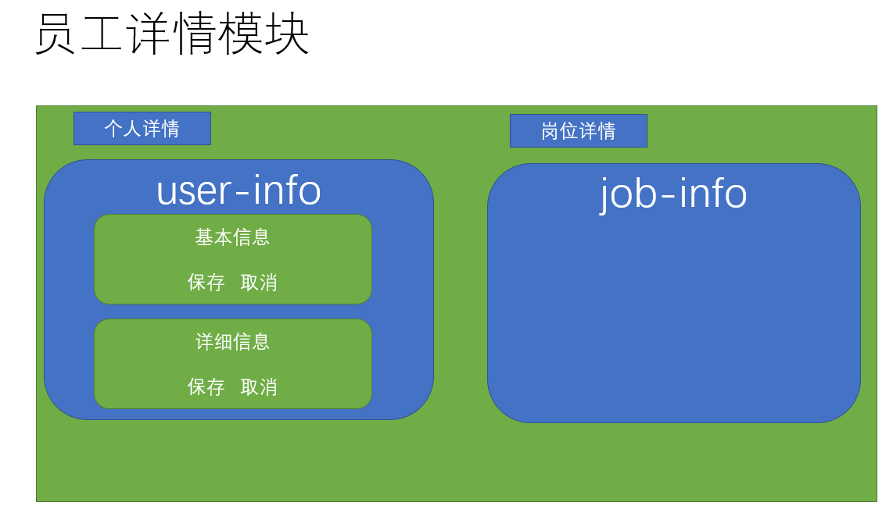

**封装个人组件**   **`src/views/employees/components/user-info.vue`**

```vue
<template>
  <div class="user-info">
    <!-- 个人信息 -->
    <el-form label-width="220px">
      <!-- 工号 入职时间 -->
      <el-row class="inline-info">
        <el-col :span="12">
          <el-form-item label="工号">
            <el-input v-model="userInfo.workNumber" class="inputW" />
          </el-form-item>
        </el-col>
        <el-col :span="12">
          <el-form-item label="入职时间">
            <el-date-picker
              v-model="userInfo.timeOfEntry"
              type="date"
              class="inputW"
              value-format="YYYY-MM-DD"
            />
          </el-form-item>
        </el-col>
      </el-row>
      <!-- 姓名 部门 -->
      <el-row class="inline-info">
        <el-col :span="12">
          <el-form-item label="姓名">
            <el-input v-model="userInfo.username" class="inputW" />
          </el-form-item>
        </el-col>
        <el-col :span="12">
          <el-form-item label="部门">
            <el-input v-model="userInfo.departmentName" class="inputW" />
          </el-form-item>
        </el-col>
      </el-row>
      <!--手机 聘用形式  -->
      <el-row class="inline-info">
        <el-col :span="12">
          <el-form-item label="手机">
            <el-input v-model="userInfo.mobile" />
          </el-form-item>
        </el-col>
        <el-col :span="12">
          <el-form-item label="聘用形式">
            <el-select v-model="userInfo.formOfEmployment" class="inputW">
              <el-option
                v-for="item in EmployeeEnum.hireType"
                :key="item.id"
                :label="item.value"
                :value="item.id"
              />
            </el-select>
          </el-form-item>
        </el-col>
      </el-row>
      <!-- 员工照片 -->
      <el-row class="inline-info">
        <el-col :span="12">
          <el-form-item label="员工头像">
            <!-- 放置上传图片 -->
           
          </el-form-item>
        </el-col>
      </el-row>
      <!-- 保存个人信息 -->
      <el-row class="inline-info" type="flex" justify="center">
        <el-col :span="12">
          <el-button type="primary" @click="saveUser">保存更新</el-button>
          <el-button @click="$router.back()">返回</el-button>

        </el-col>
      </el-row>
    </el-form>
    <!-- 基础信息 -->
    <el-form label-width="220px">
      <div class="block">
        <div class="title">基础信息</div>
        <el-form-item label="最高学历">
          <el-select v-model="formData.theHighestDegreeOfEducation" class="inputW2">
            <el-option
              v-for="item in EmployeeEnum.highestDegree"
              :key="item.value"
              :label="item.label"
              :value="item.value"
            />
          </el-select>
        </el-form-item>
        <!-- 个人头像 -->
        <!-- 员工照片 -->

        <el-form-item label="员工照片">
          <!-- 放置上传图片 -->
        </el-form-item>
        <el-form-item label="国家/地区">
          <el-select v-model="formData.nationalArea" class="inputW2">
            <el-option
              v-for="item in EmployeeEnum.isOverseas"
              :key="item.value"
              :label="item.label"
              :value="item.value"
            />
          </el-select>
        </el-form-item>
        <el-form-item label="护照号">
          <el-input v-model="formData.passportNo" placeholder="正规护照格式" class="inputW" />
        </el-form-item>
        <el-form-item label="身份证号">
          <el-input v-model="formData.idNumber" placeholder="正规身份证格式" class="inputW" />
        </el-form-item>
        <el-form-item label="籍贯">
          <el-input v-model="formData.nativePlace" placeholder="籍贯地址" class="inputW5" />
        </el-form-item>
        <el-form-item label="民族">
          <el-input v-model="formData.nation" placeholder="请输入民族" class="inputW2" />
        </el-form-item>
        <el-form-item label="婚姻状况">
          <el-select v-model="formData.maritalStatus" class="inputW2">
            <el-option
              v-for="item in EmployeeEnum.maritaStatus"
              :key="item.value"
              :label="item.label"
              :value="item.value"
            />
          </el-select>
        </el-form-item>
        <el-form-item label="生日">
          <el-input v-model="formData.birthday" placeholder="示例 0323" class="inputW" />
        </el-form-item>
        <el-form-item label="年龄">
          <el-input v-model="formData.age" type="number" class="inputW2" />
        </el-form-item>
        <el-form-item label="星座">
          <el-select v-model="formData.constellation" class="inputW2">
            <el-option
              v-for="item in EmployeeEnum.constellation"
              :key="item.value"
              :label="item.label"
              :value="item.value"
            />
          </el-select>
        </el-form-item>
        <el-form-item label="血型">
          <el-select v-model="formData.bloodType" class="inputW2">
            <el-option
              v-for="item in EmployeeEnum.bloodType"
              :key="item.value"
              :label="item.label"
              :value="item.value"
            />
          </el-select>
        </el-form-item>
        <el-form-item label="户籍所在地">
          <el-input v-model="formData.domicile" class="inputW5" />
        </el-form-item>
        <el-form-item label="政治面貌">
          <el-input v-model="formData.politicalOutlook" class="inputW2" />
        </el-form-item>
        <el-form-item label="入党时间">
          <el-date-picker
            v-model="formData.timeToJoinTheParty"
            type="date"
            placeholder="选择日期"
            class="inputW"
            value-format="yyyy-MM-dd"
          />
        </el-form-item>
        <el-form-item label="存档机构">
          <el-input v-model="formData.archivingOrganization" placeholder="请输入" />
        </el-form-item>
        <el-form-item label="子女状态">
          <el-input v-model="formData.stateOfChildren" placeholder="请输入" />
        </el-form-item>
        <el-form-item label="子女有无商业险">
          <el-radio-group v-model="formData.doChildrenHaveCommercialInsurance">
            <el-radio label="1">有</el-radio>
            <el-radio label="2">无</el-radio>
          </el-radio-group>
        </el-form-item>
        <el-form-item label="有无违法违纪状态">
          <el-input v-model="formData.isThereAnyViolationOfLawOrDiscipline" placeholder="请输入" />
        </el-form-item>
        <el-form-item label="有无重大病史">
          <el-input v-model="formData.areThereAnyMajorMedicalHistories" placeholder="请输入" />
        </el-form-item>
      </div>
      <!-- 通讯信息 -->
      <div class="block">
        <div class="title">通讯信息</div>
        <el-form-item label="QQ">
          <el-input v-model="formData.qq" placeholder="请输入" class="inputW" />
        </el-form-item>
        <el-form-item label="微信">
          <el-input v-model="formData.wechat" placeholder="请输入" class="inputW" />
        </el-form-item>
        <el-form-item label="现居住地">
          <el-input v-model="formData.placeOfResidence" placeholder="请输入" />
        </el-form-item>
        <el-form-item label="通讯地址">
          <el-input v-model="formData.postalAddress" placeholder="请输入" />
        </el-form-item>
        <el-form-item label="联系手机">
          <el-input v-model="formData.contactTheMobilePhone" placeholder="11位字符" maxlength="11" class="inputW" @change.native="handlePhone(2)" />
        </el-form-item>
        <el-form-item label="个人邮箱">
          <el-input v-model="formData.personalMailbox" placeholder="请输入" type="mail" class="inputW" />
        </el-form-item>
        <el-form-item label="紧急联系人">
          <el-input v-model="formData.emergencyContact" placeholder="请输入" class="inputW" />
        </el-form-item>
        <el-form-item label="紧急联系电话">
          <el-input v-model="formData.emergencyContactNumber" placeholder="11位字符" class="inputW" />
        </el-form-item>
      </div>
      <!-- 账号信息 -->
      <div class="block">
        <div class="title">账号信息</div>
        <el-form-item label="社保电脑号">
          <el-input v-model="formData.socialSecurityComputerNumber" placeholder="请输入" class="inputW" />
        </el-form-item>
        <el-form-item label="公积金账号">
          <el-input v-model="formData.providentFundAccount" placeholder="请输入" class="inputW" />
        </el-form-item>
        <el-form-item label="银行卡号">
          <el-input v-model="formData.bankCardNumber" placeholder="请输入" class="inputW" />
        </el-form-item>
        <el-form-item label="开户行">
          <el-input v-model="formData.openingBank" placeholder="请输入" class="inputW" />
        </el-form-item>
      </div>
      <!-- 教育信息 -->
      <div class="block">
        <div class="title">教育信息</div>
        <el-form-item label="学历类型">
          <el-select v-model="formData.educationalType" placeholder="请选择">
            <el-option
              v-for="item in EmployeeEnum.educationType"
              :key="item.value"
              :label="item.label"
              :value="item.value"
            />
          </el-select>
        </el-form-item>
        <el-form-item label="毕业学校">
          <el-input v-model="formData.graduateSchool" placeholder="请输入" class="inputW2" />
        </el-form-item>
        <el-form-item label="入学时间">
          <el-date-picker v-model="formData.enrolmentTime" type="data" placeholder="请输入时间" class="inputW" value-format="yyyy-MM-dd" />
        </el-form-item>
        <el-form-item label="毕业时间">
          <el-date-picker v-model="formData.graduationTime" type="data" placeholder="请输入时间" class="inputW" value-format="yyyy-MM-dd" />
        </el-form-item>
        <el-form-item label="专业">
          <el-input v-model="formData.major" placeholder="请输入" class="inputW" />
        </el-form-item>
      </div>
      <!-- 从业信息 -->
      <div class="block">
        <div class="title">从业信息</div>
        <el-form-item label="上家公司">
          <el-input v-model="formData.homeCompany" placeholder="请输入" class="inputW" />
        </el-form-item>
        <el-form-item label="职称">
          <el-input v-model="formData.title" placeholder="请输入" class="inputW" />
        </el-form-item>
        <el-form-item label="有无竞业限制">
          <el-input v-model="formData.isThereAnyCompetitionRestriction" placeholder="请输入" style="width:80%" />
        </el-form-item>
        <el-form-item label="备注">
          <el-input v-model="formData.remarks" type="textarea" placeholder="请输入备注" style="width:80%" />
        </el-form-item>
        <!-- 保存员工信息 -->
        <el-row class="inline-info" type="flex" justify="center">
          <el-col :span="12">
            <el-button type="primary" @click="savePersonal">保存更新</el-button>
            <el-button @click="$router.back()">返回</el-button>
          </el-col>
        </el-row>
      </div>
    </el-form>

  </div>

</template>
```

> 本章节个人数据过于**`繁杂，庞大`**，同学们在开发期间，拷贝代码即可，我们只写关键部位的代码

**定义user-info的数据**

```js
import EmployeeEnum from '@/api/constant/employees'

export default {
  data() {
    return {
      userId: this.$route.params.id,
      EmployeeEnum, // 员工枚举数据
      userInfo: {},
      formData: {
        userId: '',
        username: '', // 用户名
        sex: '', // 性别
        mobile: '', // 手机
        companyId: '', // 公司id
        departmentName: '', // 部门名称
        //  onTheJobStatus: '', // 在职状态 no
        dateOfBirth: '', // 出生日期
        timeOfEntry: '', // 入职时间
        theHighestDegreeOfEducation: '', // 最高学历
        nationalArea: '', // 国家
        passportNo: '', // 护照号
        idNumber: '', // 身份证号
        idCardPhotoPositive: '', // 身份证照正
        idCardPhotoBack: '', // 身份证照正
        nativePlace: '', // 籍贯
        nation: '', // 民族
        englishName: '', // 英文名字
        maritalStatus: '', // 婚姻状况
        staffPhoto: '', // 员工照片
        birthday: '', // 生日
        zodiac: '', // 属相
        age: '', // 年龄
        constellation: '', // 星座
        bloodType: '', // 血型
        domicile: '', // 户籍所在地
        politicalOutlook: '', // 政治面貌
        timeToJoinTheParty: '', // 入党时间
        archivingOrganization: '', // 存档机构
        stateOfChildren: '', // 子女状态
        doChildrenHaveCommercialInsurance: '1', // 保险状态
        isThereAnyViolationOfLawOrDiscipline: '', // 违法违纪状态
        areThereAnyMajorMedicalHistories: '', // 重大病史
        qq: '', // QQ
        wechat: '', // 微信
        residenceCardCity: '', // 居住证城市
        dateOfResidencePermit: '', // 居住证办理日期
        residencePermitDeadline: '', // 居住证截止日期
        placeOfResidence: '', // 现居住地
        postalAddress: '', // 通讯地址
        contactTheMobilePhone: '', // 联系手机
        personalMailbox: '', // 个人邮箱
        emergencyContact: '', // 紧急联系人
        emergencyContactNumber: '', // 紧急联系电话
        socialSecurityComputerNumber: '', // 社保电脑号
        providentFundAccount: '', // 公积金账号
        bankCardNumber: '', // 银行卡号
        openingBank: '', // 开户行
        educationalType: '', // 学历类型
        graduateSchool: '', // 毕业学校
        enrolmentTime: '', // 入学时间
        graduationTime: '', // 毕业时间
        major: '', // 专业
        graduationCertificate: '', // 毕业证书
        certificateOfAcademicDegree: '', // 学位证书
        homeCompany: '', // 上家公司
        title: '', // 职称
        resume: '', // 简历
        isThereAnyCompetitionRestriction: '', // 有无竞业限制
        proofOfDepartureOfFormerCompany: '', // 前公司离职证明
        remarks: '' // 备注
      }
    }
  }
}
```

**在detail.vue组件中，注册并使用**

```vue
 <el-tab-pane label="个人详情">
            <!-- 放置个人详情 -->
            <component :is="userComponent" />
            <!-- <user-info /> -->
  </el-tab-pane>
```

在以上代码中，我们使用了动态组件**component**，它通过 **`is`**属性来绑定需要显示在该位置的组件，is属性可以直接为**`注册组件`**的组件名称即可

### 封装岗位组件

同理，封装岗位组件

**封装岗位组件**  **`src/views/employee/components/job-info.vue`**

```vue
<template>
<div class="job-info">
    <!-- 基础信息 -->
    <el-form label-width="220px">
      <div class="block">
        <div class="title">基础信息</div>
        <el-form-item label="岗位">
          <el-input v-model="formData.post" placeholder="请输入" class="inputW" />
        </el-form-item>
        <!-- <el-form-item label="转正日期">
          <el-date-picker
            v-model="formData.dateOfCorrection"
            type="date"
            placeholder="选择日期"
            value-format="yyyy-MM-dd"
          />
        </el-form-item> -->
        <el-form-item label="转正状态">
          <el-select v-model="formData.stateOfCorrection" placeholder="请选择" disabled>
            <el-option
              v-for="item in EmployeeEnum.stateOfCorrection"
              :key="item.value"
              :value="item.value"
            />
          </el-select>
        </el-form-item>
        <el-form-item label="职级">
          <el-input v-model="formData.rank" class="inputW" />
        </el-form-item>
        <el-form-item label="转正评价">
          <el-input v-model="formData.correctionEvaluation" type="textarea" placeholder="1-300位字符" />
        </el-form-item>
        <el-form-item label="汇报对象">
          <el-select v-model="formData.reportId" filterable placeholder="请选择" class="inputW">
            <el-option v-for="item in depts" :key="item.id" :label="item.username" :value="item.id" />
          </el-select>
        </el-form-item>
        <el-form-item label="HRBP">
          <el-select v-model="formData.hrbp" filterable placeholder="请选择" class="inputW">
            <el-option v-for="item in depts" :key="item.id" :label="item.username" :value="item.id" class="inputW" />
          </el-select>
        </el-form-item>
        <el-form-item class="formInfo" label="调整司龄(天)：">
          <el-input v-model="formData.adjustmentAgedays" type="number" placeholder="请输入" class="inputW" />
        </el-form-item>
        <el-form-item label="首次参加工作时间">
          <el-date-picker
            v-model="formData.workingTimeForTheFirstTime"
            type="date"
            placeholder="选择日期"
            value-format="yyyy-MM-dd"
          />
        </el-form-item>
        <el-form-item label="调整工龄">
          <el-input v-model="formData.adjustmentOfLengthOfService" placeholder="0.00年" class="inputW" disabled />
        </el-form-item>
      </div>
      <!-- 合同信息 -->
      <div class="block">
        <div class="title">合同信息</div>
        <el-form-item class="formInfo" label="首次合同开始时间：">
          <el-date-picker
            v-model="formData.initialContractStartTime"
            type="date"
            placeholder="选择日期"
            value-format="yyyy-MM-dd"
          />
        </el-form-item>
        <el-form-item label="首次合同结束时间">
          <el-date-picker
            v-model="formData.firstContractTerminationTime"
            type="date"
            placeholder="选择日期"
            value-format="yyyy-MM-dd"
          />
        </el-form-item>
        <el-form-item label="现合同开始时间">
          <el-date-picker
            v-model="formData.currentContractStartTime"
            type="date"
            placeholder="选择日期"
            value-format="yyyy-MM-dd"
          />
        </el-form-item>
        <el-form-item label="现合同结束时间">
          <el-date-picker
            v-model="formData.closingTimeOfCurrentContract	"
            type="date"
            placeholder="选择日期"
            value-format="yyyy-MM-dd"
          />
        </el-form-item>
        <el-form-item label="合同期限">
          <el-select v-model="formData.contractPeriod" class="filter-item">
            <el-option
              v-for="item in EmployeeEnum.contractPeriod"
              :key="item.value"
              :label="item.label"
              :value="item.value"
            />
          </el-select>
        </el-form-item>
        <el-form-item label="续签次数">
          <el-select v-model="formData.renewalNumber" class="filter-item">
            <el-option
              v-for="item in EmployeeEnum.renewalCount"
              :key="item.id"
              :label="item.value"
              :value="item.id"
            />
          </el-select>
        </el-form-item>
      </div>
      <!-- 招聘信息 -->
      <div class="block">
        <div class="title">招聘信息</div>
        <el-form-item label="其他招聘渠道">
          <el-select v-model="formData.otherRecruitmentChannels" placeholder="请选择">
            <el-option
              v-for="item in EmployeeEnum.resumeSource"
              :key="item.id"
              :label="item.value"
              :value="item.value"
            />
          </el-select>
        </el-form-item>
        <el-form-item label="招聘渠道">
          <el-select v-model="formData.recruitmentChannels" placeholder="请选择">
            <el-option
              v-for="item in EmployeeEnum.resumeSource"
              :key="item.value"
              :label="item.label"
              :value="item.value"
            />
          </el-select>
        </el-form-item>
        <el-form-item label="社招/校招">
          <el-select v-model="formData.socialRecruitment" placeholder="请选择">
            <el-option
              v-for="item in EmployeeEnum.hireSourceType"
              :key="item.value"
              :label="item.label"
              :value="item.value"
            />
          </el-select>
        </el-form-item>
        <el-form-item label="推荐企业/人">
          <el-input v-model="formData.recommenderBusinessPeople" placeholder="请输入" class="infoPosition inputW" />
        </el-form-item>
      </div>
      <!-- 从业信息 -->
      <el-form-item>
        <el-button type="primary" @click="saveJob">保存更新</el-button>
        <el-button @click="$router.back()">返回</el-button>
      </el-form-item>
    </el-form>
  </div>

</template>
```

**定义岗位数据**

```js
import EmployeeEnum from '@/api/constant/employees'

export default {
  data() {
    return {
      userId: this.$route.params.id,
      depts: [],
      EmployeeEnum,
      formData: {
        adjustmentAgedays: '', // 调整司龄天
        adjustmentOfLengthOfService: '', // 调整工龄天
        closingTimeOfCurrentContract: '', // 现合同结束时间
        companyId: '', // 公司ID
        contractDocuments: '', // 合同文件
        contractPeriod: '', // 合同期限
        correctionEvaluation: '', //  转正评价
        currentContractStartTime: '', // 现合同开始时间
        firstContractTerminationTime: '', // 首次合同结束时间
        hrbp: '', // HRBP
        initialContractStartTime: '', // 首次合同开始时间
        otherRecruitmentChannels: '', // 其他招聘渠道
        post: '', // 岗位
        rank: null, // 职级
        recommenderBusinessPeople: '', // 推荐企业人
        recruitmentChannels: '', // 招聘渠道
        renewalNumber: '', // 续签次数
        reportId: '', // 汇报对象
        reportName: null, // 汇报对象
        socialRecruitment: '', // 社招校招
        stateOfCorrection: '', // 转正状态
        taxableCity: '', // 纳税城市
        userId: '', // 员工ID
        workMailbox: '', // 工作邮箱
        workingCity: '', // 工作城市
        workingTimeForTheFirstTime: '' // 首次参加工作时间
      }
    }
  }
}
```

**在detail.vue组件中，注册并使用**

```vue
 <el-tab-pane label="岗位详情">
            <!-- 放置岗位详情 -->
            <component :is="JobInfo" />
  </el-tab-pane>
```

**`本节任务`**：完成个人组件和岗位组件封装

## 员工个人信息和岗位信息-读取-保存

**`目标`**：实现个人信息的岗位信息的读取和校验，保存

### 读取个人保存个人信息

> 这个环节里面大部分都是繁杂的属性和重复的过程，所以该环节直接将过程代码拷贝到项目中即可

封装 **读取个人信息** **保存个人信息**  **读取岗位信息** **保存岗位信息**  

```js
/** *
 *  读取用户详情的基础信息
 * **/
export function getPersonalDetail(id) {
  return request({
    url: `/employees/${id}/personalInfo`
  })
}

/** *
 *  更新用户详情的基础信息
 * **/
export function updatePersonal(data) {
  return request({
    url: `/employees/${data.userId}/personalInfo`,
    method: 'put',
    data
  })
}


/** **
 * 获取用户的岗位信息
 *
 * ****/
export function getJobDetail(id) {
  return request({
    url: `/employees/${id}/jobs`
  })
}


/**
 * 保存岗位信息
 * ****/
export function updateJob(data) {
  return request({
    url: `/employees/${data.userId}/jobs`,
    method: 'put',
    data
  })
}
```

**读取，保存个人信息**  **`user-info`**  需要注意：这里的保存实际上分成了两个接口，这是接口的设计，我们只能遵守

```js
import { getPersonalDetail, updatePersonal, saveUserDetailById } from '@/api/employees'
import { getUserDetailById } from '@/api/user'
 created() {
    this.getPersonalDetail()
    this.getUserDetailById()
  },
  methods: {
    async getPersonalDetail() {
      this.formData = await getPersonalDetail(this.userId) // 获取员工数据
    },
    async savePersonal() {
      await updatePersonal({ ...this.formData, id: this.userId })
      this.$message.success('保存成功')
    },
    async saveUser() {
    //  调用父组件
      await saveUserDetailById(this.userInfo)
      this.$message.success('保存成功')
    },
    async getUserDetailById() {
      this.userInfo = await getUserDetailById(this.userId)
    }
  }
```

### 读取保存岗位信息

**读取，保存岗位信息**  **`job-info`**

```js
  import { getEmployeeSimple, updateJob, getJobDetail } from '@/api/employees'

  created() {
    this.getJobDetail()
    this.getEmployeeSimple()
  },
  methods: {
    async getJobDetail() {
      this.formData = await getJobDetail(this.userId)
    },
    // 获取员工列表
    async getEmployeeSimple() {
      this.depts = await getEmployeeSimple()
    },
    // 保存岗位信息
    async saveJob() {
      await updateJob(this.formData)
      this.$message.success('保存岗位信息成功')
    }
  }
```

**提交代码**

**`本节任务`** 实现个人信息的岗位信息的读取和校验，保存

## 配置腾讯云Cos

**`目标`**： 配置一个腾讯云cos

> 由于上课的开发的特殊性，我们不希望把所有的图片都上传到我们自己的官方服务器上，这里我们可以采用一个腾讯云的图片方案

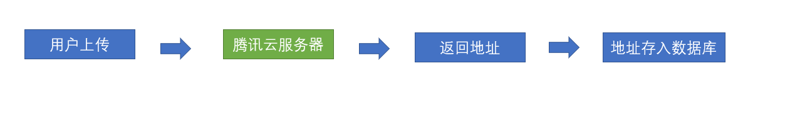

> 上边图的意思就是说，我们找一个可以免费上传图片的服务器，帮我们**`代管图片`**，我们在自己的数据库里只保存一个地址就行， 这其实也是很多项目的处理方案，会有一个**`公共的文件服务器`**

第一步，我们必须先拥有一个[腾迅云](https://cloud.tencent.com/login?s_url=https%3A%2F%2Fconsole.cloud.tencent.com%2F)的开发者账号(**小心腾讯云的广告电话**)

> 请按照腾讯云的注册方式，注册自己的账号

第二步，实名认证

> 选择个人账户


**填写个人身份信息**

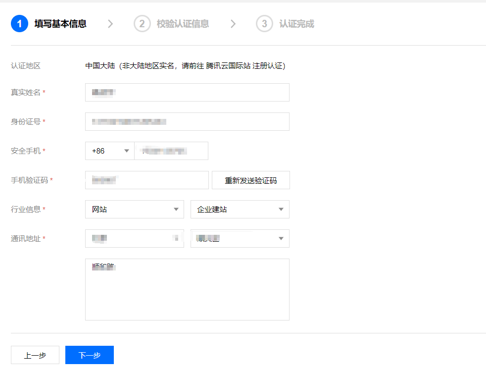

下一步，扫描二维码授权


**手机端授权**


点击**领取免费产品**


**选择对象存储COS**

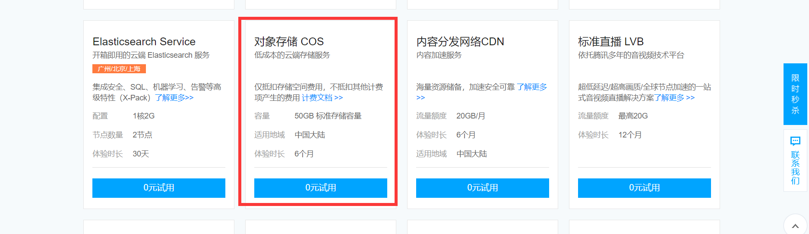

> 我们免费拥有**`6个月的50G流量`**的对象存储空间使用权限，足够我们上传用户头像的使用了

**点击0元试用，开通服务**

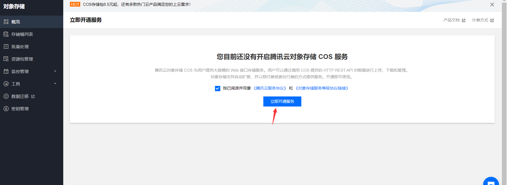


到这一步，账号的部分就操作完毕，接下来，我们需要来创建一个存储图片的存储桶

登录 [对象存储控制台](https://console.cloud.tencent.com/cos5) ，[创建存储桶](https://cloud.tencent.com/document/product/436/13309)。设置存储桶的权限为 **`公有读，私有写`**


设置cors规则


AllowHeader 需配成`*`，如下图所示。

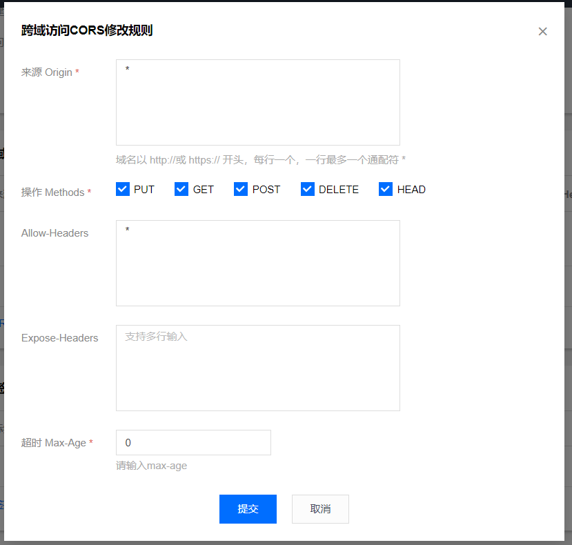

> 因为我们本身没有域名，所以这里设置成**`*`**，仅限于测试，正式环境的话，这里需要配置真实的域名地址

到这里，我们的腾讯云存储桶就设置好了。


## 封装上传图片组件-上传组件需求分析

**`目标`** 梳理整个的上传过程

**初始化cos对象参数**

| 名称      | 描述                                                         |
| :-------- | :----------------------------------------------------------- |
| SecretId  | 开发者拥有的项目身份识别 ID，用以身份认证，可在 [API 密钥管理](https://console.cloud.tencent.com/capi) 页面获取 |
| SecretKey | 开发者拥有的项目身份密钥，可在 [API 密钥管理](https://console.cloud.tencent.com/capi) 页面获取 |

> 注意，上述的参数我们在本次开发过程中，直接将参数放置在前端代码中存储，但是腾讯云本身是不建议这么做的，因为**`敏感信息`**放在前端很容易被捕获，由于我们本次是测试研发，所以这个过程可以忽略
>
> 正确的做法应该是，通过网站调用接口换取敏感信息

[相关文档](https://cloud.tencent.com/document/product/436/11459)

实例化 上传sdk

```js
var cos = new COS({
    SecretId: 'COS_SECRETID', // 身份识别 ID
    SecretKey: 'COS_SECRETKEY', // 身份密钥
});
```

> 到目前为止，我们上传图片准备的内容就已经OK，接下来，我们在**`src/componets`** 新建一个**`ImageUpload`** 组件

该组件需要满足什么要求呢？

1. 可以显示传入的图片地址
2. 可以删除传入的图片地址
3. 可以上传图片到云服务器
4. 上传到腾讯云之后，可以返回图片地址，显示  
5. 上传成功之后，可以回调成功函数

这个上传组件简单吗？

**`no ! ! !`**

看似需求很明确，但是它真正的实现很复杂，我们通过一个图来看一下


从上图中，我们可以看到，实际上是有两种场景的，本地场景和已经上传的场景

下个章节，针对这个场景我们进行开发

## 封装上传组件-代码实现

**`目标`**实现上传组件的代码部分

> JavaScript SDK 需浏览器支持基本的 HTML5 特性（支持 IE10 以上浏览器），以便支持 ajax 上传文件和计算文件 MD5 值。

### 新建文件上传组件

**安装JavaScript SDK**

```bash
$ npm i cos-js-sdk-v5 --save
```

**新建上传图片组件** **`src/components/ImageUpload/index.vue`**

> 上传组件，我们可以沿用element的el-upload组件,并且采用照片墙的模式 **`list-type="picture-card"`**

**放置el-upload组件**

```vue
<template>
  <el-upload list-type="picture-card">
     <i class="el-icon-plus" />
  </el-upload>
</template>
```

**全局注册组件**

```js
import PageTools from './PageTools'
import UploadExcel from './UploadExcel'
import ImageUpload from './ImageUpload'
export default {
  install(Vue) {
    Vue.component('PageTools', PageTools) // 注册工具栏组件
    Vue.component('UploadExcel', UploadExcel) // 注册导入excel组件
    Vue.component('ImageUpload', ImageUpload) // 注册导入上传组件
  }
}

```

### 点击图片进行预览

**限定上传的图片数量和action**

```vue
<template>
  <el-upload list-type="picture-card" :limit="1" action="#">
  </el-upload>
</template>
```

> action为什么给#， 因为前面我们讲过了，我们要上传到腾讯云，需要自定义的上传方式,action给个#防止报错

**预览**

```js
data() {
    return {
      fileList: [], // 图片地址设置为数组 
      showDialog: false, // 控制显示弹层
      imgUrl: ''
    }
  },
```

```js
     preview(file) {
      // 这里应该弹出一个层 层里是点击的图片地址
      this.imgUrl = file.url
      this.showDialog = true
  },  
```

**预览弹层**

```vue
  <el-dialog title="图片" :visible.sync="showDialog">
      
   </el-dialog>
```

### 根据上传数量控制上传按钮

**控制上传显示**

```js
 computed: {
    // 设定一个计算属性 判断是否已经上传完了一张
    fileComputed() {
      return this.fileList.length === 1
    }
  },
```

```css
 <el-upload
      :on-preview="preview"
      :on-remove="handleRemove"
      :on-change="changeFile"
      :file-list="fileList"
      list-type="picture-card"
      action="#"
      :limit="1"
      :class="{disabled: fileComputed }"
    >

<style>
.disabled .el-upload--picture-card {
  display: none
}
</style>

```

### 删除图片和添加图片

**删除文件**

```js
	 handleRemove(file) {
      // file是点击删除的文件
    //   将原来的文件给排除掉了 剩下的就是最新的数组了
      this.fileList = this.fileList.filter(item => item.uid !== file.uid)
    },
```

**添加文件**

```js
    // 修改文件时触发
    // 此时可以用fileList 因为该方法会进来很多遍 不能每次都去push
    // fileList因为fileList参数是当前传进来的最新参数 我们只需要将其转化成数组即可 需要转化成一个新的数组
    // [] => [...fileList] [] => fileList.map()
    // 上传成功之后 还会进来 需要实现上传代码的逻辑 这里才会成功
    changeFile(file, fileList) {
      this.fileList = fileList.map(item => item)
    }
```

### 上传之前检查

> 控制上传图片的类型和上传大小， 如果不满足条件 返回false上传就会停止

```js
    beforeUpload(file) {
      // 要开始做文件上传的检查了
      // 文件类型 文件大小
      const types = ['image/jpeg', 'image/gif', 'image/bmp', 'image/png']
      if (!types.includes(file.type)) {
        this.$message.error('上传图片只能是 JPG、GIF、BMP、PNG 格式!')
        return false
      }
      //  检查大小
      const maxSize = 5 * 1024 * 1024
      if (maxSize < file.size) {
        this.$message.error('图片大小最大不能超过5M')
        return false
      }
      return true
    }
```

### 上传动作调用上传腾讯云

**上传动作为el-upload的http-request属性**

```js
 :http-request="upload"

    // 自定义上传动作 有个参数 有个file对象，是我们需要上传到腾讯云服务器的内容
    upload(params) {
      console.log(params.file)
    }

```

> 我们需要在该方法中，调用腾讯云的上传方法

[腾讯云文档地址](https://cloud.tencent.com/document/product/436/35649#.E7.AE.80.E5.8D.95.E4.B8.8A.E4.BC.A0.E5.AF.B9.E8.B1.A1)

身份ID和密钥可以通过腾讯云平台获取

登录 [访问管理控制台](https://console.cloud.tencent.com/capi) ，获取您的项目 SecretId 和 SecretKey。


实现代码

```js
    // 进行上传操作
    upload(params) {
    //   console.log(params.file)
      if (params.file) {
        // 执行上传操作
        cos.putObject({
          Bucket: 'shuiruohanyu-106-1302806742', // 存储桶
          Region: 'ap-beijing', // 地域
          Key: params.file.name, // 文件名
          Body: params.file, // 要上传的文件对象
          StorageClass: 'STANDARD' // 上传的模式类型 直接默认 标准模式即可
          // 上传到腾讯云 =》 哪个存储桶 哪个地域的存储桶 文件  格式  名称 回调
        }, function(err, data) {
          // data返回数据之后 应该如何处理
          console.log(err || data)
        })
      }
    }
```

### 上传成功之后处理返回数据

> 如何处理返回成功的返回数据

确定要上传记录id

```js
  beforeUpload(file) {
      //   先检查文件类型
      const types = ['image/jpeg', 'image/gif', 'image/bmp', 'image/png']
      if (!types.some(item => item === file.type)) {
        //   如果不存在
        this.$message.error('上传图片只能是 JPG、GIF、BMP、PNG 格式!')
        return false // 上传终止
      }
      // 检查文件大小  5M 1M = 1024KB 1KB = 1024B
      const maxSize = 5 * 1024 * 1024
      if (file.size > maxSize) {
        //   超过了限制的文件大小
        this.$message.error('上传的图片大小不能大于5M')
        return false
      }
      //   已经确定当前上传的就是当前的这个file了
      this.currentFileUid = file.uid
      return true // 最后一定要return  true
    },
```

> 处理返回数据

```js
    // 进行上传操作
    upload(params) {
    //   console.log(params.file)
      if (params.file) {
        // 执行上传操作
        cos.putObject({
          Bucket: 'shuiruohanyu-106-1302806742', // 存储桶
          Region: 'ap-beijing', // 地域
          Key: params.file.name, // 文件名
          Body: params.file, // 要上传的文件对象
          StorageClass: 'STANDARD' // 上传的模式类型 直接默认 标准模式即可
          // 上传到腾讯云 =》 哪个存储桶 哪个地域的存储桶 文件  格式  名称 回调
        }, (err, data) => {
          // data返回数据之后 应该如何处理
          console.log(err || data)
          // data中有一个statusCode === 200 的时候说明上传成功
          if (!err && data.statusCode === 200) {
            //   此时说明文件上传成功  要获取成功的返回地址
            // fileList才能显示到上传组件上 此时我们要将fileList中的数据的url地址变成 现在上传成功的地址
            // 目前虽然是一张图片 但是请注意 我们的fileList是一个数组
            // 需要知道当前上传成功的是哪一张图片
            this.fileList = this.fileList.map(item => {
              // 去找谁的uid等于刚刚记录下来的id
              if (item.uid === this.currentFileUid) {
                // 将成功的地址赋值给原来的url属性
                return { url: 'http://' + data.Location, upload: true }
                // upload 为true 表示这张图片已经上传完毕 这个属性要为我们后期应用的时候做标记
                // 保存  => 图片有大有小 => 上传速度有快又慢 =>要根据有没有upload这个标记来决定是否去保存
              }
              return item
            })
            // 将上传成功的地址 回写到了fileList中 fileList变化  =》 upload组件 就会根据fileList的变化而去渲染视图
          }
        })
      }
    }
```

> 我们在fileList中设置了属性为upload为true的属性，表示该图片已经上传成功了，如果fileList还有upload不为true的数据，那就表示该图片还没有上传完毕

### 上传的进度条显示

> 为了再上传图片过程中显示进度条，我们可以使用element-ui的进度条显示当前的上传进度

**放置进度条**

```vue
 <el-progress v-if="showPercent" style="width: 180px" :percentage="percent" />
```

**通过腾讯云sdk监听上传进度**

```js
 cos.putObject({
          // 配置
          Bucket: 'laogao-1302806742', // 存储桶名称
          Region: 'ap-guangzhou', // 存储桶地域
          Key: params.file.name, // 文件名作为key
          StorageClass: 'STANDARD', // 此类写死
          Body: params.file, // 将本地的文件赋值给腾讯云配置
          // 进度条
          onProgress: (params) => {
            this.percent = params.percent * 100
          }
        }
```

**完整代码**

```vue
<template>
  <div>
    <!-- 放置一个上传组件 -->
    <!-- action这里不写上传地址 因为我们是调用腾讯云cos 不是一个地址可以搞定的 要用自定义的上传 -->
    <el-upload
      :on-preview="preview"
      :on-remove="handleRemove"
      :on-change="changeFile"
      :before-upload="beforeUpload"
      :file-list="fileList"
      :http-request="upload"
      list-type="picture-card"
      action="#"
      :limit="1"
      :class="{disabled: fileComputed }"
    >
      <i class="el-icon-plus" />
    </el-upload>
    <!-- 进度条 -->
    <el-progress v-if="showPercent" style="width: 180px" :percentage="percent" />
    <!-- 放置一个弹层 -->
    <!-- sync修饰符自动将弹层关闭了 -->
    <el-dialog title="图片" :visible.sync="showDialog">
      
    </el-dialog>
  </div>
</template>

<script>
import COS from 'cos-js-sdk-v5' // 引入腾讯云的包
// 需要实例化
const cos = new COS({
  SecretId: 'AKID0mqfEWqlUzIbeSkGRL6c7ML6c0B93To9',
  SecretKey: 'JFwNZdeRF2iOp03FFsGNDm44vWFitmNF'
}) // 实例化的包 已经具有了上传的能力 可以上传到该账号里面的存储桶了
export default {
  data() {
    return {
      fileList: [],
      showDialog: false, // 控制图片的显示或者隐藏
      imgUrl: '', // 存储点击的图片地址
      currentFileUid: '', // 用一个变量 记住当前上传的图片id
      percent: 0,
      showPercent: false // 默认不显示进度条
    }
  },
  computed: {
    // 设定一个计算属性 判断是否已经上传完了一张
    fileComputed() {
      return this.fileList.length === 1
    }
  },
  methods: {
    preview(file) {
      // 这里应该弹出一个层 层里是点击的图片地址
      this.imgUrl = file.url
      this.showDialog = true
    },
    handleRemove(file) {
      // file是点击删除的文件
    //   将原来的文件给排除掉了 剩下的就是最新的数组了
      this.fileList = this.fileList.filter(item => item.uid !== file.uid)
    },
    // 修改文件时触发
    // 此时可以用fileList 因为该方法会进来很多遍 不能每次都去push
    // fileList因为fileList参数是当前传进来的最新参数 我们只需要将其转化成数组即可 需要转化成一个新的数组
    // [] => [...fileList] [] => fileList.map()
    // 上传成功之后 还会进来 需要实现上传代码的逻辑 这里才会成功
    changeFile(file, fileList) {
      this.fileList = fileList.map(item => item)
    },
    beforeUpload(file) {
      // 要开始做文件上传的检查了
      // 文件类型 文件大小
      const types = ['image/jpeg', 'image/gif', 'image/bmp', 'image/png']
      if (!types.includes(file.type)) {
        this.$message.error('上传图片只能是 JPG、GIF、BMP、PNG 格式!')
        return false
      }
      //  检查大小
      const maxSize = 5 * 1024 * 1024
      if (maxSize < file.size) {
        this.$message.error('图片大小最大不能超过5M')
        return false
      }
      // file.uid
      this.currentFileUid = file.uid // 记住当前的uid
      this.showPercent = true
      return true
    },
    // 自定义上传动作 有个参数 有个file对象，是我们需要上传到腾讯云服务器的内容
    upload(params) {
      if (params.file) {
        //  上传文件到腾讯云
        cos.putObject({
          // 配置
          Bucket: 'laogao-1302806742', // 存储桶名称
          Region: 'ap-guangzhou', // 存储桶地域
          Key: params.file.name, // 文件名作为key
          StorageClass: 'STANDARD', // 此类写死
          Body: params.file, // 将本地的文件赋值给腾讯云配置
          // 进度条
          onProgress: (params) => {
            this.percent = params.percent * 100
          }
        }, (err, data) => {
          // 需要判断错误与成功
          if (!err && data.statusCode === 200) {
            // 如果没有失败表示成功了
            // 此时认为上传成功了
            // this.currentFileUid
            // 仍然有个小问题， 比如此时我们正在上传，但是调用了保存，保存在上传过程中进行，
            // 此时上传还没有完成  此时可以这样做 ： 给所有上传成功的图片 加一个属性 upload: true
            this.fileList = this.fileList.map(item => {
              if (item.uid === this.currentFileUid) {
                //   upload为true表示 该图片已经成功上传到服务器，地址已经是腾讯云的地址了  就不可以执行保存了
                return { url: 'http://' + data.Location, upload: true } // 将本地的地址换成腾讯云地址
              }
              return item
            })
            setTimeout(() => {
              this.showPercent = false // 隐藏进度条
              this.percent = 0 // 进度归0
            }, 2000)

            // 将腾讯云地址写入到fileList上 ，保存的时候 就可以从fileList中直接获取图片地址

            // 此时注意，我们应该记住 当前上传的是哪个图片  上传成功之后，将图片的地址赋值回去
          }
        })
      }
    }
  }
}
</script>

<style>
.disabled .el-upload--picture-card {
  display: none
}
</style>

```

> 上传动作中，用到了上个小节中，我们注册的腾讯云cos的**`存储桶名称`**和**`地域名称`**

通过上面的代码，我们会发现，我们把上传之后的图片信息都给了**`fileList数据`**，那么在应用时，就可以直接获取该实例的**`fileList数据即可`**

**提交代码**

**`本节任务`** 完成上传组件的封装

## 在员工详情中应用上传组件

**`目标`**：应用封装好的上传组件

### 将员工的头像和证件照赋值给上传组件

在**`user-info.vue`**中放置上传组件

**员工头像**

```vue
  <!-- 员工照片 -->
      <el-row class="inline-info">
        <el-col :span="12">
          <el-form-item label="员工头像">
            <!-- 放置上传图片 -->
            <image-upload ref="staffPhoto" />
          </el-form-item>
        </el-col>
      </el-row>
```

**读取时赋值头像**

```js
 // 读取上半部分的内容
    async getUserDetailById() {
      this.userInfo = await getUserDetailById(this.userId)
      if (this.userInfo.staffPhoto) {
        // 这里我们赋值，同时需要给赋值的地址一个标记 upload: true
        this.$refs.staffPhoto.fileList = [{ url: this.userInfo.staffPhoto, upload: true }]
      }
    },
```

**员工证件照**

```vue
  <el-form-item label="员工照片">
          <!-- 放置上传图片 -->
          <!-- ref不要重名 -->
          <image-upload ref="myStaffPhoto" />
        </el-form-item>
```

**读取时赋值照片**

```js
 // 读取下半部分内容
    async  getPersonalDetail() {
      this.formData = await getPersonalDetail(this.userId)
      if (this.formData.staffPhoto) {
        this.$refs.myStaffPhoto.fileList = [{ url: this.formData.staffPhoto, upload: true }]
      }
    },
```

### 保存时处理头像和证件照的保存

**当点击保存更新时，获取图片的内容**

```js
  async  saveUser() {
      // 去读取 员工上传的头像
      const fileList = this.$refs.staffPhoto.fileList // 读取上传组件的数据
      if (fileList.some(item => !item.upload)) {
        //  如果此时去找 upload为false的图片 找到了说明 有图片还没有上传完成
        this.$message.warning('您当前还有图片没有上传完成！')
        return
      }
      // 通过合并 得到一个新对象
      await saveUserDetailById({ ...this.userInfo, staffPhoto: fileList && fileList.length ? fileList[0].url : '' })
      this.$message.success('保存基本信息成功')
    },
```

> 上面代码中，upload如果为true，表示该图片已经完成上传，以此来判断图片是否已经上传完成

**保存时读取头像**

```js
   async savePersonal() {
      const fileList = this.$refs.myStaffPhoto.fileList
      if (fileList.some(item => !item.upload)) {
        //  如果此时去找 upload为false的图片 找到了说明 有图片还没有上传完成
        this.$message.warning('您当前还有图片没有上传完成！')
        return
      }
      await updatePersonal({ ...this.formData, staffPhoto: fileList && fileList.length ? fileList[0].url : '' })
      this.$message.success('保存基础信息成功')
    }
```

**提交代码**

**`本节任务`** ： 在员工详情中应用上传组件

## 员工列表显示图片

**`目标`**：在员工列表中心显示图片

> 员工的头像可以在列表项中添加一列来进行显示

```vue
<el-table-column label="头像" align="center">
            <template slot-scope="{row}">
              
            </template>
</el-table-column>
```

> 我们尝试用之前的指令来处理图片的异常问题，但是发现只有两三张图片能显示


> 这是因为有的员工的头像的地址为空，给img赋值空的src不能触发错误事件，针对这一特点，我们需要对指令进行升级

插入节点的钩子里面判断空， 然后在组件更新之后的钩子中同样判断空

```js
export const imageerror = {
  inserted(dom, options) {
    //   图片异常的逻辑
    //  监听img标签的错误事件  因为图片加载失败 会触发  onerror事件
    dom.src = dom.src || options.value

    dom.onerror = function() {
      // 图片失败  赋值一个默认的图片
      dom.src = options.value
    }
  },
  componentUpdated(dom, options) {
    dom.src = dom.src || options.value
  }
}

```

这样我们可以看到每个用户的头像了，如果没有头像则显示默认图片


**`任务`**：员工列表显示图片

## 图片地址生成二维码

**`目标`** 将图片地址生成二维码显示

> 我们想完成这样一个功能，当我们拥有头像地址时，将头像地址生成一个二维码，用手机扫码来访问

首先，需要安装生成二维码的插件

```bash 
$ npm i qrcode
```

> qrcode的用法是

```js
QrCode.toCanvas(dom, info)
```

> dom为一个canvas的dom对象， info为转化二维码的信息

我们尝试将canvas标签放到dialog的弹层中

```vue
    <el-dialog title="二维码" :visible.sync="showCodeDialog" @opened="showQrCode" @close="imgUrl=''">
      <el-row type="flex" justify="center">
        <canvas ref="myCanvas" />
      </el-row>
    </el-dialog>
```

在点击员工的图片时，显示弹层，并将图片地址转化成二维码

```js
    showQrCode(url) {
      // url存在的情况下 才弹出层
      if (url) {
        this.showCodeDialog = true // 数据更新了 但是我的弹层会立刻出现吗 ？页面的渲染是异步的！！！！
        // 有一个方法可以在上一次数据更新完毕，页面渲染完毕之后
        this.$nextTick(() => {
          // 此时可以确认已经有ref对象了
          QrCode.toCanvas(this.$refs.myCanvas, url) // 将地址转化成二维码
          // 如果转化的二维码后面信息 是一个地址的话 就会跳转到该地址 如果不是地址就会显示内容
        })
      } else {
        this.$message.warning('该用户还未上传头像')
      }
    }

```


## 打印员工信息

**`目标`** 完成个人信息和工作信息的打印功能

### 新建打印页面及路由

**创建页面组件**

```vue
<template>
  <div class="dashboard-container" id="myPrint">
    <div class="app-container">
      <el-card>
        <el-breadcrumb separator="/" class="titInfo ">
          <el-breadcrumb-item :to="{ path: '/' }">首页</el-breadcrumb-item>
          <el-breadcrumb-item>
            <router-link :to="{'path':'/employees'}">员工管理</router-link>
          </el-breadcrumb-item>
          <el-breadcrumb-item>打印</el-breadcrumb-item>
        </el-breadcrumb>
        <div v-if="type === 'personal'">
          <h2 class="centInfo">员工信息表</h2>
          <table cellspacing="0" width="100%" class="tableList">
            <tr class="title">
              <td colspan="8" class="centInfo">基本信息</td>
            </tr>
            <tr>
              <th style="width:10%">姓名</th>
              <td colspan="6" style="width:80%">{{ formData.username }}</td>
              <td rowspan="5" style="width:10%"></td>

            </tr>
            <tr>
              <th>性别</th>
              <td colspan="6">{{ formData.sex }}</td>
            </tr>
            <tr>
              <th>手机</th>
              <td colspan="6">{{ formData.mobile }}</td>
            </tr>
            <tr>
              <th>出生日期</th>
              <td colspan="6">{{ formData.dateOfBirth | formatDate }}</td>
            </tr>
            <tr>
              <th>最高学历</th>
              <td colspan="6">{{ formData.theHighestDegreeOfEducation }}</td>
            </tr>
            <tr>
              <th style="width:10%">是否可编辑</th>
              <td style="width:35%">{{ formData.isItEditable }}</td>
              <th style="width:10%">是否隐藏号码</th>
              <td colspan="5" style="width:45%">{{ formData.doYouHideNumbers }}</td>
            </tr>
            <tr>
              <th>国家地区</th>
              <td>{{ formData.nationalArea }}</td>
              <th>护照号</th>
              <td colspan="5">{{ formData.passportNo }}</td>
            </tr>
            <tr>
              <th>身份证号</th>
              <td>{{ formData.idNumber }}</td>
              <th>身份证照片</th>
              <td colspan="5">{{ formData.iDCardPhoto }}</td>
            </tr>
            <tr>
              <th>籍贯</th>
              <td>{{ formData.nativePlace }}</td>
              <th>民族</th>
              <td colspan="5">{{ formData.nation }}</td>
            </tr>
            <tr>
              <th>英文名</th>
              <td>{{ formData.englishName }}</td>
              <th>婚姻状况</th>
              <td colspan="5">{{ formData.maritalStatus }}</td>
            </tr>
            <tr>
              <th>员工照片</th>
              <td>{{ formData.staffPhoto }}</td>
              <th>生日</th>
              <td colspan="5">{{ formData.birthday }}</td>
            </tr>
            <tr>
              <th>属相</th>
              <td>{{ formData.zodiac }}</td>
              <th>年龄</th>
              <td colspan="5">{{ formData.age }}</td>
            </tr>
            <tr>
              <th>星座</th>
              <td>{{ formData.constellation }}</td>
              <th>血型</th>
              <td colspan="5">{{ formData.bloodType }}</td>
            </tr>
            <tr>
              <th>户籍所在地</th>
              <td>{{ formData.domicile }}</td>
              <th>政治面貌</th>
              <td colspan="5">{{ formData.politicalOutlook }}</td>
            </tr>
            <tr>
              <th>入党时间</th>
              <td>{{ formData.timeToJoinTheParty }}</td>
              <th>存档机构</th>
              <td colspan="5">{{ formData.archivingOrganization }}</td>
            </tr>
            <tr>
              <th>子女状态</th>
              <td>{{ formData.stateOfChildren }}</td>
              <th>子女有无商业保险</th>
              <td colspan="5">{{ formData.doChildrenHaveCommercialInsurance }}</td>
            </tr>
            <tr>
              <th>有无违法违纪行为</th>
              <td>{{ formData.isThereAnyViolationOfLawOrDiscipline }}</td>
              <th>有无重大病史</th>
              <td colspan="5">{{ formData.areThereAnyMajorMedicalHistories }}</td>
            </tr>
            <tr class="title">
              <td colspan="8" class="centInfo">通讯信息</td>
            </tr>
            <tr>
              <th>QQ</th>
              <td>{{ formData.qQ }}</td>
              <th>微信</th>
              <td colspan="5">{{ formData.weChat }}</td>
            </tr>
            <tr>
              <th>居住证城市</th>
              <td>{{ formData.residenceCardCity }}</td>
              <th>居住证办理日期</th>
              <td colspan="5">{{ formData.dateOfResidencePermit }}</td>
            </tr>
            <tr>
              <th>居住证截止日期</th>
              <td>{{ formData.residencePermitDeadline }}</td>
              <th>现居住地</th>
              <td colspan="5">{{ formData.placeOfResidence }}</td>
            </tr>
            <tr>
              <th>通讯地址</th>
              <td>{{ formData.postalAddress }}</td>
              <th>联系手机</th>
              <td colspan="5">{{ formData.contactTheMobilePhone }}</td>
            </tr>
            <tr>
              <th>个人邮箱</th>
              <td>{{ formData.personalMailbox }}</td>
              <th>紧急联系人</th>
              <td colspan="5">{{ formData.emergencyContact }}</td>
            </tr>
            <tr>
              <th>紧急联系电话</th>
              <td colspan="7">{{ formData.emergencyContactNumber }}</td>
            </tr>
            <tr class="title">
              <td colspan="8" class="centInfo">账号信息</td>
            </tr>
            <tr>
              <th>社保电脑号</th>
              <td>{{ formData.socialSecurityComputerNumber }}</td>
              <th>公积金账号</th>
              <td colspan="5">{{ formData.providentFundAccount }}</td>
            </tr>
            <tr>
              <th>银行卡号</th>
              <td>{{ formData.bankCardNumber }}</td>
              <th>开户行</th>
              <td colspan="5">{{ formData.openingBank }}</td>
            </tr>
            <tr class="title">
              <td colspan="8" class="centInfo">教育信息</td>
            </tr>
            <tr>
              <th>学历类型</th>
              <td>{{ formData.educationalType }}</td>
              <th>毕业学校</th>
              <td colspan="5">{{ formData.graduateSchool }}</td>
            </tr>
            <tr>
              <th>入学时间</th>
              <td>{{ formData.enrolmentTime }}</td>
              <th>毕业时间</th>
              <td colspan="5">{{ formData.graduationTime }}</td>
            </tr>
            <tr>
              <th>专业</th>
              <td>{{ formData.major }}</td>
              <th>毕业证书</th>
              <td colspan="5">{{ formData.graduationCertificate }}</td>
            </tr>
            <tr>
              <th>学位证书</th>
              <td colspan="7">{{ formData.certificateOfAcademicDegree }}</td>
            </tr>
            <tr class="title">
              <td colspan="8" class="centInfo">从业信息</td>
            </tr>
            <tr>
              <th>上家公司</th>
              <td>{{ formData.homeCompany }}</td>
              <th>职称</th>
              <td colspan="5">{{ formData.title }}</td>
            </tr>
            <tr>
              <th>简历</th>
              <td>{{ formData.resume }}</td>
              <th>有无竞业限制</th>
              <td colspan="5">{{ formData.isThereAnyCompetitionRestriction }}</td>
            </tr>
            <tr>
              <th>前公司离职证明</th>
              <td>{{ formData.proofOfDepartureOfFormerCompany }}</td>
              <th>备注</th>
              <td colspan="5">{{ formData.remarks }}</td>
            </tr>
          </table>
          <div class="foot">签字：___________日期:___________</div>
        </div>
        <div v-else>
          <h2 class="centInfo">岗位信息表</h2>
          <table cellspacing="0" width="100%" class="tableList">
            <tr class="title">
              <td colspan="4" class="centInfo">基本信息</td>
            </tr>
            <tr>
              <th style="width:10%">姓名</th>
              <td style="width:40%">{{ formData.username }}</td>
              <th style="width:10%">入职日期</th>
              <td style="width:40%">{{ formData.dateOfEntry }}</td>
            </tr>
            <tr>
              <th>部门</th>
              <td>{{ formData.departmentName }}</td>
              <th>岗位</th>
              <td>{{ formData.post }}</td>
            </tr>
            <tr>
              <th>工作邮箱</th>
              <td>{{ formData.workMailbox }}</td>
              <th>工号</th>
              <td>{{ formData.workNumber }}</td>
            </tr>
            <tr>
              <th>转正日期</th>
              <td>{{ formData.dateOfCorrection }}</td>
              <th>转正状态</th>
              <td>{{ formData.stateOfCorrection }}</td>
            </tr>
            <tr>
              <th>职级</th>
              <td>{{ formData.rank }}</td>
              <th>汇报对象</th>
              <td>{{ formData.reportName }}</td>
            </tr>
            <tr>
              <th>HRBP</th>
              <td>{{ formData.hRBP }}</td>
              <th>聘用形式</th>
              <td>{{ formData.formOfEmployment }}</td>
            </tr>

            <tr>
              <th>管理形式</th>
              <td>{{ formData.formOfManagement }}</td>
              <th>调整司龄</th>
              <td>{{ formData.adjustmentAgedays }}</td>
            </tr>
            <tr>
              <th>司龄</th>
              <td>{{ formData.ageOfDivision }}</td>
              <th>首次参加工作时间</th>
              <td>{{ formData.workingTimeForTheFirstTime }}</td>
            </tr>

            <tr>
              <th>调整工龄天</th>
              <td>{{ formData.adjustmentOfLengthOfService }}</td>
              <th>工龄</th>
              <td>{{ formData.workingYears }}</td>
            </tr>
            <tr>
              <th>纳税城市</th>
              <td>{{ formData.taxableCity }}</td>
              <th>转正评价</th>
              <td>{{ formData.correctionEvaluation }}</td>
            </tr>
            <tr class="title">
              <td colspan="4" class="centInfo">合同信息</td>
            </tr>
            <tr>
              <th>首次合同开始时间</th>
              <td>{{ formData.initialContractStartTime }}</td>
              <th>首次合同结束时间</th>
              <td>{{ formData.firstContractTerminationTime }}</td>
            </tr>
            <tr>
              <th>现合同开始时间</th>
              <td>{{ formData.currentContractStartTime }}</td>
              <th>现合同结束时间</th>
              <td>{{ formData.closingTimeOfCurrentContract }}</td>
            </tr>

            <tr>
              <th>合同期限</th>
              <td>{{ formData.contractPeriod }}</td>
              <th>合同文件</th>
              <td>{{ formData.contractDocuments }}</td>
            </tr>
            <tr>
              <th>续签次数</th>
              <td colspan="3">{{ formData.renewalNumber }}</td>
            </tr>
            <tr class="title">
              <td colspan="4" class="centInfo">招聘信息</td>
            </tr>
            <tr>
              <th>其他招聘渠道</th>
              <td>{{ formData.otherRecruitmentChannels }}</td>
              <th>招聘渠道</th>
              <td>{{ formData.recruitmentChannels }}</td>
            </tr>
            <tr>
              <th>社招校招</th>
              <td>{{ formData.socialRecruitment }}</td>
              <th>推荐企业人</th>
              <td>{{ formData.recommenderBusinessPeople }}</td>
            </tr>
          </table>
          <div class="foot">签字：___________日期:___________</div>
        </div>
      </el-card>
    </div>
  </div>
</template>

<script>
import { getPersonalDetail, getJobDetail } from '@/api/employees'
import { getUserDetailById } from '@/api/user'
export default {
  data() {
    return {
      formData: {},
      userId: this.$route.params.id,
      type: this.$route.query.type // 打印类型
    }
  },
  // 创建完毕状态
  created() {
    this.type === 'personal' ? this.getPersonalDetail() : this.getJobDetail()
  },
  // 组件更新
  methods: {
    async getPersonalDetail() {
      this.formData = await getPersonalDetail(this.userId) // 获取个人基本信息
    },
    async getJobDetail() {
      const userInfo = await getUserDetailById(this.userId)
      const jobInfo = await getJobDetail(this.userId) // 获取个人基本信息
      this.formData = { ...userInfo, ...jobInfo }
    }
  }
}
</script>

<style lang="scss">
.foot {
  padding: 30px 0;
  text-align: right;
}
</style>


```

> 该页面内容实际上就是读取个人和详情的接口数据，根据传入的type类型决定显示个人还是岗位

type为**`personal`**时显示个人，为**`job`**时显示岗位

**新建打印页面路由**

```js
{
    path: 'print/:id', // 二级默认路由
    component: () => import('@/views/employees/print'), // 按需加载
    hidden: true,
    meta: {
      title: '打印', // 标记当前路由规则的中文名称 后续在做左侧菜单时 使用
      icon: 'people'
    }
  }
```

完成详情到打印的跳转

**个人**

```vue
 <el-row type="flex" justify="end">
            <el-tooltip content="打印个人基本信息">
                <router-link :to="`/employees/print/${userId}?type=personal`">
                  <i class="el-icon-printer" />
                </router-link>
             </el-tooltip>
  </el-row>
```

**岗位**

```vue
  <el-row type="flex" justify="end">
              <el-tooltip content="打印岗位信息">
                <router-link :to="`/employees/print/${userId}?type=job`">
                  <i class="el-icon-printer"  />
                </router-link>
              </el-tooltip>
    </el-row>
```

### 利用vue-print-nb进行打印

首先，打印功能我们借助一个比较流行的插件

```bash
$ npm i vue-print-nb
```

> 它的用法是 

首先注册该插件

```js
import Print from 'vue-print-nb'
Vue.use(Print);
```

使用v-print指令的方式进行打印

```vue
  <el-row type="flex" justify="end">
          <el-button v-print="printObj" size="small" type="primary">打印</el-button>
   </el-row>
   printObj: {
        id: 'myPrint'
   }
```

最终，我们看到的效果


**提交代码**

**`本节任务`**打印员工信息


# 权限设计和管理
## 权限设计-RBAC的权限设计思想

  

> 首先，我们先了解下什么是传统的权限设计


> 基于此，RBAC的权限模型就应运而生了，RBAC(Role-Based Access control) ，也就是基于角色的权限分配解决方案，相对于传统方案，RBAC提供了中间层Role（角色），其权限模式如下


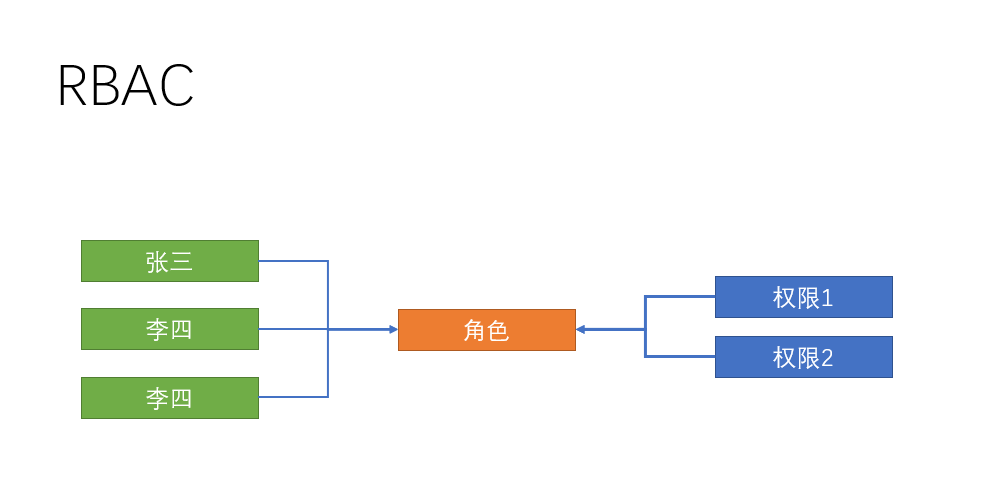

  

RBAC实现了用户和权限点的分离，想对某个用户设置权限，只需要对该用户设置相应的角色即可，而该角色就拥有了对应的权限，这样一来，权限的分配和设计就做到了极简，高效，当想对用户收回权限时，只需要收回角色即可，接下来，我们就在该项目中实施这一设想

  

## 给分配员工角色

  

**`目标`**在员工管理页面，分配角色

  

### 新建分配角色窗体

  

> 在上一节章节中，员工管理的角色功能，我们并没有实现，此章节我们实现给员工分配角色

  


  

从上图中，可以看出，用户和角色是**`1对多`**的关系，即一个用户可以拥有多个角色，比如公司的董事长可以拥有总经理和系统管理员一样的角色
 
  

首先，新建分配角色窗体 **`assign-role.vue`**

  

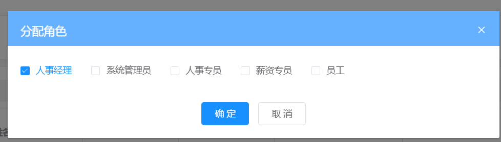

  

```vue

<template>

<el-dialog title="分配角色" :visible="showRoleDialog">

<!-- el-checkbox-group选中的是 当前用户所拥有的角色 需要绑定 当前用户拥有的角色-->

<el-checkbox-group>

<!-- 选项 -->

</el-checkbox-group>

<el-row slot="footer" type="flex" justify="center">

<el-col :span="6">

<el-button type="primary" size="small">确定</el-button>

<el-button size="small">取消</el-button>

</el-col>

</el-row>

</el-dialog>

</template>

  

<script>

export default {

props: {

showRoleDialog: {

type: Boolean,

default: false

},

// 用户的id 用来查询当前用户的角色信息

userId: {

type: String,

default: null

}

}

}

</script>

  
  

```

  

### 获取角色列表和当前用户角色

  

**获取所有角色列表**

  

```vue

<!-- 分配角色 -->

<el-checkbox-group v-model="roleIds">

<el-checkbox v-for="item in list" :key="item.id" :label="item.id">

{{

item.name

}}

</el-checkbox>

</el-checkbox-group>

```

  

**获取角色列表**

  

```js

import { getRoleList } from '@/api/setting'

  

export default {

props: {

showRoleDialog: {

type: Boolean,

default: false

},

userId: {

type: String,

default: null

}

},

data() {

return {

list: [], // 角色列表

roleIds: []

}

},

created() {

this.getRoleList()

},

methods: {

// 获取所有角色

async getRoleList() {

const { rows } = await getRoleList()

this.list = rows

}

}

}

```

  

**获取用户的当前角色**

  

```js

import { getUserDetailById } from '@/api/user'

  

async getUserDetailById(id) {

const { roleIds } = await getUserDetailById(id)

this.roleIds = roleIds // 赋值本用户的角色

}

```

  

**点击角色弹出层**

  

```vue

// 编辑角色

async editRole(id) {

this.userId = id // props传值 是异步的,不知道能不能使用通过props传入的userid，  所以调用下面的实例方法时，传入id， 调用

await this.$refs.assignRole.getUserDetailById(id) // 父组件调用子组件方法

this.showRoleDialog = true

},

<!-- 放置角色分配组件 -->

<assign-role ref="assignRole" :show-role-dialog.sync="showRoleDialog" :user-id="userId" />

```

  

### 给员工分配角色

  

**分配角色接口** **`api/employees.js`**

  

```js

/** *

* 给用户分配角色

* ***/

export function assignRoles(data) {

return request({

url: '/sys/user/assignRoles',

data,

method: 'put'

})

}

```

  

**确定保存** **`assign-role`**

  

```js

async btnOK() {

await assignRoles({ id: this.userId, roleIds: this.roleIds })

// 关闭窗体

this.$emit('update:showRoleDialog', false)

},

```

  

**取消或者关闭 ** **`assign-role`**

  

```js

btnCancel() {

this.roleIds = [] // 清空原来的数组

this.$emit('update:showRoleDialog', false)

}

```

  

**提交代码**

  

**`本节任务`** 分配员工权限

  

## 权限点管理页面开发

  

**`目标`**： 完成权限点页面的开发和管理

  

### 新建权限点管理页面

  

> 人已经有了角色， 那么权限是什么

  

在企业服务中，权限一般分割为 **页面访问权限**，**按钮操作权限**，**API访问权限**

  

> API权限多见于在后端进行拦截，所以我们这一版本只做**`页面访问`**和**`按钮操作授权`/**

  

由此，我们可以根据业务需求设计权限管理页面

  


  

**完成权限页面结构** **`src/views/permission/index.vue`**

  

```vue

<template>

<div class="dashboard-container">

<div class="app-container">

<!-- 靠右的按钮 -->

<page-tools>

<template v-slot:after>

<el-button type="primary" size="small">添加权限</el-button>

</template>

</page-tools>

<!-- 表格 -->

<el-table border>

<el-table-column align="center" label="名称" />

<el-table-column align="center" label="标识" />

<el-table-column align="center" label="描述" />

<el-table-column align="center" label="操作">

<template>

<el-button type="text">添加</el-button>

<el-button type="text">编辑</el-button>

<el-button type="text">删除</el-button>

</template>

</el-table-column>

  

</el-table>

</div>

</div>

</template>

```

  

**封装权限管理的增删改查请求** **`src/api/permisson.js`**

  

```js

// 获取权限

export function getPermissionList(params) {

return request({

url: '/sys/permission',

params

})

}

// 新增权限

export function addPermission(data) {

return request({

url: '/sys/permission',

method: 'post',

data

})

}

  

// 更新权限

export function updatePermission(data) {

return request({

url: `/sys/permission/${data.id}`,

method: 'put',

data

})

}

  

// 删除权限

export function delPermission(id) {

return request({

url: `/sys/permission/${id}`,

method: 'delete'

})

}

// 获取权限详情

export function getPermissionDetail(id) {

return request({

url: `/sys/permission/${id}`

})

}

  

```

  

### 获取权限数据并转化树形

  

这里，我们通过树形操作方法，将列表转化成层级数据

  

```vue

<script>

import { getPermissionList } from '@/api/permission'

import { transListToTreeData } from '@/utils'

export default {

data() {

return {

list: [],

formData: {

name: '', // 名称

code: '', // 标识

description: '', // 描述

type: '', // 类型 该类型 不需要显示 因为点击添加的时候已经知道类型了

pid: '', // 因为做的是树 需要知道添加到哪个节点下了

enVisible: '0' // 开启

},

rules: {

name: [{ required: true, message: '权限名称不能为空', trigger: 'blur' }],

code: [{ required: true, message: '权限标识不能为空', trigger: 'blur' }]

},

showDialog: false

}

},

created() {

this.getPermissionList()

},

computed: {

showText() {

return this.formData.id ? '编辑' : '新增'

}

},

methods: {

async getPermissionList() {

this.list = transListToTreeData(await getPermissionList(), '0')

}

}

  

}

</script>

```

  

**绑定表格数据**

  

```vue

<el-table :data="list" border="" row-key="id">

<el-table-column label="名称" prop="name" />

<el-table-column label="标识" prop="code" />

<el-table-column label="描述" prop="description" />

<el-table-column label="操作">

<template slot-scope="{ row }">

<el-button v-if="row.type === 1" type="text" @click="addPermission(row.id, 2)">添加</el-button>

<el-button type="text" @click="editPermission(row.id)">编辑</el-button>

<el-button type="text" @click="delPermission(row.id)"> 删除</el-button>

</template>

</el-table-column>

</el-table>

```

  

需要注意的是， 如果需要树表， 需要给**el-table**配置**row-key**属性 id

  

> 当type为1时为访问权限，type为2时为功能权限

  

> 和前面内容一样，我们需要完成 新增权限 / 删除权限 / 编辑权限

  

### 新增编辑权限的弹层

  

**新增权限/编辑权限弹层**

  

```vue

<!-- 放置一个弹层 用来编辑新增节点 -->

<el-dialog :title="`${showText}权限点`" :visible="showDialog" @close="btnCancel">

<!-- 表单 -->

<el-form ref="perForm" :model="formData" :rules="rules" label-width="120px">

<el-form-item label="权限名称" prop="name">

<el-input v-model="formData.name" style="width:90%" />

</el-form-item>

<el-form-item label="权限标识" prop="code">

<el-input v-model="formData.code" style="width:90%" />

</el-form-item>

<el-form-item label="权限描述">

<el-input v-model="formData.description" style="width:90%" />

</el-form-item>

<el-form-item label="开启">

<el-switch

v-model="formData.enVisible"

active-value="1"

inactive-value="0"

/>

</el-form-item>

</el-form>

<el-row slot="footer" type="flex" justify="center">

<el-col :span="6">

<el-button size="small" type="primary" @click="btnOK">确定</el-button>

<el-button size="small" @click="btnCancel">取消</el-button>

</el-col>

</el-row>

</el-dialog>

```

  

### 新增，编辑，删除权限点

  

**新增/删除/编辑逻辑**

  

```js

import { updatePermission, addPermission, getPermissionDetail, delPermission, getPermissionList } from '@/api/permission'

methods: {

// 删除操作

async delPermission(id) {

try {

await this.$confirm('确定要删除该数据吗')

await delPermission(id)

this.getPermissionList()

this.$message.success('删除成功')

} catch (error) {

console.log(error)

}

},

btnOK() {

this.$refs.perForm.validate().then(() => {

if (this.formData.id) {

return updatePermission(this.formData)

}

return addPermission(this.formData)

}).then(() => {

// 提示消息

this.$message.success('新增成功')

this.getPermissionList()

this.showDialog = false

})

},

btnCancel() {

this.formData = {

name: '', // 名称

code: '', // 标识

description: '', // 描述

type: '', // 类型 该类型 不需要显示 因为点击添加的时候已经知道类型了

pid: '', // 因为做的是树 需要知道添加到哪个节点下了

enVisible: '0' // 开启

}

this.$refs.perForm.resetFields()

this.showDialog = false

},

addPermission(pid, type) {

this.formData.pid = pid

this.formData.type = type

this.showDialog = true

},

async editPermission(id) {

// 根据获取id获取详情

this.formData = await getPermissionDetail(id)

this.showDialog = true

}

}

```

  

**提交代码**

  

**`本节任务`**: 权限点管理页面开发

  

## 给角色分配权限

  

**`目标`**： 完成给角色分配权限的业务 

  

### 新建分配权限弹出层

  

> 在公司设置的章节中，我们没有实现分配权限的功能，在这里我们来实现一下

  

**封装分配权限的api** **`src/api/setting.js`**

  

```js

// 给角色分配权限

export function assignPerm(data) {

return request({ 

url: '/sys/role/assignPrem',

method: 'put',

data

})

}

  

```

**给角色分配权限弹出层**

  

```vue

<el-dialog title="分配权限" :visible="showPermDialog" @close="btnPermCancel">

<!-- 权限是一颗树 -->

<!-- 将数据绑定到组件上 -->

<!-- check-strictly 如果为true 那表示父子勾选时 不互相关联 如果为false就互相关联 -->

<!-- id作为唯一标识 -->

<el-tree

ref="permTree"

:data="permData"

:props="defaultProps"

:show-checkbox="true"

:check-strictly="true"

:default-expand-all="true"

:default-checked-keys="selectCheck"

node-key="id"

/>

<!-- 确定 取消 -->

<el-row slot="footer" type="flex" justify="center">

<el-col :span="6">

<el-button type="primary" size="small" @click="btnPermOK">确定</el-button>

<el-button size="small" @click="btnPermCancel">取消</el-button>

</el-col>

</el-row>

</el-dialog>

```

  

**定义数据**

  

```js

showPermDialog: false, // 控制分配权限弹层的显示后者隐藏

defaultProps: {

label: 'name'

},

permData: [], // 专门用来接收权限数据 树形数据

selectCheck: [], // 定义一个数组来接收 已经选中的节点

roleId: null // 用来记录分配角色的id

```

  

**点击分配权限**

  

```vue

<el-button size="small" type="success" @click="assignPerm(row.id)">分配权限</el-button>

```

  

### 给角色分配权限

  

**分配权限**/**树形数据**

  

```js

import { transListToTreeData } from '@/utils'

import { getPermissionList } from '@/api/permission'

methods: {

// 点击分配权限

// 获取权限点数据 在点击的时候调用 获取权限点数据

async assignPerm(id) {

this.permData = tranListToTreeData(await getPermissionList(), '0') // 转化list到树形数据

this.roleId = id

// 应该去获取 这个id的 权限点

// 有id 就可以 id应该先记录下来

const { permIds } = await getRoleDetail(id) // permIds是当前角色所拥有的权限点数据

this.selectCheck = permIds // 将当前角色所拥有的权限id赋值

this.showPermDialog = true

},

async btnPermOK() {

// 调用el-tree的方法

// console.log(this.$refs.permTree.getCheckedKeys())

await assignPerm({ permIds: this.$refs.permTree.getCheckedKeys(), id: this.roleId })

this.$message.success('分配权限成功')

this.showPermDialog = false

},

btnPermCancel() {

this.selectCheck = [] // 重置数据

this.showPermDialog = false

}

}

  

```

  

**提交代码**

  

**`本节任务`** 给角色分配权限

  

## 前端权限应用-页面访问和菜单

  

**`目标`**： 在当前项目应用用户的页面访问权限

  

### 权限受控的主体思路

  

> 到了最关键的环节，我们设置的权限如何应用？

  

在上面的几个小节中，我们已经把给用户分配了角色， 给角色分配了权限，那么在用户登录获取资料的时候，会自动查出该用户拥有哪些权限，这个权限需要和我们的菜单还有路由有效结合起来

  

> 我们在路由和页面章节中，已经介绍过，动态权限其实就是根据用户的实际权限来访问的，接下来我们操作一下

  


  

在权限管理页面中，我们设置了一个**标识**， 这个标识可以和我们的路由模块进行关联，也就是说，如果用户拥有这个标识，那么用户就可以**拥有这个路由模块**，如果没有这个标识，就不能**访问路由模块**

  

> 用什么来实现？

  

vue-router提供了一个叫做[addRoutes](https://router.vuejs.org/zh/api/#router-addroutes)的API方法，这个方法的含义是**动态添加路由规则**

  

思路如下

  


  

### 新建Vuex中管理权限的模块

  

> 在**主页模块**章节中，我们将用户的资料设置到vuex中，其中便有权限数据，我们可以就此进行操作

  

我们可以在vuex中新增一个permission模块

  

**`src/store/modules/permission.js`**

  

```js

// vuex的权限模块

import { constantRoutes } from '@/router'

// vuex中的permission模块用来存放当前的 静态路由 + 当前用户的 权限路由

const state = {

routes: constantRoutes // 所有人默认拥有静态路由

}

const mutations = {

// newRoutes可以认为是 用户登录 通过权限所得到的动态路由的部分

setRoutes(state, newRoutes) {

// 下面这么写不对 不是语法不对 是业务不对

// state.routes = [...state.routes, ...newRoutes]

// 有一种情况 张三 登录 获取了动态路由 追加到路由上 李四登录 4个动态路由

// 应该是每次更新 都应该在静态路由的基础上进行追加

state.routes = [...constantRoutes, ...newRoutes]

}

}

const actions = {}

export default {

namespaced: true,

state,

mutations,

actions

}

  

```

  

在Vuex管理模块中引入permisson模块

  

```js

import permission from './modules/permission'

const store = new Vuex.Store({

modules: {

// 子模块 $store.state.app.

// mapGetters([])

app,

settings,

user,

permission

},

getters

})

```

  

### Vuex筛选权限路由

  

> OK， 那么我们在哪将用户的标识和权限进行关联呢 ？

  


  

我们可以在这张图中，进一步的进行操作

  


  
  
  

访问权限的数据在用户属性**`menus`**中，**`menus`**中的标识该怎么和路由对应呢？

  


  

> 可以将路由模块的根节点**`name`**属性命名和权限标识一致，这样只要标识能对上，就说明用户拥有了该权限

  

这一步，在我们命名路由的时候已经操作过了

  


  

接下来， vuex的permission中提供一个action，进行关联

  

```js

import { asyncRoutes, constantRoutes } from '@/router'

  

const actions = {

// 筛选权限路由

// 第二个参数为当前用户的所拥有的菜单权限

// menus: ["settings","permissions"]

// asyncRoutes是所有的动态路由

// asyncRoutes [{path: 'setting',name: 'setting'},{}]

filterRoutes(context, menus) {

const routes = []

// 筛选出 动态路由中和menus中能够对上的路由

menus.forEach(key => {

// key就是标识

// asyncRoutes 找 有没有对象中的name属性等于 key的 如果找不到就没权限 如果找到了 要筛选出来

routes.push(...asyncRoutes.filter(item => item.name === key)) // 得到一个数组 有可能 有元素 也有可能是空数组

})

// 得到的routes是所有模块中满足权限要求的路由数组

// routes就是当前用户所拥有的 动态路由的权限

context.commit('setRoutes', routes) // 将动态路由提交给mutations

return routes // 这里为什么还要return state数据 是用来 显示左侧菜单用的 return 是给路由addRoutes用的

}

```

  

### 权限拦截出调用筛选权限Action

  

在拦截的位置，调用关联action， 获取新增routes，并且**addRoutes**

  

```js

// 权限拦截在路由跳转 导航守卫

  

import router from '@/router'

import store from '@/store' // 引入store实例 和组件中的this.$store是一回事
 
import nprogress from 'nprogress' // 引入进度条

import 'nprogress/nprogress.css' // 引入进度条样式

// 不需要导出 因为只需要让代码执行即可

// 前置守卫

// next是前置守卫必须必须必须执行的钩子 next必须执行 如果不执行 页面就死了

// next() 放过

// next(false) 跳转终止

// next(地址) 跳转到某个地址

const whiteList = ['/login', '/404'] // 定义白名单

router.beforeEach(async(to, from, next) => {

nprogress.start() // 开启进度条的意思

if (store.getters.token) {

// 只有有token的情况下 才能获取资料

// 如果有token

if (to.path === '/login') {

// 如果要访问的是 登录页

next('/') // 跳到主页 // 有token 用处理吗？不用

} else {

// 只有放过的时候才去获取用户资料

// 是每次都获取吗

// 如果当前vuex中有用户的资料的id 表示 已经有资料了 不需要获取了 如果没有id才需要获取

if (!store.getters.userId) {

// 如果没有id才表示当前用户资料没有获取过

// async 函数所return的内容 用 await就可以接收到

const { roles } = await store.dispatch('user/getUserInfo')

// 如果说后续 需要根据用户资料获取数据的话 这里必须改成 同步

// 筛选用户的可用路由

// actions中函数 默认是Promise对象 调用这个对象 想要获取返回的值话 必须 加 await或者是then

// actions是做异步操作的

const routes = await store.dispatch('permission/filterRoutes', roles.menus)

// routes就是筛选得到的动态路由

// 动态路由 添加到 路由表中 默认的路由表 只有静态路由 没有动态路由

// addRoutes 必须 用 next(地址) 不能用next()

router.addRoutes(routes) // 添加动态路由到路由表 铺路

// 添加完动态路由之后

next(to.path) // 相当于跳到对应的地址 相当于多做一次跳转 为什么要多做一次跳转

// 进门了，但是进门之后我要去的地方的路还没有铺好，直接走，掉坑里，多做一次跳转，再从门外往里进一次，跳转之前 把路铺好，再次进来的时候，路就铺好了

} else {

next()

}

}

} else {

// 没有token的情况下

if (whiteList.indexOf(to.path) > -1) {

// 表示要去的地址在白名单

next()

} else {

next('/login')

}

}

nprogress.done() // 解决手动切换地址时 进度条不关闭的问题

})

// 后置守卫

router.afterEach(() => {

nprogress.done() // 关闭进度条

})

  

```

  

### 静态路由动态路由解除合并

  

**注意**： 这里有个非常容易出问题的位置，当我们判断用户是否已经添加路由的前后，不能都是用**next()**，

  

在添加路由之后应该使用 **next(to.path)**， 否则会使刷新页面之后 权限消失，这属于一个vue-router的**已知缺陷**

  

同时，不要忘记，我们将原来的静态路由 + 动态路由合体的模式 改成 只有静态路由 **`src/router/index.js`**

  

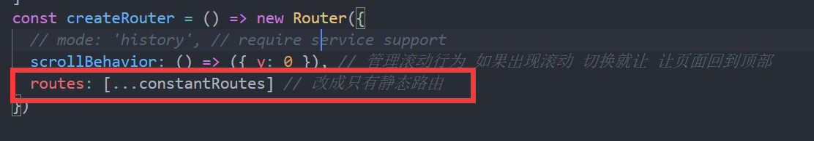

  
  
  

> 此时，我们已经完成了权限设置的一半， 此时我们发现左侧菜单失去了内容，这是因为左侧菜单读取的是固定的路由，我们要把它换成实时的最新路由

  

在**`src/store/getters.js`**配置导出routes

  

```js

const getters = {

sidebar: state => state.app.sidebar,

device: state => state.app.device,

token: state => state.user.token,

name: state => state.user.userInfo.username, // 建立用户名称的映射

userId: state => state.user.userInfo.userId, // 建立用户id的映射

companyId: state => state.user.userInfo.companyId, // 建立用户的公司Id映射

routes: state => state.permission.routes // 导出当前的路由

}

export default getters

  

```

  

在左侧菜单组件中， 引入routes

  

```js

computed: {

...mapGetters([

'sidebar', 'routes'

]),

```

  

> OK，到现在为止，我们已经可以实现不同用户登录的时候，菜单是动态的了

  

**提交代码**

  

**`本节任务`** 前端权限应用-页面访问和菜单

  
  
  

## 登出时，重置路由权限和 404问题

  

**目标**： 处理当登出页面时，路由不正确的问题

  

> 上一小节，我们看似完成了访问权限的功能，实则不然，因为当我们登出操作之后，虽然看不到菜单，但是用户实际上可以访问页面，直接在地址栏输入地址就能访问

  

这是怎么回事？

  

> 这是因为我们前面在**addRoutes**的时候，一直都是在**加**，登出的时候，我们并没有删，也没有重置，也就是说，我们之前加的路由在登出之后一直在，这怎么处理？

  

大家留意我们的**router/index.js**文件，发现一个重置路由方法

  

```js

// 重置路由

export function resetRouter() {

const newRouter = createRouter()

router.matcher = newRouter.matcher // 重新设置路由的可匹配路径

}

```

  

没错，这个方法就是将路由重新实例化，相当于换了一个新的路由，之前**`加的路由`**自然不存在了，只需要在登出的时候， 处理一下即可

  

```js

// 登出的action

lgout(context) {

// 删除token

context.commit('removeToken') // 不仅仅删除了vuex中的 还删除了缓存中的

// 删除用户资料

context.commit('removeUserInfo') // 删除用户信息

// 重置路由

resetRouter()

// 还有一步 vuex中的数据是不是还在

// 要清空permission模块下的state数据

// vuex中 user子模块 permission子模块

// 子模块调用子模块的action 默认情况下 子模块的context是子模块的

// 父模块 调用 子模块的action

context.commit('permission/setRoutes', [], { root: true })

// 子模块调用子模块的action 可以 将 commit的第三个参数 设置成 { root: true } 就表示当前的context不是子模块了 而是父模块

}

```

  

除此之外，我们发现在页面刷新的时候，本来应该拥有权限的页面出现了404，这是因为404的匹配权限放在了静态路由，而动态路由在没有addRoutes之前，找不到对应的地址，就会显示404，所以我们需要将404放置到动态路由的最后

  

**`src/permission.js`**

  

```js

router.addRoutes([...routes, { path: '*', redirect: '/404', hidden: true }]) // 添加到路由表

```

  

**提交代码**

  

## 功能权限应用

  

**目标**： 实现功能权限的应用

  

### 功能权限的受控思路

  

> 上小节中，当我们拥有了一个模块，一个页面的访问权限之后，页面中的某些功能，用户可能有，也可能没有，这就是功能权限

  

这就是上小节，查询出来的数据中的**`points`**

  

> 比如，我们想对员工管理的删除功能做个权限怎么做？

  

首先需要在员工管理的权限点下， 新增一个删除权限点，启用

  


  

> 我们要做的就是看看用户，是否拥有**point-user-delete**这个point，有就可以让删除能用，没有就隐藏或者禁用

  

### 使用Mixin技术将检查方法注入

  

所以，我们可以采用一个新的技术 [mixin(混入)](https://cn.vuejs.org/v2/guide/mixins.html)来让所有的组件可以拥有一个公共的方法

**`src/mixin/checkPermission.js`**

```js

import store from '@/store'

export default {

methods: {

checkPermission(key) {

const { userInfo } = store.state.user

if (userInfo.roles.points && userInfo.roles.points.length) {

return userInfo.roles.points.some(item => item === key)

}

return false

}

}

}

  

```


**在员工组件中检查权限点**

```vue

<el-button :disabled="!checkPermission('POINT-USER-UPDATE')" type="text" size="small" @click="$router.push(`/employees/detail/${obj.row.id}`)">查看</el-button>

  

```

  

此时，可以通过配置权限的方式，检查权限的可用性了

  

**提交代码**


# 首页的页面结构
  

**`目标`**： 实现系统首页的页面结构


> 目前，我们的页面还剩下首页，这里我们可以按照如图实现一下的结构


首页页面结构，**src/views/dashboard/index.vue**


```vue

<template>

<div class="dashboard-container">

<!-- 头部内容 -->

<el-card class="header-card">

<div>

<div class="fl headL">

<div class="headImg">


</div>

<div class="headInfoTip">

<p class="firstChild">早安，管理员，祝你开心每一天！</p>

<p class="lastChild">早安，管理员，祝你开心每一天！</p>

</div>

</div>

<div class="fr" />

</div>

</el-card>

<!-- 主要内容 -->

<el-row type="flex" justify="space-between">

<!-- 左侧内容 -->

<el-col :span="13" style="padding-right:26px">

<!-- 工作日历 -->

<el-card class="box-card">

<div slot="header" class="header">

<span>工作日历</span>

</div>

<!-- 放置日历组件 -->

</el-card>

<!-- 公告 -->

<el-card class="box-card">

<div class="advContent">

<div class="title"> 公告</div>

<div class="contentItem">

<ul class="noticeList">

<li>

<div class="item">


<div>

<p><span class="col">朱继柳</span> 发布了 第1期“传智大讲堂”互动讨论获奖名单公布</p>

<p>2018-07-21 15:21:38</p>

</div>

</div>

</li>

<li>

<div class="item">


<div>

<p><span class="col">朱继柳</span> 发布了 第2期“传智大讲堂”互动讨论获奖名单公布</p>

<p>2018-07-21 15:21:38</p>

</div>

</div>

</li>

<li>

<div class="item">


<div>

<p><span class="col">朱继柳</span> 发布了 第3期“传智大讲堂”互动讨论获奖名单公布</p>

<p>2018-07-21 15:21:38</p>

</div>

</div>

</li>

</ul>

</div>

</div>

</el-card>

</el-col>

<!-- 右侧内容 -->

<el-col :span="11">

<el-card class="box-card">

<div class="header headTit">

<span>流程申请</span>

</div>

<div class="sideNav">

<el-button class="sideBtn">加班离职</el-button>

<el-button class="sideBtn">请假调休</el-button>

<el-button class="sideBtn">审批列表</el-button>

<el-button class="sideBtn">我的信息</el-button>

</div>

</el-card>

  

<!-- 绩效指数 -->

<el-card class="box-card">

<div slot="header" class="header">

<span>绩效指数</span>

</div>

<!-- 放置雷达图 -->

</el-card>

<!-- 帮助连接 -->

<el-card class="box-card">

<div class="header headTit">

<span>帮助链接</span>

</div>

<div class="sideLink">

<el-row>

<el-col :span="8">

<a href="#">

<span class="icon iconGuide" />

<p>入门指南</p>

</a>

</el-col>

<el-col :span="8">

<a href="#">

<span class="icon iconHelp" />

<p>在线帮助手册</p>

</a>

</el-col>

<el-col :span="8">

<a href="#">

<span class="icon iconTechnology" />

<p>联系技术支持</p>

</a>

</el-col>

</el-row>

</div>

</el-card>

</el-col>

</el-row>

</div>

</template>

  

<script>

import { mapGetters } from 'vuex'

  

export default {

name: 'Dashboard',

computed: {

...mapGetters([

'name'

])

}

}

</script>

  

<style lang="scss" scoped>

.dashboard-container {

margin: 10px;

li {

list-style: none;

}

.headImg {

float: left;

width: 100px;

height: 100px;

border-radius: 50%;

background: #999;

img {

width: 100%;

height: 100%;

border-radius: 50%;

}

}

  

.headInfoTip {

padding: 25px 0 0;

margin-left: 120px;

p {

padding: 0 0 15px;

margin: 0;

&.firstChild {

font-size: 24px;

}

&.lastChild {

font-size: 20px;

color: #7f8c8d;

}

}

}

}

  

.box-card {

padding: 5px 10px;

margin-top: 20px;

.header {

span {

color: #2c3e50;

font-size: 24px;

}

.item {

color: #97a8be;

float: right;

padding: 3px 0;

}

}

.headTit {

span {

border-bottom: 4px solid #8a97f8;

padding-bottom: 10px;

}

}

}

.header-card{

position: relative;

.header {

position: absolute;

right: 20px;

top: 15px;

z-index: 1;

}

}

  

.advContent {

background: #fff;

border-radius: 5px 5px 0px 0px;

.title {

font-size: 16px;

padding: 20px;

font-weight: bold;

border-bottom: solid 1px #ccc;

}

.contentItem {

padding: 0 30px;

min-height: 350px;

.item {

display: flex;

padding:18px 0 10px;

border-bottom: solid 1px #ccc;

.col {

color: #8a97f8;

}

img {

width: 56px;

height: 56px;

border-radius: 50%;

margin-right: 10px;

}

p{

padding: 0 0 8px;

}

}

}

}

.noticeList {

margin: 0;

padding: 0;

}

.sideNav,

.sideLink {

padding: 30px 0 12px;

.sideBtn {

padding: 16px 26px;

font-size:16px;

margin: 10px 5px;

}

}

.sideLink {

text-align: center;

.icon {

display: inline-block;

width: 76px;

height: 76px;

background: url('./../../assets/common/icon.png') no-repeat;

}

.iconGuide {

background-position: 0 0;

}

.iconHelp {

background-position: -224px 0;

}

.iconTechnology {

background-position: -460px 0;

}

}

</style>

  

```

大家发现，我们预留了**`工作日历`**和**`绩效指数`**两个组件，我们会在后续的组件中进行开发

## 首页用户资料显示


​ **`目标`**：将首页的信息换成真实的用户资料


> 直接获取Vuex的用户资料即可

  

```vue

<script>

import { createNamespacedHelpers } from 'vuex'

const { mapState } = createNamespacedHelpers('user')

export default {

name: 'Dashboard',

data() {

return {

defaultImg: require('@/assets/common/head.jpg'),

}

},

computed: {

...mapState(['userInfo'])

}

}

</script>

```

  

在 vue视图中绑定

  

```vue

<div class="fl headL">

<div class="headImg">


</div>

<div class="headInfoTip">

<p class="firstChild">早安，{{ userInfo.username }}，祝你开心每一天！</p>

<p class="lastChild">{{ userInfo.username }} | {{ userInfo.companyName }}-{{ userInfo.departmentName }}</p>

</div>

</div>

```

  

> 除此之外，当我们加载图片失败的时候，图片地址存在，但是却不能显示，之前我们封装的图片错误指令可以应用

  

```vue


```

  

## 工作日历组件封装

  

**`目标`**封装一个工作日历组件在首页中展示

  

### 新建工作日历组件结构

  

> 工作日历的要求很简单，显示每个月的日期，可以设定日期的范围

  

我们可以基于Element组件[el-calendar](https://element.eleme.cn/#/zh-CN/component/calendar)进行封装

  

代码如下 **`src/views/dashboard/components/work-calendar.vue`**

  

```vue

<template>

<div>

<el-row type="flex" justify="end">

<el-select v-model="currentYear" size="small" style="width: 120px" @change="dateChange">

<el-option v-for="item in yearList" :key="item" :label="item" :value="item">{{ item }}</el-option>

</el-select>

<el-select v-model="currentMonth" size="small" style="width: 120px;margin-left:10px" @change="dateChange">

<el-option v-for="item in 12" :key="item" :label="item" :value="item">{{ item }}</el-option>

</el-select>

</el-row>

<el-calendar v-model="currentDate">

<template v-slot:dateCell="{ date, data }" class="content">

<div class="date-content">

<span class="text"> {{ data.day | getDay }}</span>

<span v-if="isWeek(date)" class="rest">休</span>

</div>

</template>

</el-calendar>

</div>

</template>

  

<script>

export default {

props: {

startDate: {

type: Date,

default: () => new Date()

}

},

data() {

return {

currentMonth: null, // 当前月份

currentYear: null, // 当前年份

currentDate: null,

yearList: []

}

}

}

</script>

  

<style scoped>

/deep/ .el-calendar-day {

height: auto;

}

/deep/ .el-calendar-table__row td,/deep/ .el-calendar-table tr td:first-child, /deep/ .el-calendar-table__row td.prev{

border:none;

}

.date-content {

height: 40px;

text-align: center;

line-height: 40px;

font-size: 14px;

}

.date-content .rest {

color: #fff;

border-radius: 50%;

background: rgb(250, 124, 77);

width: 20px;

height: 20px;

line-height: 20px;

display: inline-block;

font-size: 12px;

margin-left: 10px;

}

.date-content .text{

width: 20px;

height: 20px;

line-height: 20px;

display: inline-block;

  

}

/deep/ .el-calendar-table td.is-selected .text{

background: #409eff;

color: #fff;

border-radius: 50%;

}

/deep/ .el-calendar__header {

display: none

}

</style>

  

```

  

### 实现工作日历逻辑

  

```js

export default {

filters: {

getDay(value) {

const day = value.split('-')[2]

return day.startsWith('0') ? day.substr(1) : day

}

},

props: {

startDate: {

type: Date,

default: () => new Date()

}

},

data() {

return {

currentMonth: null, // 当前月份

currentYear: null, // 当前年份

currentDate: null,

yearList: []

}

},

// 初始化事件

created() {

// 处理起始时间

// 组件要求起始时间必须是 周一开始 以一个月为开始

this.currentMonth = this.startDate.getMonth() + 1

this.currentYear = this.startDate.getFullYear()

// 根据当前的年 生成可选年份 前后各加5年

this.yearList = Array.from(Array(11), (value, index) => this.currentYear + index - 5 )

// 计算 当年当月的第一个周一 再加上 四周之后的一个月月份

this.dateChange()

},

methods: {

// 是否是休息日

isWeek(value) {

return value.getDay() === 6 || value.getDay() === 0

},

// 年月份改变之后

dateChange() {

const year = this.currentYear

const month = this.currentMonth

this.currentDate = new Date(`${year}-${month}-1`) // 以当前月的1号为起始

}

}

}

```

  

**在主页中应用**

  

```vue

<!-- 放置日历组件 -->

<work-calendar />

```

  
  
  

**提交代码**

  

## 封装雷达图图表显示在首页

  

**`目标`**：封装一个echarts中的雷达图表显示在首页的绩效指数的位置

  

### 了解雷达图

  

### 封装雷达图插件

  

> 首页中，还有一个绩效指数的位置需要放置一个雷达图的图表，我们可以采用百度的echarts进行封装

  

第一步， 安装echarts图表

  

```bash

$ npm i echarts

```

  

> echarts是一个很大的包，里面包含了众多图形，假设我们只使用雷达图，可以做按需加载

  

第二步， 新建雷达图组件，**`src/views/dashboard/components/radar.vue`**

  

```vue

<template>

<!-- 雷达图 图表必须给高和宽度-->

<div ref="myDiv" class="radar-echart" />

</template>

  

<script>

// 完成加载过程

// var echarts = require('echarts')

var echarts = require('echarts/lib/echarts') // 引入echarts主模块

require('echarts/lib/chart/radar') // 引入雷达图

// 引入提示框和标题组件

require('echarts/lib/component/tooltip')

require('echarts/lib/component/title')

  

export default {

// 页面渲染完毕事件

mounted() {

const myChart = echarts.init(this.$refs.myDiv) // 得到图表实例

myChart.setOption({

title: {

text: '基础雷达图'

},

tooltip: {},

legend: {

data: ['预算分配（Allocated Budget）', '实际开销（Actual Spending）']

},

radar: {

// shape: 'circle',

name: {

textStyle: {

color: '#fff',

backgroundColor: '#999',

borderRadius: 3,

padding: [3, 5]

}

},

// 每个区域的最高值

indicator: [

{ name: '工作效率', max: 100 },

{ name: '考勤', max: 100 },

{ name: '积极性', max: 100 },

{ name: '帮助同事', max: 100 },

{ name: '自主学习', max: 100 },

{ name: '正确率', max: 100 }

]

},

series: [{

name: '预算 vs 开销（Budget vs spending）',

type: 'radar',

// areaStyle: {normal: {}},

data: [

{

value: [10, 1, 100, 5, 100, 0],

name: '张三'

},

{

value: [50, 50, 50, 50, 50, 10],

name: '李四'

}

]

}]

})

}

}

</script>

  

<style>

.radar-echart {

width: 600px;

height: 400px;

}

</style>

  

```

  

我们得到一个雷达图，对绩效指数进行统计

  


  

**`注意`**：相关数据的缺失，所以这里我们进行的是模拟数据

  

**在主页中引入使用**

  

```vue

import Radar from './components/radar'

```

  

## 审批流程业务的基本介绍

  

> 什么是审批流程

  

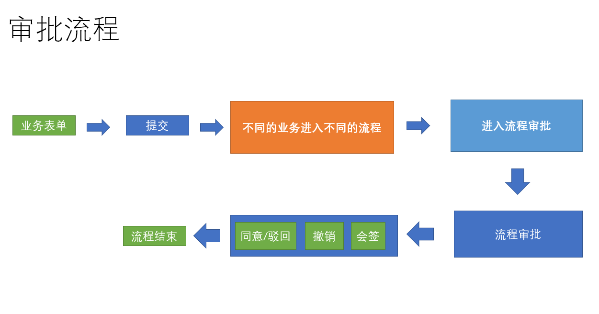

  

## 提交一个离职审批

**`目标`**： 提交一个离职的审批，并完成业务流转

**离职弹层**

```vue

<!-- 弹出层 -->

<el-dialog :visible="showDialog" title="离职申请" @close="btnCancel">

<el-form

ref="ruleForm"

:model="ruleForm"

status-icon

label-width="110px"

:rules="rules"

>

<!--离职表单-->

<el-form-item label="离职时间" prop="end_time">

<el-date-picker

v-model="ruleForm.exceptTime"

type="datetime"

value-format="yyyy-MM-dd HH:mm:ss"

placeholder="选择日期时间"

/>

</el-form-item>

<el-form-item label="离职原因" prop="reason">

<el-input

v-model="ruleForm.reason"

type="textarea"

:autosize="{ minRows: 3, maxRows: 8}"

style="width: 70%;"

placeholder="请输入内容"

/>

</el-form-item>

</el-form>

<el-row slot="footer" type="flex" justify="center">

<el-col :span="6">

<el-button size="small" type="primary" @click="btnOK">确定</el-button>

<el-button size="small" @click="btnCancel">取消</el-button>

</el-col>

</el-row>

</el-dialog>

```

  

**显示弹层**

  

```vue

<el-button class="sideBtn" @click="showDialog = true">加班离职</el-button>

```

  

**加班数据及校验**

  

```js

showDialog: false,

ruleForm: {

exceptTime: '',

reason: '',

processKey: 'process_dimission', // 特定的审批

processName: '离职'

},

rules: {

exceptTime: [{ required: true, message: '离职时间不能为空' }],

reason: [{ required: true, message: '离职原因不能为空' }]

}

```

  

**提交审批逻辑**

  

```js

import { startProcess } from '@/api/approvals'

methods: {

btnOK() {

this.$refs.ruleForm.validate(async validate => {

if (validate) {

const data = { ...this.ruleForm, userId: this.userInfo.userId }

await startProcess(data)

this.$message.success('提交流程成功')

this.btnCancel()

}

})

},

btnCancel() {

this.showDialog = false

this.$refs.ruleForm.resetFields()

this.ruleForm = {

exceptTime: '',

reason: '',

processKey: 'process_dimission', // 特定的审批

processName: '离职'

}

}

}

```

  

**配置审批列表的导航**

  

```vue

<el-button class="sideBtn" @click="$router.push('/users/approvals')">审批列表</el-button>

<el-button class="sideBtn" @click="$router.push('/users/info')">我的信息</el-button>

```

  

**完成该流程的审批和流转**

  

注意： 审批接口中的同意接口存在一定问题，可以测试 提交 /撤销 驳回等操作

  

**`提交代码`**
# 全屏主题
## 全屏插件的引用

  

**目标**：实现页面的全屏功能

  

> 全屏功能可以借助一个插件来实现

  

第一步，安装全局插件**screenfull**

  

```bash

$ npm i screenfull

```

  

第二步，封装全屏显示的插件·· **`src/components/ScreenFull/index.vue`**

  

```vue

<template>

<!-- 放置一个图标 -->

<div>

<!-- 放置一个svg的图标 -->

<svg-icon icon-class="fullscreen" style="color:#fff; width: 20px; height: 20px" @click="changeScreen" />

</div>

</template>

  

<script>

import ScreenFull from 'screenfull'

export default {

methods: {

// 改变全屏

changeScreen() {

if (!ScreenFull.isEnabled) {

// 此时全屏不可用

this.$message.warning('此时全屏组件不可用')

return

}

// document.documentElement.requestFullscreen() 原生js调用

// 如果可用 就可以全屏

ScreenFull.toggle()

}

}

}

</script>

  

<style>

  

</style>

  

```

  

第三步，全局注册该组件 **`src/components/index.js`**

  

```js

import ScreenFull from './ScreenFull'

Vue.component('ScreenFull', ScreenFull) // 注册全屏组件

```

  

第四步，放置于**`layout/navbar.vue`**中

  

```vue

<screen-full class="right-menu-item" />

.right-menu-item {

vertical-align: middle;

}

```

  

**提交代码**

  

**`本节任务`**： 实现页面的全屏功能

  

## 动态主题的设置

  

**`目标`**： 实现动态主题的设置

  

> 我们想要实现在页面中实时的切换颜色，此时页面的主题可以跟着设置的颜色进行变化

  

**简单说明一下它的原理：** element-ui 2.0 版本之后所有的样式都是基于 SCSS 编写的，所有的颜色都是基于几个基础颜色[变量](https://github.com/PanJiaChen/custom-element-theme/blob/master/element-variables.scss)来设置的，所以就不难实现动态换肤了，只要找到那几个颜色变量修改它就可以了。 首先我们需要拿到通过 `package.json` 拿到 element-ui 的版本号，根据该版本号去请求相应的样式。拿到样式之后将样色，通过正则匹配和替换，将颜色变量替换成你需要的，之后动态添加 `style` 标签来覆盖原有的 css 样式。

  

第一步， 封装颜色选择组件 **`ThemePicker`** 代码地址：[@/components/ThemePicker](https://github.com/PanJiaChen/vue-element-admin/blob/master/src/components/ThemePicker/index.vue)。

  

> 注意：本章节重点在于集成，内部的更换主题可以先不用关心。

  

**实现代码**

  

```vue

<template>

<el-color-picker

v-model="theme"

:predefine="['#409EFF', '#1890ff', '#304156','#212121','#11a983', '#13c2c2', '#6959CD', '#f5222d', ]"

class="theme-picker"

popper-class="theme-picker-dropdown"

/>

  

</template>

  

<script>

const version = require('element-ui/package.json').version // element-ui version from node_modules

const ORIGINAL_THEME = '#409EFF' // default color

export default {

data() {

return {

chalk: '', // content of theme-chalk css

theme: ''

}

},

computed: {

defaultTheme() {

return this.$store.state.settings.theme

}

},

watch: {

defaultTheme: {

handler: function(val, oldVal) {

this.theme = val

},

immediate: true

},

async theme(val) {

const oldVal = this.chalk ? this.theme : ORIGINAL_THEME

if (typeof val !== 'string') return

const themeCluster = this.getThemeCluster(val.replace('#', ''))

const originalCluster = this.getThemeCluster(oldVal.replace('#', ''))

console.log(themeCluster, originalCluster)

const $message = this.$message({

message: ' Compiling the theme',

customClass: 'theme-message',

type: 'success',

duration: 0,

iconClass: 'el-icon-loading'

})

const getHandler = (variable, id) => {

return () => {

const originalCluster = this.getThemeCluster(ORIGINAL_THEME.replace('#', ''))

const newStyle = this.updateStyle(this[variable], originalCluster, themeCluster)

let styleTag = document.getElementById(id)

if (!styleTag) {

styleTag = document.createElement('style')

styleTag.setAttribute('id', id)

document.head.appendChild(styleTag)

}

styleTag.innerText = newStyle

}

}

if (!this.chalk) {

const url = `https://unpkg.com/element-ui@${version}/lib/theme-chalk/index.css`

await this.getCSSString(url, 'chalk')

}

const chalkHandler = getHandler('chalk', 'chalk-style')

chalkHandler()

const styles = [].slice.call(document.querySelectorAll('style'))

.filter(style => {

const text = style.innerText

return new RegExp(oldVal, 'i').test(text) && !/Chalk Variables/.test(text)

})

styles.forEach(style => {

const { innerText } = style

if (typeof innerText !== 'string') return

style.innerText = this.updateStyle(innerText, originalCluster, themeCluster)

})

this.$emit('change', val)

$message.close()

}

},

methods: {

updateStyle(style, oldCluster, newCluster) {

let newStyle = style

oldCluster.forEach((color, index) => {

newStyle = newStyle.replace(new RegExp(color, 'ig'), newCluster[index])

})

return newStyle

},

getCSSString(url, variable) {

return new Promise(resolve => {

const xhr = new XMLHttpRequest()

xhr.onreadystatechange = () => {

if (xhr.readyState === 4 && xhr.status === 200) {

this[variable] = xhr.responseText.replace(/@font-face{[^}]+}/, '')

resolve()

}

}

xhr.open('GET', url)

xhr.send()

})

},

getThemeCluster(theme) {

const tintColor = (color, tint) => {

let red = parseInt(color.slice(0, 2), 16)

let green = parseInt(color.slice(2, 4), 16)

let blue = parseInt(color.slice(4, 6), 16)

if (tint === 0) { // when primary color is in its rgb space

return [red, green, blue].join(',')

} else {

red += Math.round(tint * (255 - red))

green += Math.round(tint * (255 - green))

blue += Math.round(tint * (255 - blue))

red = red.toString(16)

green = green.toString(16)

blue = blue.toString(16)

return `#${red}${green}${blue}`

}

}

const shadeColor = (color, shade) => {

let red = parseInt(color.slice(0, 2), 16)

let green = parseInt(color.slice(2, 4), 16)

let blue = parseInt(color.slice(4, 6), 16)

red = Math.round((1 - shade) * red)

green = Math.round((1 - shade) * green)

blue = Math.round((1 - shade) * blue)

red = red.toString(16)

green = green.toString(16)

blue = blue.toString(16)

return `#${red}${green}${blue}`

}

const clusters = [theme]

for (let i = 0; i <= 9; i++) {

clusters.push(tintColor(theme, Number((i / 10).toFixed(2))))

}

clusters.push(shadeColor(theme, 0.1))

return clusters

}

}

}

</script>

  

<style>

.theme-message,

.theme-picker-dropdown {

z-index: 99999 !important;

}

.theme-picker .el-color-picker__trigger {

height: 26px !important;

width: 26px !important;

padding: 2px;

}

.theme-picker-dropdown .el-color-dropdown__link-btn {

display: none;

}

.el-color-picker {

height: auto !important;

}

</style>

  

```

  

**注册代码**

  

```js

import ThemePicker from './ThemePicker'

Vue.component('ThemePicker', ThemePicker)

```

  

第二步， 放置于**`layout/navbar.vue`**中

  

```vue

<!-- 放置全屏插件 -->

<theme-picker class="right-menu-item" />

```

  

**提交代码**

  

## 多语言实现

**`目标`**实现国际化语言切换

### 初始化多语言包

本项目使用国际化 i18n 方案。通过 [vue-i18n](https://github.com/kazupon/vue-i18n)而实现。

**第一步，我们需要首先国际化的包**

```bash

$ npm i vue-i18n

```

  

**第二步，需要单独一个多语言的实例化文件 `src/lang/index.js`**

  

```js

import Vue from 'vue' // 引入Vue

import VueI18n from 'vue-i18n' // 引入国际化的包

import Cookie from 'js-cookie' // 引入cookie包

import elementEN from 'element-ui/lib/locale/lang/en' // 引入饿了么的英文包

import elementZH from 'element-ui/lib/locale/lang/zh-CN' // 引入饿了么的中文包

Vue.use(VueI18n) // 全局注册国际化包

export default new VueI18n({

locale: Cookie.get('language') || 'zh', // 从cookie中获取语言类型 获取不到就是中文

messages: {

en: {

...elementEN // 将饿了么的英文语言包引入

},

zh: {

...elementZH // 将饿了么的中文语言包引入

}

}

})

  

```

  

> 上面的代码的作用是将Element的两种语言导入了

  

**第三步，在main.js中对挂载 i18n的插件，并设置element为当前的语言**

  

```js

// 设置element为当前的语言

Vue.use(ElementUI, {

i18n: (key, value) => i18n.t(key, value)

})

  

new Vue({

el: '#app',

router,

store,

i18n,

render: h => h(App)

})

  

```

  

### 引入自定义语言包

  

> 此时，element已经变成了zh，也就是中文，但是我们常规的内容怎么根据当前语言类型显示？

  

这里，针对英文和中文，我们可以提供两个不同的语言包 **`src/lang/zh.js , src/lang/en.js`**

  

> 该语言包，我们已经在资源中提供

  

**第四步，在index.js中同样引入该语言包**

  

```js

import customZH from './zh' // 引入自定义中文包

import customEN from './en' // 引入自定义英文包

Vue.use(VueI18n) // 全局注册国际化包

export default new VueI18n({

locale: Cookie.get('language') || 'zh', // 从cookie中获取语言类型 获取不到就是中文

messages: {

en: {

...elementEN, // 将饿了么的英文语言包引入

...customEN

},

zh: {

...elementZH, // 将饿了么的中文语言包引入

...customZH

}

}

})

```

  

### 在左侧菜单中应用多语言包

  

> 自定义语言包的内容怎么使用?

  

**第五步，在左侧菜单应用**

  

当我们全局注册i18n的时候，每个组件都会拥有一个**`$t`**的方法，它会根据传入的key，自动的去寻找当前语言的文本，我们可以将左侧菜单变成多语言展示文本

  

**`layout/components/SidebarItem.vue`**

  

```vue

<item :icon="onlyOneChild.meta.icon||(item.meta&&item.meta.icon)" :title="$t('route.'+onlyOneChild.name)" />

  

```

  

注意：当文本的值为嵌套时，可以通过**`$t(key1.key2.key3...)`**的方式获取

  

> 现在，我们已经完成了多语言的接入，现在封装切换多语言的组件

  

### 封装多语言插件

  

**第六步，封装多语言组件** **`src/components/lang/index.vue`**

  

```vue

<template>

<el-dropdown trigger="click" @command="changeLanguage">

<!-- 这里必须加一个div -->

<div>

<svg-icon style="color:#fff;font-size:20px" icon-class="language" />

</div>

<el-dropdown-menu slot="dropdown">

<el-dropdown-item command="zh" :disabled="'zh'=== $i18n.locale ">中文</el-dropdown-item>

<el-dropdown-item command="en" :disabled="'en'=== $i18n.locale ">en</el-dropdown-item>

</el-dropdown-menu>

</el-dropdown>

</template>

  

<script>

import Cookie from 'js-cookie'

export default {

methods: {

changeLanguage(lang) {

Cookie.set('language', lang) // 切换多语言

this.$i18n.locale = lang // 设置给本地的i18n插件

this.$message.success('切换多语言成功')

}

}

}

</script>

  
  

```

  

**第七步，在Navbar组件中引入**

  

```vue

<!-- 放置切换多语言 -->

<lang class="right-menu-item" />

<!-- 放置主题 -->

<theme-picker class="right-menu-item" />

<!-- 放置全屏插件 -->

<screen-full class="right-menu-item" />

```

  

最终效果

  


  

**提交代码**

  

## tab页的视图引入

  

**`目标`**： 实现tab页打开路由的功能

  

> 当前我们实现的打开页面，看到一个页面之后，另一个页面就会关闭，为了显示更加有效率，我们可以引入多页签组件

  

多页签的组件的代码过于繁杂，开发实际需要的是集成和调用能力，所以我们只是将开发好的组件集成到当前的功能项中即可。

  

> 在资源目录中，**`多页签`**目录下放置的是 组件和vuex模块

  

第一步，将组件TagsView目录放置到**`src/components`** , 并全局注册

  

```js

import TagsView from './TagsView'

Vue.component('TagsView', TagsView)

```

  
  
  

第二步，将Vuex模块**`tagsView.js`**放置到 **`src/store/modules`**

  

并在store中引入该模块

  

```js

import tagsView from './modules/tagsView'

const store = new Vuex.Store({

modules: {

app,

settings,

user,

permission,

tagsView

},

getters

})

```

  

第三步，在**`src/layout/Index.vue`**中引入该组件

  

```vue

<template>

<div :class="classObj" class="app-wrapper">

<div v-if="device==='mobile'&&sidebar.opened" class="drawer-bg" @click="handleClickOutside" />

<sidebar class="sidebar-container" />

<div class="main-container">

<div :class="{'fixed-header':fixedHeader}">

<navbar />

<!-- 放置tabsview -->

<tags-view />

</div>

<app-main />

</div>

</div>

</template>

```


# 打包上线
## **打包之前的路由模式**
  
**`目标`**配置打包之前的路由模式


> 在SPA单页应用中，有两种路由模式


**hash模式** ： #后面是路由路径，特点是前端访问，#后面的变化不会经过服务器

  

**history模式**：正常的/访问模式，特点是后端访问，任意地址的变化都会访问服务器

  

> 开发到现在，我们一直都在用hash模式，打包我们尝试用history模式

  
改成history模式非常简单，只需要将路由的mode类型改成history即可

  

```js

const createRouter = () => new Router({

mode: 'history', // require service support

scrollBehavior: () => ({ y: 0 }), // 管理滚动行为 如果出现滚动 切换就让 让页面回到顶部

routes: [...constantRoutes] // 改成只有静态路由

})

```

  
> 假设我们的地址是这样的 **`www.xxxx/com/hr`**/a **`www.xxxx/com/hr`**/b

  
我们会发现，其实域名是**`www.xxxx/com`**，hr是特定的前缀地址，此时我们可以配置一个base属性，配置为hr


```js

const createRouter = () => new Router({

mode: 'history', // require service support

base: '/hr/', // 配置项目的基础地址

scrollBehavior: () => ({ y: 0 }), // 管理滚动行为 如果出现滚动 切换就让 让页面回到顶部

routes: [...constantRoutes] // 改成只有静态路由

})

```

  
此时，我们会发现地址已经变成我们想要的样子了


## 性能分析和CDN的应用


**`目标`**： 对开发的应用进行性能分析和CDN的应用


### 性能分析

  

> 我们集成了 功能，写了很多组件，最终都会打包成一堆文件，那么真实运行的性能如何呢？

  
我们可以使用vue-cli本身提供的性能分析工具，对我们开发的所有功能进行打包分析

  

它的应用非常简单

  

```bash

$ npm run preview -- --report

```

  

这个命令会从我们的**`入口main.js`**进行依赖分析，分析出最大的包，方便我们进行观察和优化


如图所以，方块越大，说明该文件占用的文件越大，文件越大，对于网络带宽和访问速度的要求就越高，这也就是我们优化的方向

  

> 像这种情况，我们怎么优化一下呢

  

### webpack排除打包

  

CDN是一个比较好的方式

  

> 文件不是大吗？我们就不要把这些大的文件和那些小的文件打包到一起了，像这种xlsx,element这种功能性很全的插件，我们可以放到CDN服务器上，一来，减轻整体包的大小，二来CDN的加速服务可以加快我们对于插件的访问速度

  

**使用方式**

  

先找到 `vue.config.js`， 添加 `externals` 让 `webpack` 不打包 `xlsx` 和 `element`

  

**`vue.config.js`**

  

```js

// 排除 elementUI xlsx 和 vue  //在configureWebpack：{}对象里排除

externals:

{

'vue': 'Vue',

'element-ui': 'ELEMENT',

'xlsx': 'XLSX'

}

```

  

再次运行，我们会发现包的大小已经大幅减小

  

### CDN文件配置

  

> 但是，没有被打包的几个模块怎么处理？

  

可以采用CDN的方式，在页面模板中预先引入

  

**`vue.config.js`**

  

```js

const cdn = {

css: [

// element-ui css

'https://unpkg.com/element-ui/lib/theme-chalk/index.css' // 样式表

],

js: [

// vue must at first!

'https://unpkg.com/vue/dist/vue.js', // vuejs

// element-ui js

'https://unpkg.com/element-ui/lib/index.js', // elementUI

'https://cdn.jsdelivr.net/npm/xlsx@0.16.6/dist/jszip.min.js',

'https://cdn.jsdelivr.net/npm/xlsx@0.16.6/dist/xlsx.full.min.js'

]

}

```

  

> 但是请注意，这时的配置实际上是对开发环境和生产环境都生效的，在开发环境时，没有必要使用CDN，此时我们可以使用环境变量来进行区分

  

```js

let cdn = { css: [], js: [] }

// 通过环境变量 来区分是否使用cdn

const isProd = process.env.NODE_ENV === 'production' // 判断是否是生产环境

let externals = {} 注意：这个externals这个对象做完判断还是要在configureWebpack：{}对象里做排除

if (isProd) {

// 如果是生产环境 就排除打包 否则不排除

externals = {   

// key(包名) / value(这个值 是 需要在CDN中获取js, 相当于 获取的js中 的该包的全局的对象的名字)

'vue': 'Vue', // 后面的名字不能随便起 应该是 js中的全局对象名

'element-ui': 'ELEMENT', // 都是js中全局定义的

'xlsx': 'XLSX' // 都是js中全局定义的

}

cdn = {

css: [

'https://unpkg.com/element-ui/lib/theme-chalk/index.css' // 提前引入elementUI样式

], // 放置css文件目录

js: [

'https://unpkg.com/vue/dist/vue.js', // vuejs

'https://unpkg.com/element-ui/lib/index.js', // element

'https://cdn.jsdelivr.net/npm/xlsx@0.16.6/dist/xlsx.full.min.js', // xlsx 相关

'https://cdn.jsdelivr.net/npm/xlsx@0.16.6/dist/jszip.min.js' // xlsx 相关

] // 放置js文件目录

}

}

```

  

### 注入CDN文件到模板

  

之后通过 `html-webpack-plugin`注入到 `index.html`之中:

  

```js
chainWebpack(config) {  //在vue.config.js的这个方法里注入
config.plugin('html').tap(args => {

args[0].cdn = cdn

return args

})
}
```

  

找到 `public/index.html`。通过你配置的`CDN Config` 依次注入 css 和 js。

  

```vue

<head>

<!-- 引入样式 -->

<% for(var css of htmlWebpackPlugin.options.cdn.css) { %>

<link rel="stylesheet" href="<%=css%>">

<% } %>

</head>

  

<!-- 引入JS -->

<% for(var js of htmlWebpackPlugin.options.cdn.js) { %>

<script src="<%=js%>"></script>

<% } %>

```

  

最后，进行打包

  

```bash

$ npm run build:prod

```

  

## 在nodejs环境中应用并代理跨域

  

**`目标`**将打包好的代码打包上线，并在nodejs中代理跨域

  

### 使用koa框架部署项目

  

> 到现在为止，我们已经完成了一个前端工程师的开发流程，按照常规的做法，此时，运维会将我们的代码部署到阿里云的ngix服务上，对于我们而言，我们可以将其部署到本机的nodejs环境中

  

部署 自动化部署 /手动部署

  

第一步，建立web服务文件夹 **`hrServer`**

  

```bash

$ mkdir hrServer #建立hrServer文件夹

```

  

第二步，在该文件夹下，初始化npm

  

```bash

$ npm init -y

```

  

第三步，安装服务端框架koa(也可以采用express或者egg)

  

```bash

$ npm i koa koa-static

```

  

第四步，拷贝上小节打包的dist目录到**`hrServer/public`**下

  

第五步，在根目录下创建app.js，代码如下

  

```js

const Koa = require('koa')

const serve = require('koa-static');

  

const app = new Koa();

app.use(serve(__dirname + "/public")); //将public下的代码静态化

app.listen(3333, () => {

console.log('人资项目启动')

})

```

接着 node app启动这个js文件
  

> 此时，我们可以访问，http://localhost:3333

  

### 解决history页面访问问题

  

但是，此时存在两个问题，

  

1. **当我们刷新页面，发现404**

  

> 这是因为我们采用了history的模式，地址的变化会引起服务器的刷新，我们只需要在app.js对所有的地址进行一下处理即可

  

安装 koa中间件

  

```bash

$ npm i koa2-connect-history-api-fallback #专门处理history模式的中间件

```

  

**注册中间件**

  

```js

const Koa = require('koa')

const serve = require('koa-static');

const { historyApiFallback } = require('koa2-connect-history-api-fallback');

const path = require('path')

const app = new Koa();

// 这句话 的意思是除接口之外所有的请求都发送给了 index.html

app.use(historyApiFallback({

whiteList: ['/prod-api']

})); // 这里的whiteList是 白名单的意思

app.use(serve(__dirname + "/public")); //将public下的代码静态化

  

app.listen(3333, () => {

console.log('人资项目启动')

})

```

  

### 解决生产环境跨域问题

  

1. 当点击登录时，发现接口404

  

> 前面我们讲过，vue-cli的代理只存在于开发期，当我们上线到node环境或者ngix环境时，需要我们再次在环境中代理

  

在nodejs中代理

  

安装跨域代理中间件

  

```bash

$ npm i koa2-proxy-middleware

```

  

配置跨越代理

  

```js

const proxy = require('koa2-proxy-middleware')

  

app.use(proxy({

targets: {

// (.*) means anything

'/prod-api/(.*)': {

target: 'http://ihrm-java.itheima.net/api', //后端服务器地址

changeOrigin: true,

pathRewrite: {

'/prod-api': ""

}

}

}

}))

```

  

注意：这里之所以用了**pathRewrite**，是因为生产环境的请求基础地址是 **/prod-api**，需要将该地址去掉

  

此时，我们的项目就可以跨域访问了！

  

> 到现在为止，我们在十几天的时间里，完成了一个较为复杂的中台项目的解剖和开发，任何一个复杂的项目都是各种各样的功能通过合理的设计和布局组装而成的，所以未来我们每个同学要掌握的能力就是不论项目的难度和复杂度，都要学会技术的解耦和设计，这样我们的开发能力就会变得越来越强

  

**That is All !**

  

**感谢 ! ! !**