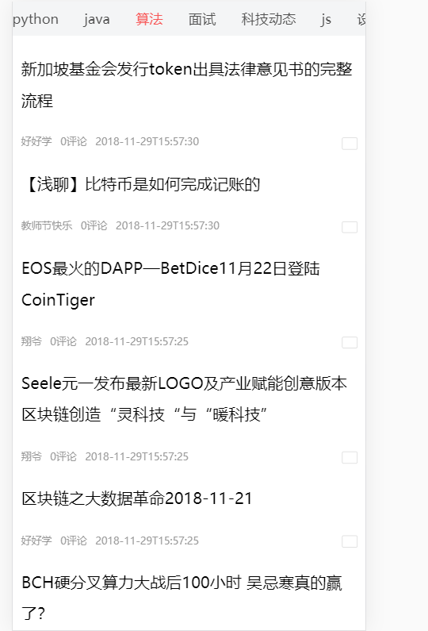

## vuex案例-搭建黑马头条项目

接下来，通过一个案例来使用Vuex介入我们的数据管理


> 通过vue-cli脚手架搭建项目


```bash

$ vue create toutiao #创建项目

```


> 选择 vuex / eslint（stanadard） / pre-cssprocesser (less) 确定


**在main.js中引入样式**(该样式在**资源/vuex样式**中，拷贝到styles目录下)


```js

import './styles/index.css'

```
  

**拷贝图片资源到assets目录下**（在**资源/vuex样式目录下的图片**）

  
**在App.vue中拷贝基本结构**


```vue

<div id="app">

<ul class="catagtory">

<li class='select'>开发者资讯</li>

<li>ios</li>

<li>c++</li>

<li>android</li>

<li>css</li>

<li>数据库</li>

<li>区块链</li>

<li>go</li>

<li>产品</li>

<li>后端</li>

<li>linux</li>

<li>人工智能</li>

<li>php</li>

<li>javascript</li>

<li>架构</li>

<li>前端</li>

<li>python</li>

<li>java</li>

<li>算法</li>

<li>面试</li>

<li>科技动态</li>

<li>js</li>

<li>设计</li>

<li>数码产品</li>

<li>html</li>

<li>软件测试</li>

<li>测试开发</li>

</ul>

<div class="list">

<div class="article_item">

<h3 class="van-ellipsis">python数据预处理 ：数据标准化</h3>

<div class="img_box">


</div>

<!---->

<div class="info_box">

<span>13552285417</span>

<span>0评论</span>

<span>2018-11-29T17:02:09</span>

</div>

</div>

</div>

</div>

```

  

## vuex案例-封装分类组件和频道组件

  为了更好的区分组件之间的职责，我们将上方的频道和下方的列表封装成不同的组件


**`components/catagtory.vue`**


```vue

<template>

<ul class="catagtory">

<li class='select'>开发者资讯</li>

<li>ios</li>

<li>c++</li>

<li>android</li>

<li>css</li>

<li>数据库</li>

<li>区块链</li>

<li>go</li>

<li>产品</li>

<li>后端</li>

<li>linux</li>

<li>人工智能</li>

<li>php</li>

<li>javascript</li>

<li>架构</li>

<li>前端</li>

<li>python</li>

<li>java</li>

<li>算法</li>

<li>面试</li>

<li>科技动态</li>

<li>js</li>

<li>设计</li>

<li>数码产品</li>

<li>html</li>

<li>软件测试</li>

<li>测试开发</li>

</ul>

</template>

```

  

**`components/new-list.vue`**

  

```vue

<template>

<div class="list">

<div class="article_item">

<h3 class="van-ellipsis">python数据预处理 ：数据标准化</h3>

<div class="img_box">


</div>

<!---->

<div class="info_box">

<span>13552285417</span>

<span>0评论</span>

<span>2018-11-29T17:02:09</span>

</div>

</div>

</div>

</template>

```

  

**在App.vue中引入并使用**

  

```vue

<template>

<!-- app.vue是根组件 -->

<div id="app">

<catagtory />

<new-list />

</div>

</template>

<script>

import Catagtory from './components/catagtory'

import NewList from './components/new-list'

  

export default {

components: {

Catagtory, NewList

}

}

</script>

  

```

  

## vuex案例-在vuex中加载分类和频道数据


  

### 设计categtory和newlist的vuex模块

  

**安装请求数据的工具 axios**

  

```bash

$ npm i axios

```

  

**接口**

  

​ 获取频道列表

  

​ http://ttapi.research.itcast.cn/app/v1_0/channels

  

​ 获取频道头条

  

​ http://ttapi.research.itcast.cn/app/v1_1/articles?channel_id=频道id&timestamp=时间戳&with_top=1

  

> 我们采用模块化的管理模式，建立一个专门的模块来管理分类和新闻数据

  

**在store目录下新建目录modules， 新建 catagtory.js和newlist.js**

  

**模块结构**

  

```js

export default {

namespaced: true,

state: {},

mutations: {},

actions: {}

}

```

  

**在store/index.js中引入定义的两个模块**

  

```js

import catagtory from './modules/catagtory'

import newlist from './modules/newlist'

export default new Vuex.Store({

state: {

},

mutations: {

},

actions: {

},

modules: {

catagtory,

newlist

}

})

  

```

  

### 分类模块下设置分类数组和当前激活分类

  

**在catagtory的 state中定义分类频道列表和当前激活**

  

```js

state: {

catagtory: [],

currentCatagtory: ''

}

```

  

**定义更新频道列表的mutations**

  

```js

mutations: {

updateCatagtory (state, payload) {

state.catagtory = payload // 更新分类数据

},

updateCurrentCatagtory (state, payload) {

state.currentCatagtory = payload

}

}

```

  

**通过getters建立对于分类数据和当前分类的快捷访问**

  

```js

export default new Vuex.Store({

state: {

},

mutations: {

},

actions: {

},

modules: {

catagtory,

newlist

},

getters: {

catagtory: state => state.catagtory.catagtory, // 建立快捷访问

currentCatagtory: state => state.catagtory.currentCatagtory

}

})

```

  

### 遍历分类数据并判断激活class

  

**分类组件遍历vuex数据**

  

```js

import { mapGetters } from 'vuex'

computed: {

...mapGetters(['catagtory', 'currentCatagtroy'])

},

```

  

```vue

<ul class="catagtory">

<li :class="{ select: currentCatagtory === item.id }" v-for="item in catagtory" :key="item.id">{{ item.name }}</li>

</ul>

```

  

### 封装调用获取分类action,激活第一个分类

  

**定义获取频道列表的action, 将第一个频道激活**

  

```js

actions: {

async getCatagtory (context) {

const { data: { data: { channels } } } = await axios.get('http://ttapi.research.itcast.cn/app/v1_0/channels')

context.commit('updateCatagtory', channels)

context.commit('updateCurrentCatagtory', channels[0].id)

}

}

```

  

**初始化catagtory时调用action**

  

```js

import { mapGetters } from 'vuex'

  

export default {

computed: {

...mapGetters(['catagtory'])

},

created () {

this.$store.dispatch('catagtory/getCatagtory')

}

}

```

  

**点击分类时，触发分类切换**

  

```vue

<li @click="$store.commit('catagtory/updateCurrentCatagtory', item.id)" :class="{ select: currentCatagtroy === item.id }" v-for="item in catagtory" :key="item.id">{{ item.name }}</li>

  

```

  

### 定义新闻数据，并封装获取新闻的Action

  

**在newlist.js中定义获取头条内容的数据**

  

```js

state: {

allData: {}

}

```

  

**定义更新头条内容的mutations**

  

```js

mutations: {

// payload 载荷 { 1: [], 2: [], 3: [], 4}

updateList (state, { currentCatagtory, list }) {

// 不是响应式的

// state.allData[currentCatagtory] = list // 这样做事大错特错第 感觉不到变化 就不会通知组件

state.allData = { ...state.allData, [currentCatagtory]: list }

// 这句代码的含义 就相当于 在一个新的对象后面追加了一个属性 更新某个属性的内容

}

},

```

  

**定义根据分类标识获取新闻的action**

  

```js

actions: {

// 获取新闻列表数据

// 分类id只能通过传递的方式传进来

async getNewList (context, cataId) {

const { data: { data: { results } } } = await axios.get(`http://ttapi.research.itcast.cn/app/v1_1/articles?channel_id=${cataId}&timestamp=${Date.now()}&with_top=1`)

// results是新闻列表

context.commit('updateList', { currentCatagtory: cataId, list: results })

}

}

```

  

### 监听激活分类，触发获取新闻Action

  

**在new-list组件中，引入当前分类的id，监视其改变，一旦改变，触发获取新闻的action**

  

```js

import { mapGetters } from 'vuex'

export default {

computed: {

...mapGetters(['currentCatagtroy'])

},

watch: {

currentCatagtory (newValue) {

this.$store.dispatch('newlist/getNewList', newValue)

}

}

}

```

  

### 处理显示新闻内容的数据

  

**定义当前显示列表的getters**

  

```js

getters: {

currentList: state => state.newlist.allData[state.catagtory.currentCatagtory] || []

}

```

  

**修改new-list内容**

  

```vue &lt;div class=&#39;list&#39;&gt;

<template>

<div class="list">

<div class="article_item" v-for="item in currentList" :key="item.art_id">

<h3 class="van-ellipsis">{{ item.title }}</h3>

<div class="img_box" v-if="item.cover.type === 1">


</div>

<div class="img_box" v-else-if="item.cover.type === 3">


</div>

<!---->

<div class="info_box">

<span>{{ item.aut_name }}</span>

<span>{{ item.comm_count }}评论</span>

<span>{{ item.pubdate }}</span>

</div>

</div>

</div>

</template>

  

<script>

// 引入当前激活的分类id

import { mapGetters } from 'vuex'

export default {

computed: {

...mapGetters(['currentCatagtory', 'currentList'])

},

watch: {

currentCatagtory (newValue) {

// newValue是当前最新的激活的id

this.$store.dispatch('newlist/getNewList', newValue)

}

}

}

</script>

  

<style>

  

</style>

  

```

  
  
  

