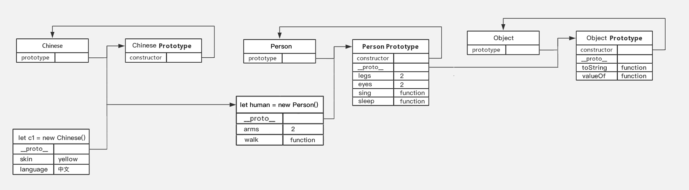

  
# 高级JS
## 一、作用域

  

> 了解作用域对程序执行的影响及作用域链的查找机制，使用闭包函数创建隔离作用域避免全局变量污染。

>

作用域（scope）规定了变量能够被访问的“范围”，离开了这个“范围”变量便不能被访问，作用域分为全局作用域和局部作用域。

  

### 局部作用域

  

局部作用域分为函数作用域和块作用域。

  

### 函数作用域

  

在函数内部声明的变量只能在函数内部被访问，外部无法直接访问。

  

```html

<script>

// 声明 counter 函数

function counter(x, y) {

// 函数内部声明的变量

let s = x + y;

console.log(s); // 18

}

  

// 设用 counter 函数

counter(10, 8);

  

// 访问变量 s

console.log(s); // 报错

</script>

```

  

总结：

  

1. 函数内部声明的变量，在函数外部无法被访问

2. 函数的参数也是函数内部的局部变量

3. 不同函数内部声明的变量无法互相访问

4. 函数执行完毕后，函数内部的变量实际被清空了

  

### 块作用域

* 用let const声明

* 在 JavaScript 中使用 `{}` 包裹的代码称为代码块，代码块内部声明的变量外部将【有可能】无法被访问。

>let声明

```html

<script>

{

// age 只能在该代码块中被访问

let age = 18;

console.log(age); // 正常

}

// 超出了 age 的作用域

console.log(age); // 报错

let flag = true;

if(flag) {

// str 只能在该代码块中被访问

let str = 'hello world!';

console.log(str); // 正常

}

// 超出了 age 的作用域

console.log(str); // 报错

for(let t = 1; t <= 6; t++) {

// t 只能在该代码块中被访问

console.log(t); // 正常

}

// 超出了 t 的作用域

console.log(t); // 报错

</script>

```

>const声明

  

JavaScript 中除了变量外还有常量，常量与变量本质的区别是【常量必须要有值且不允许被重新赋值】，常量值为对象时其属性和方法允许重新赋值。

  

```html

<script>

// 必须要有值

const version = '1.0.0';

  

// 不能重新赋值

// version = '1.0.1';

  

// 常量值为对象类型

const user = {

name: '小明',

age: 18

}

  

// 不能重新赋值

user = {};

  

// 属性和方法允许被修改

user.name = '小小明';

user.gender = '男';

</script>

```

  

总结：

  

1. `let` 声明的变量会产生块作用域，`var` 不会产生块作用域

2. var相当于给window加属性，而let直接产生变量

3. `const` 声明的常量也会产生块作用域

4. 不同代码块之间的变量无法互相访问

5. 推荐使用 `let` 或 `const`

  

注：开发中 `let` 和 `const` 经常不加区分的使用，如果担心某个值会不小被修改时，则只能使用 `const` 声明成常量。常量一般全大写声明

  

- | 关键字 | 块级作用域 | 变量提升 | 初始值 | 更改值 | 通过window调用 |

| ------ | :--------: | :------: | :----: | :----: | :------------: |

| let | √ | ×√ | - | Yes | No |

| const | √ | ×√ | Yes | No | No |

| var | × | √ | - | Yes | Yes |

  


###  全局作用域
`<script>` 标签和 `.js` 文件的【最外层】就是所谓的全局作用域，在此声明的变量在函数内部也可以被访问。
* `<script>` 标签导入的js文件的变量，同样可以在其他 `<script>` 中使用
  

```html

<script>

// 此处是全局

function sayHi() {

// 此处为局部

}

  

// 此处为全局

</script>

```

  

全局作用域中声明的变量，任何其它作用域都可以被访问，如下代码所示：

  

```html

<script>

// 全局变量 name

let name = '小明';

// 函数作用域中访问全局

function sayHi() {

// 此处为局部

console.log('你好' + name);

}

  

// 全局变量 flag 和 x

let flag = true;

let x = 10;

// 块作用域中访问全局

if(flag) {

let y = 5;

console.log(x + y); // x 是全局的

}

</script>

```

  

总结：

  

1. 为 `window` 对象动态添加的属性默认也是全局的，不推荐！

2. 函数中未使用任何关键字声明的变量为全局变量，不推荐！！！

3. 尽可能少的声明全局变量，防止全局变量被污染

  

JavaScript 中的作用域是程序被执行时的底层机制，了解这一机制有助于规范代码书写习惯，避免因作用域导致的语法错误。

  

### 作用域链

  

在解释什么是作用域链前先来看一段代码：

  

```html

<script>

// 全局作用域

let a = 1;

let b = 2;

// 局部作用域

function f() {

let c;

// 局部作用域

function g() {

let d = 'yo';

}

}

</script>

```

  

函数内部允许创建新的函数，`f` 函数内部创建的新函数 `g`，会产生新的函数作用域，由此可知作用域产生了嵌套的关系。

  
  

作用域链本质上是底层的变量查找机制，在函数被执行时，会优先查找当前函数作用域中查找变量，如果当前作用域查找不到则会依次逐级查找父级作用域直到全局作用域，如下代码所示：

  

```html

<script>

// 全局作用域

let a = 1;

let b = 2;

  

// 局部作用域

function f() {

let c;

// let a = 10;

console.log(a); // 1 或 10

console.log(d); // 报错

// 局部作用域

function g() {

let d = 'yo';

// let b = 20;

console.log(b); // 2 或 20

}

// 调用 g 函数

g()

}

  

console.log(c); // 报错

console.log(d); // 报错

f();

</script>

```

  

总结：

  

1. 嵌套关系的作用域串联起来形成了作用 域链

2. 相同作用域链中按着从里到外的规则查找变量

3. 子作用域能够访问父作用域，父级作用域无法访问子级作用域（就近原则）

4. 同级别作用域，不能互相访问

  

### 闭包

  

闭包是一种比较特殊和函数，使用闭包能够访问函数作用域中的变量。从代码形式上看闭包是一个做为返回值的函数，如下代码所示：

  

```html

<script>

function foo() {

let i = 0;

  

// 函数内部分函数

function bar() {

console.log(++i);

}

  

// 将函数做为返回值

return bar;

}

// fn 即为闭包函数

let fn = foo();

fn(); // 1

</script>

```

  

总结：

  

闭包：一个作用域有权访问另外一个作用域的局部变量（子作用域访问父作用域局部变量）

  

好处：可以把一个变量使用范围延伸

  

1. 闭包本质仍是函数，只不是从函数内部返回的

2. 闭包能够创建外部可访问的隔离作用域，避免全局变量污染

3. 过度使用闭包可能造成内存泄漏

  

注：回调函数也能访问函数内部的局部变量。

```html

<script>

function fn(a) {

let num = 0;

a(num);

}

fu(function (n) {console.log(n);}); // 0

</script>

```

  

### 变量提升

* 代码执行前，先预解析变量

变量提升是 JavaScript 中比较“奇怪”的现象，它允许在变量声明之前即被访问，

  

```html

<script>

// 访问变量 str

console.log(str + 'world!');

  

// 声明变量 str

var str = 'hello ';

</script>

  

let和var都有提升，但是let定义的变量没有赋值之前是不可以使用、var可以使用是undefined

```

  

总结：

  

1. 变量在未声明即被访问时会报语法错误

2. 变量在声明之前即被访问，变量的值为 `undefined`

3. `let` 声明的变量不存在变量提升，推荐使用 `let`【也有人认为具有提升但是不赋值不能使用】

4. 变量提升出现在相同作用域当中

5. 变量声明前，不能使用变量，死区

6. 实际开发中推荐先声明再访问变量

  

注：关于变量提升的原理分析会涉及较为复杂的词法分析等知识，而开发中使用 `let` 可以轻松规避变量的提升，因此在此不做过多的探讨，有兴趣可[查阅资料](https://segmentfault.com/a/1190000013915935)。

  

## 二、函数

  

> 知道函数参数默认值、动态参数、剩余参数的使用细节，提升函数应用的灵活度，知道箭头函数的语法及与普通函数的差异。

  

### 2.1 函数提升

* 任何作用域执行前都要预解析 --把变量，函数提前解析在最前面

* 代码执行前，先预解析函数

* 提前解析带有名字的函数，解析到当前作用域的最前面

  
  

```html

<script>

// 调用函数

foo();

  

// 声明函数

function foo() {

console.log('声明之前即被调用...');

}

// 不存在提升现象

bar();

var bar = function () {

console.log('函数表达式不存在提升现象...');

}

</script>

```

  

总结：

  

1. 函数提升能够使函数的声明调用更灵活

2. 函数表达式不存在提升的现象，但存在变量提升

3. 函数提升出现在相同作用域当中，

### 2.2 参数

  

函数参数的使用细节，能够提升函数应用的灵活度。

  

#### 默认值

  

```html

<script>

// 设置参数默认值

function sayHi(name="小明", age=18) {

document.write(`<p>大家好，我叫${name}，我今年${age}岁了。</p>`);

}

// 调用函数

sayHi();

sayHi('小红');

sayHi('小刚', 21);

</script>

```

  

总结：

  

1. 声明函数时为形参赋值即为参数的默认值

2. 如果参数未自定义默认值时，参数的默认值为 `undefined`

3. 调用函数时没有传入对应实参时，参数的默认值被当做实参传入

  

#### 动态参数

  

* `arguments` 是函数内部内置的伪数组变量，它包含了调用函数时传入的所有实参。

* 参数不固定时使用，可以遍历数组

  

```html

<script>

// 求生函数，计算所有参数的和

function sum() {

// console.log(arguments);

let s = 0;

for(let i = 0; i < arguments.length; i++) {

s += arguments[i];

}

console.log(s);

}

  

// 调用求和函数

sum(5, 10); // 两个参数

sum(1, 2, 4); // 两个参数

</script>

```

  

总结：

  

1. `arguments` 是一个伪数组

2. `arguments` 的作用是动态获取函数的实参

  

#### 剩余参数

* 用于不固定参数

```html

<script>

function config(baseURL, ...other) {

console.log(baseURL);

// other 是真数组，动态获取实参

console.log(other);

}

  

// 调用函数

config('http://baidu.com', 'get', 'json');

</script>

```

  

总结：

  

1. `...` 是语法符号，置于最末函数形参之前，用于获取多余的实参

2. 借助 `...` 获取的剩余实参

3. ...a相当于arguments，可以传入所有实参

4. 剩余参数时真正的数组，只能放最后一个

  

### 2.3 箭头函数

  

箭头函数是一种声明函数的简洁语法，它与普通函数并无本质的区别，差异性更多体现在语法格式上。

  

```html

<script>

// 箭头函数

let foo = (a) => {

console.log('^_^ 长相奇怪的函数...');

}

// 一个形参，省略小括号

let foo = a => {

}

一行代码，省略大括号，并自动返回值

let foo = a => a * a

// 调用函数

foo();

// 更简洁的语法

let form = document.querySelector('form');

form.addEventListener('click', ev => ev.preventDefault());

</script>

```

  

总结：

  

1. 箭头函数属于表达式函数，因此不存在函数提升

2. 箭头函数只有一个参数时可以省略圆括号 `()`

3. 箭头函数函数体只有一行代码时可以省略花括号 `{}`，并自动做为返回值被返回

4. 箭头函数中没有 `arguments`，只能使用 `...` 动态获取实参

5. 涉及到this的使用，不建议用箭头函数，因为箭头函数的this指向箭头函数作用域的调用者，相当于父级this

  

## 三、解构赋值

  

> 知道解构的语法及分类，使用解构简洁语法快速为变量赋值。

  

解构赋值是一种快速为变量赋值的简洁语法，本质上仍然是为变量赋值，分为数组解构、对象解构两大类型。

  

#### 3.1 数组解构

  

数组解构是将数组的单元值快速批量赋值给一系列变量的简洁语法，如下代码所示：

变量与值结构上一定要一一对应哪怕不需要

```html

<script>

// 普通的数组

let arr = [1, 2, 3];

// 批量声明变量 a b c

// 同时将数组单元值 1 2 3 依次赋值给变量 a b c

let [a, b, c] = arr;

console.log(a); // 1

console.log(b); // 2

console.log(c); // 3

</script>

```

  

总结：

  

1. 赋值运算符 `=` 左侧的 `[]` 用于批量声明变量，右侧数组的单元值将被赋值给左侧的变量

2. 变量的顺序对应数组单元值的位置依次进行赋值操作

3. 变量的数量大于单元值数量时，多余的变量将被赋值为 `undefined`

4. 变量的数量小于单元值数量时，可以通过 `...` 获取剩余单元值，但只能置于最末位

5. 跟传参有点像，当想赋值特定几个变量时，可以用，，，a，b跳过不要的值

6. 允许初始化变量的默认值，且只有单元值为 `undefined` 时默认值才会生效

  

注：支持多维解构赋值，比较复杂后续有应用需求时再进一步分析

  

#### 3.2 对象解构

  

对象解构是将对象属性和方法快速批量赋值给一系列变量的简洁语法

就是把对象里面的属性，解构出来，赋值给左边的属性

如下代码所示：

  

```html

<script>

// 普通对象

let user = {

name: '小明',

age: 18

};

  

// 批量声明变量 name age

// 同时将数组单元值 1 2 3 依次赋值给变量 a b c

let {name, age} = {

name: '小明',

age: 18

}

console.log(name); // 小明

console.log(age); // 18

</script>

```

  

总结：

  

1. 赋值运算符 `=` 左侧的 `{}` 用于批量声明变量，右侧对象的属性值将被赋值给左侧的变量

2. 对象属性的值将被赋值给与属性名相同的变量

3. 当属性名已经被let声明过，可以 let {name:username, 属性2}用冒号更改变量名

4. 对象中找不到与变量名一致的属性时变量值为 `undefined`

5. 允许初始化变量的默认值，属性不存在或单元值为 `undefined` 时默认值才会生效

  

注：支持多维解构赋值，比较复杂后续有应用需求时再进一步分析

  
  
  
  

## 四、面向对象之创建

  

> 了解面向对象的基础概念，能够利用构造函数创建对象。

* 类 -把各种具体的东西的抽象出共性，同一性的概念，可以有很多个

* 对象 - 抽象的实例化，属性和方法的集合体。把抽象的共性，变为具体的实例，只有一个

### 1.1创建对象

#### 字面量

* 字面量底层也是构造函数生成对象（数组）

let obj = {

name: abc，

age:19，

};

#### 构造函数

构造函数是专门用于创建对象的函数，本身也是对象，如果一个函数使用 `new` 关键字调用，那么这个函数就是构造函数。

>构造函数如同类的概念，而实例化是对象的概念，可以说所有的对象都是构造函数的实例化

  

* 内置构造函数object，new object()；--内置的构造函数用来创建对象

* new Date(); 创建日期函数

* new Array(); 创建数组的函数

#### 自定义构造函数

* 自定义构造函数可以创建多样的类，写入多样的属性和方法，可以传参。从而创建多样的实例化对象

```html

<script>

// 定义函数

function Foo() {

console.log('通过 new 也能调用函数...');

}

// 调用函数

new Foo;

</script>

```

  

总结：

  

1. 使用 `new` 关键字调用函数的行为被称为实例化

2. 实例化构造函数时没有参数时可以省略 `()`

3. 构造函数的返回值即为新创建的对象

4. 构造函数内部的 `return` 返回的值无效！

  

注：实践中为了从视觉上区分构造函数和普通函数，习惯将构造函数的首字母大写。

  

##### 实例成员

  

* 通过构造函数创建的对象称为实例对象，实例对象中的属性和方法称为实例成员（给实例化对象添加的属性和方法）。

* 构造函数可以new创建多个实例化对象

```html

<script>

// 构造函数

function Person(小名， 大名) {

// 构造函数内部的 this 就是实例对象

  

// 实例对象中动态添加属性

this.name = 小明;

// 实例对象动态添加方法

this.sayHi = function () {

console.log('大家好~');

}

}

  

// 实例化，p1 是实例对象

// p1 实际就是 构造函数内部的 this

let p1 = new Person(张三，张三疯); --传属性

  

console.log(p1);

console.log(p1.name); // 访问实例属性

p1.sayHi(); // 调用实例方法

</script>

```

  

总结：

  

1. 构造函数内部 `this` 实际上就是实例对象，为其动态添加的属性和方法即为实例成员

2. 实例成员用this创建，指向实例对象

3. 为构造函数传入参数，动态创建结构相同但值不同的对象

4. 实例对象.constructor --返回构造函数本身

5. 实例对象 instanceof 构造函数 --返回布尔值，用于检测实例对象对应的构造函数

  

注：构造函数创建的实例对象彼此独立互不影响。

  

##### 静态成员

  

* 在 JavaScript 中底层函数本质上也是对象类型，因此允许直接为函数动态添加属性或方法。

* 给构造函数本身添加的属性和方法是静态成员

  

```html

<script>

// 构造函数

function Person(name, age) {

// 省略实例成员

}

  

// 静态属性

Person.eyes = 2;

Person.arms = 2;

// 静态方法

Person.walk = function () {

console.log('^_^人都会走路...');

// this 指向 Person

console.log(this.eyes);

}

</script>

```

  

总结：

  

1. 静态成员指的是添加到构造函数本身的属性和方法

2. 一般公共特征的属性或方法静态成员设置为静态成员

3. 静态成员方法中的 `this` 指向构造函数本身

4. 静态成员与实例成员之间互不影响

  

## 五、面向对象之数据类型

一切皆对象

  

> 体会 JavaScript 一切皆对象的语言特征，掌握各引用类型和包装类型对象属性和方法的使用。

* 字符串、数值、布尔、undefined、null也被称为简单类型或基础类型

* 对象，数组也被称为复杂数据类型即引用类型。

  

### 数据类型的传递

* 简单数据类型数据储存在栈内存中，值的传递也是栈内存数据的复制，所以互相不影响。

* 普通对象数据保存在堆内存之中，栈内存中保存了普通对象在堆内存的地址。

* 普通对象在赋值时只是复制了栈内中的地址，而非堆内存中的数据

* 普通对象赋值后，无论修改哪个变量另一个对象的数据值也会相当发生改变。

  

总结：

面试回答堆与栈的区别：

  

1. 堆和栈是内存中的数据存储空间

2. 简单类型的数据保存在内存的栈空间中

3. 引用类型的数据保存在内存的堆空间中，栈内存中存取的是引用类型的地址（房间号）

### 2.1 引用类型

  

#### Object

  

`Object` 是内置的构造函数，用于创建普通对象。

  

```html

<script>

// 通过构造函数创建普通对象

let user = new Object({name: '小明', age: 15});

  

// 这种方式声明的变量称为【字面量】

let student = {name: '杜子腾', age: 21}

// 对象语法简写

let name = '小红';

let people = {

// 相当于 name: name

name,

// 相当于 walk: function () {}

walk () {

console.log('人都要走路...');

}

}

  

console.log(student.constructor);

console.log(user.constructor);

console.log(student instanceof Object);

</script>

```

1. 推荐使用字面量方式声明对象，而不是 `Object` 构造函数

2. `Object.assign` 静态方法创建新的对象

3. `Object.keys` 静态方法获取对象中所有属性（键）

4. `Object.values` 静态方法获取对象中所有属性值

  

#### Array

  

`Array` 是内置的构造函数，用于创建数组。

任何一个数组都是Array构造函数的实例化对象（Object同理）

  

```html

<script>

// 构造函数创建数组

let arr = new Array(5, 7, 8);

  

// 字面量方式创建数组

let list = ['html', 'css', 'javascript'];

  

console.log(list.constructor);

console.log(list instanceof Array);

</script>

```

  

总结：

  

1. 推荐使用字面量方式声明数组，而不是 `Array` 构造函数

2. 实例方法 `forEach` 用于遍历数组，替代 `for` 循环

* arr.forEach( function(item, index, arr){});

3. 实例方法`find` 用于查找首次出现的满足条件的值，并返回值

let re = arr.find( function(item, index, arr){ return item > 5;});

4. 实例方法 `some` ，用于查找首次出现的满足条件的值，并返回true

let re = arr.some( function(item, index, arr){ return （筛选条件）;});

5. 实例方法 `evey` ，用于查找都满足条件的值，并返回true

let re = arr.evey( function(item, index, arr){ return item > 5;});

6. 实例方法 `filter` 用于查找满足条件的值，并返回值，生成新数组

let re = arr.filter( function(item, index, arr){ return item > 5;});

7. 实例方法 `map` 让数组每一个元素都执行回调函数，并返回值，生成新数组

let re = arr.filter( function(item, index, arr){ return item * item;});

8. 实例方法 `join` 数组单元素拼接成了符串

9. 实例方法 `concat` 合并两个数组，生成新数组

10. 实例方法 `sort` 对原数组单元值编码排序 所以！

* 正序排序 arr.sort(function (a, b){return a - b;});

* 倒序排序 arr.sort(function (a, b){return b - a;});

8. 实例方法 `splice` 删除或替换原数组单元

9. 实例方法 `indexOf` 检索数组首次出现的索引没有就返回-1

10. 实例方法 `reverse` 反转数组

11. 静态方法 `from` 伪数组转成数组 （伪数组必须有length属性）

12. 静态方法 `isArray` 判断是不是数组，返回布尔

  

#### RegExp

  

`RegExp` 内置的构造函数，用于创建正则表达式。

* 正则也是对象，也有方法和属性

当使用构造函数创建正则时有两种写法：

```html

<script>

// 构造函数创建正则

// 使用 '' 定义正则

let reg = new RegExp('\d', 'i');

  

// 字面量方式创建正则

// let reg = /(\d)/i;

  

reg.exec('123');

</script>

```

  
  

```html

<script>

// 使用 // 定义正则

let reg = new RegExp(/\d/);

// 如果使用引号定义正则时，\d、\s、\w

需要多添加一个 \

let reg1 = new RegExp('\\d');

</script>

```

总结：

  

1. 推荐使用字面量定义正则表达式，而不是 `RegExp` 构造函数

2. `RegExp` 静态属性 $1、$2、$3、... 获取正则分组单元

  
  
  
  

### 2.2 包装类型

  

在 JavaScript 中的字符串、数值、布尔具有对象的使用特征，如具有属性和方法，如下代码举例：

```html

<script>

// 字符串类型

let str = 'hello world!';

// 统计字符的长度（字符数量）

console.log(str.length); --可以使用属性，因为包装类型

// 数值类型

let price = 12.345;

// 保留两位小数

price.toFixed(2);

</script>

```

  

之所以具有对象特征的原因是字符串、数值、布尔类型数据是 JavaScript 底层使用 Object 构造函数“包装”来的，被称为包装类型。

  

#### String

  

`String` 是内置的构造函数，用于创建字符串。

  

```html

<script>

// 使用构造函数创建字符串

let str = new String('hello world!');

  

// 字面量创建字符串

let str2 = '你好，世界！';

  

// 检测是否属于同一个构造函数

console.log(str.constructor === str2.constructor); // true

console.log(str instanceof String); // false

</script>

```

  

总结：

  

1. 推荐使用字面量方式声明字符串，而不是 `String` 构造函数

2. 实例属性 `length` 用来获取字符串的度长

3. 实例方法 `trim` 用来将字符串两端空白去掉

4. 实例方法 `split` 用来将字符串拆分成数组

5. 实例方法 `toUpperCase` 用于将字母转换成大写

6. 实例方法 `toLowerCase` 用于将字母转换成小写

7. 实例方法 `slice` 用于字符串截取

8. 实例方法 `indexOf` 检测是否包含某字符

9. 实例方法 `startsWith` 检测是否以某字符开头

10. 实例方法 `endsWith` 检测是否以某字符结尾

11. 实例方法 `replace` 用于替换字符串，支持正则匹配

12. 实例方法 `padStart` 固定长度字符开始位置打补丁

13. 实例方法 `padEnd` 固定长度字符结束位置打补丁

14. 实例方法 `match` 用于查找字符串，支持正则匹配

  

注：String，也可以当成函数，强制转换值为字符串数据类型。toString()也是使用构造函数转换的

  

#### Number

  

`Number` 是内置的构造函数，用于创建数值。

  

```html

<script>

// 使用构造函数创建数值

let x = new Number('10');

let y = new Number(5);

  

// 字面量创建数值

let z = 20;

  

// 检测是否属于同一个构造函数

console.log(x.constructor === z.constructor);

</script>

```

  

总结：

  

1. 推荐使用字面量方式声明数值，而不是 `Number` 构造函数

2. 实例方法 `toFixed` 用于设置保留小数位的长度

  

注：Number 也可以当做普通函数使用，这时它的作用是强制转换成数值数据类型。

  

#### Boolean

  

`Boolean` 是内置的构造函数，用于创建布尔值。

  

```html

<script>

// 使用构造函数创建布尔类型

let locked = new Boolean('10');

  

// 字面量创建布尔类型

let flag = true;

  

// 检测是否属于同一个构造函数

console.log(locked.constructor === flag.constructor);

</script>

```

  

总结：

  

1. 推荐使用字面量方式声明布尔值，而不是 `Boolean` 构造函数

  

注：Boolean 也可以当做普通函数使用，这时它的作用是强制转换成布尔类型数据，由其它数据类型转换成布尔类型的数据被称为真值（truly）或假值（falsly）。

  

### 2.3 写在最后

  

至此对 JavaScript 有了更深的理解，即 JavaScript 中一切皆为对象，还有以前学习的 window、Math 对象，最后补充一点无论是引用类型或是包装包类型都包含两个公共的方法 `toString` 和 `valueOf` undefined null  不能使用此方法

  

```html

<script>

// 对象类型数据

let user = {name: '小明', age: 18}

// 数值类型

let num = 12.345;

// 字符串类型

let str = 'hello world!';

str.valueOf(); // 原始值

user.toString(); // 表示该对象的字符串

</script>

```

  

总计：

  

1. `valueOf` 方法获取原始值，数据内部运算的基础，很少主动调用该方法

2. `toString` 方法以字符串形式表示对象,

  
  
  

## 六、面向对象的特征

  

> 学习 JavaScript 中基于原型的面向对象编程序的`语法实现，理解面向对象编程的特征。

  

面向对象编程是一种程序设计思想，它具有 3 个显著的特征：封装、继承、多态。

  

### 1.1 封装

  

封装的本质是将具有关联的代码组合在一起，其优势是能够保证代码复用且易于维护，函数是最典型也是最基础的代码封装形式，面向对象思想中的封装仍以函数为基础，但提供了更高级的封装形式。

  

#### 命名空间（普通函数）

先来回顾一下以往代码封装的形式：

  

```html

<script>

// 普通对象（命名空间）形式的封装

let beats = {

name: '狼',

setName: function (name) {

this.name = this.name;

},

getName() {

console.log(this.name);

}

}

  

beats.setName('熊');

beats.getName();

</script>

```

  

以往以普通对象（命名空间）形式封装的代码只是单纯把一系列的变量或函数组合到一起，所有的数据变量都被用来共享（使用 this 访问）。

  

#### 构造函数

  

构造函数封装可以独立各个对象数据

  

```html

<script>

function Person() {

this.name = '佚名';

// 设置名字

this.setName = function (name) {

this.name = name;

}

// 读取名字

this.getName = () => {

console.log(this.name);

}

}

  

// 实例对像，获得了构造函数中封装的所有逻辑

let p1 = new Person();

p1.setName('小明');

console.log(p1.name);// 小明

  

// 实例对象

let p2 = new Person();

console.log(p2.name); // 佚名

</script>

```

  

构造函数相当于一个"模子"，能够像字面量那样创建出对象来，所不同的是借助构造函数创建出来的实例对象之间是**彼此不影响**的。

  

总结：

  

1. 构造函数体现了面向对象的封装特性

2. 构造函数实例创建的对象彼此独立、互不影响

3. 命名空间式的封装无法保证数据的独立性

4. 构造函数式的封装，构造方法时，会产生很多多余的空间。因为每一次构造，都会开辟新的空间

  
  

##### 原型对象

  

* 实际上每一个构造函数都有一个名为 `prototype` 的属性，译成中文是原型的意思

* `prototype` 是对象数据类型，称为构造函数的原型对象

* 每个原型对象都具有 `constructor` 属性指向该原型对象对应的构造函数本身。

  

来看原型对象具体的作用，如下代码所示：

  

```html

<script>

function Person() {

// 此处未定义任何方法

}

  

// 为构造函数的原型对象添加方法

Person.prototype.sayHi = function () {

console.log('Hi~');

}

// 实例化

let p1 = new Person();

p1.sayHi(); // 输出结果为 Hi~

</script>

```

* 原型对象里面的方法，实例对象也可以调用

  
  

```html

<script>

function Person() {

// 此处定义同名方法 sayHi

this.sayHi = function () {

console.log('嗨!');

}

}

  

// 为构造函数的原型对象添加方法

Person.prototype.sayHi = function () {

console.log('Hi~');

}

  

let p1 = new Person();

p1.sayHi(); // 输出结果为 嗨!

</script>

```

  

* 构造函数 `Person` 中定义与原型对象中相同名称的方法，这时实例对象调用则是构造函数中的方法

  
  

```html

<script>

function Person() {

// 此处定义同名方法 sayHi

this.sayHi = function () {

console.log('嗨!' + this.name);

}

}

  

// 为构造函数的原型对象添加方法

Person.prototype.sayHi = function () {

console.log('Hi~' + this.name);

}

// 在构造函数的原型对象上添加属性

Person.prototype.name = '小明';

  

let p1 = new Person();

p1.sayHi(); // 输出结果为 嗨!

let p2 = new Person();

p2.sayHi();

</script>

```

  

总结：

* 实际开发往往会将封装的功能函数添加到原型对象中。因为原型对象里的方法与实例对象共有的

* 调用构造函数的属性或方法时，先在当前实例成员是查找，然后再去原型对象查找，并且原型对象被所有实例共享。

* 每一个构造函数都有原型对象（显式原型）。

* 每一个原型对象都有constructor属性，指向当前构造函数，所以实例对象可以直接调用constructor，返回当前构造函数。（原型对象被所有实例共享）

* 每一个实例对象都有_proto_属性，指向原型对象（隐式原型），也是原型对象里的方法可以共享的原理

* 也就是原型对象指向构造函数，实例对象里的_proto_指向原型对象

  

### 1.2 继承

  

继承是面向对象编程的另一个特征，通过继承进一步提升代码封装的程度，JavaScript 中大多是借助原型对象实现继承的特性。

  

继承的原因：

  

```html

<script>

// 封装中国人的行为特征

function Chinese() {

// 中国人的特征

this.arms = 2;

this.legs = 2;

this.eyes = 2;

  

this.skin = 'yellow';

this.language = '中文';

  

// 中国人的行为

this.walk = function () {}

this.sing = function () {}

this.sleep = function () {}

}

  

// 封装日本人的行为特征

function Japanese() {

// 日本人的特征

this.arms = 2;

this.legs = 2;

this.eyes = 2;

  

this.skin = 'yellow';

this.language = '日文';

  

// 日本人的行为

this.walk = function () {}

this.sing = function () {}

this.sleep = function () {}

}

</script>

```

  

其实我们都知道无论是中国人、日本人还是其它民族，人们的大部分特征是一致的，然而体现在代码中时人的相同的行为特征被重复编写了多次，代码显得十分冗余

  

##### 原型继承

  

基于构造函数原型对象实现面向对象的继承特性。

  

```html

<script>

// 所有人

function Person() {

// 人的特征

this.arms = 2;

this.legs = 2;

this.eyes = 2;

// 人的行为

this.walk = function () {}

this.sing = function () {}

this.sleep = function () {}

}

// 中国人

function Chinese() {

this.skin = 'yellow';

this.language = '中文';

}

// 日本人

function Japanese() {

this.skin = 'yellow';

this.language = '日文';

}

</script>

```

  

* 上述代码可以理解成将 `Chinese` 和 `Japanese` 共有的属性和方法提取出来了

* 原型对象的属性和方法恰好是可以被用来共享的

###### 方法一

* 创建【共有】的行为特征是对象

* 把公共对象写入构造函数的原型对象

* 给原型对象重新赋值构造器，指会构造函数本身

  

```html

<script>

// 人们【共有】的行为特征

let people = {

// 人的特征

arms: 2,

legs: 2,

eyes:2,

// 人的行为

walk: function () {},

sleep: function () {},

sing: function () {}

}

// 中国人

function Chinese() {

this.skin = 'yellow';

this.language = '中文';

}

// 日本人

function Japanese() {

this.skin = 'yellow';

this.language = '日文';

}

// 英国人

function Englist() {

this.skin = 'white';

this.language= '英文';

}

// 中国人

// 把公共对象写入构造函数的原型对象

Chinese.prototype = people;

// 给原型对象重新赋值构造器

Chinese.prototype.constructor = Chinese;

let c1 = new Chinese();

// 日本人

Japanese.prototype = people;

Janpanese.prototype.constructor = Japanese;

// 英国人

English.prototype = people;

English.prototype.constructor = English;

// ...

</script>

```

这种方法创建的继承，会改变构造器的指向，因为对象会被的覆盖，重新添加构造器的时候会被覆盖

###### 方法二

构造函数来实现：

* 把公共特征的对象用构造函数的实例化对象替代

* 这样每次添加对象到原型的时候，都会new出新对象，不会覆盖构造器了



  

```html

<script>

// 所有人

function Person() {

// 人的特征

this.arms = 2;

this.legs = 2;

this.eyes = 2;

  

// 人的行为

this.walk = function () {}

this.sing = function () {}

this.sleep = function () {}

}

  

// 封装中国人的行为特征

function Chinese() {

// 中国人的特征

this.skin = 'yellow';

this.language = '中文';

}

  

// 封装日本人的行为特征

function Japanese() {

// 日本人的特征

this.skin = 'yellow';

this.language = '日文';

}

  

// human 是构造函数 Person 的实例

let human = new Person();

  

// 中国人

Chinese.prototype = new Person();

Chinese.prototype.constructor = Chinese;

// 日本人

Japanese.prototype = human;

Japanese.prototype.constructor = Japanese;

</script>

```

  
  

##### 原型链

  

基于原型对象的继承使得不同构造函数的原型对象关联在一起，并且这种关联的关系是一种链状的结构，我们将原型对象的链状结构关系称为原型链，如下图所示：

  


  

```html

作用：用于查找成员提供机制

  

<script>

// Person 构造函数

function Person() {

this.arms = 2;

this.walk = function () {}

}

// Person 原型对象

Person.prototype.legs = 2;

Person.prototype.eyes = 2;

Person.prototype.sing = function () {}

Person.prototype.sleep = function () {}

// Chinese 构造函数

function Chinese() {

this.skin = 'yellow';

this.language = '中文';

}

// Chinese 原型对象

Chinese.prototype = new Person();

Chinese.prototype.constructor = Chinese;

// 实例化

let c1 = new Chinese();

console.log(c1);

</script>

```

* 只要是对象，就有_proto_属性指向其所在构造函数的原型对象

* 构造函数的实例化对象指向其构造函数的原型对象，此原型对象也有_proto_属性指向Object构造函数的原型对象。Object构造函数的原型对象指向一个null值

* 所有对象来源于Object构造函数，所有对象都可以调用Object原型对象的方法

* 原型对象的属性共享，但是就近原则查找

* 可以给Object，array 构造函数的原型对象添加方法，然后所有的对象，数组都可以使用

* 数组、对象的实例的方法，都在其构造函数的原型对象中，所以数组，对象的实例才可以调用

  

>* 每一个函数都有prototype属性，和_proto_属性因为函数还是对象，是Object的实例化对象。

>* 每一个对象都有_proto_属性，指向构造函数的实例化对象

  
  

### 1.3异常处理

  

> 了解 JavaScript 中程序异常处理的方法，提升代码运行的健壮性。

  

##### throw

  

异常处理是指预估代码执行过程中可能发生的错误，然后最大程度的避免错误的发生导致整个程序无法继续运行。

  

```html

<script>

function counter(x, y) {

  

if(!x || !y) {

// throw '参数不能为空!';

throw new Error('参数不能为空!');

}

  

return x + y;

}

  

counter();

</script>

```

  

总结：

  

1. `throw` 抛出异常信息，程序也会终止执行

2. `throw` 后面跟的是错误提示信息

3. `Error` 对象配合 `throw` 使用，能够设置更详细的错误信息

  

##### try ... catch

  

```html

<script>

function foo() {

  

try {

// 查找 DOM 节点

var p = docunent.querySelector('p');

  

} catch(error) {

// try 代码段中执行有错误时，会执行 catch 代码段

  

// 查看错误信息

console.log(error.message);

  

// 终止代码继续执行

return;

}

  

// 改变文本样式

p.style.color = 'red';

}

  

foo();

</script>

```

  

总结：

  

1. `try...catch` 用于捕获错误信息

2. 将预估可能发生错误的代码写在 `try` 代码段中

3. 如果 `try` 代码段中出现错误后，会执行 `catch` 代码段，并截获到错误信息

  
  
  

## 七、this

  

> 了解函数中 this 在不同场景下的默认值，知道动态指定函数 this 值的方法。

* 任何一个作用域都有一个this

### 1.1 默认值

  

`this` 是 JavaScript 最具“魅惑”的知识点，不同的应用场合 `this` 的取值可能会有意想不到的结果，在此我们对以往学习过的关于【 `this` 默认的取值】情况进行归纳和总结。

> 函数里的this指向调用者

* 普通函数指向window，因为window调用

* 构造函数指向实例化对象

* 对象的方法指向该对象，因为对象调用方法

* 事件处理函数指向事件源

* 定时器指向window，因为window调用

#### 普通函数

  

**普通函数**的调用方式决定了 `this` 的值，即【谁调用 `this` 的值指向谁】

* 因为普通函数谁都可以调用。所以其this是变化的

  

```html

<script>

// 普通函数

function sayHi() {

console.log(this);

}

// 函数表达式

let sayHello = function () {

console.log(this);

}

// 函数的调用方式决定了 this 的值

sayHi(); // window

window.sayHi();

// 普通对象

let user = {

name: '小明',

walk: function () {

console.log(this);

}

};

// 动态为 user 添加方法

user.sayHi = sayHi;

uesr.sayHello = sayHello;

// 函数调用方式，决定了 this 的值

user.sayHi();

user.sayHello();

</script>

```

> 普通函数没有明确调用者时 `this` 值为 `window`

> 严格模式下没有调用者时 `this` 的值为 `undefined`。

  

#### 箭头函数

  

**箭头函数**中的 `this` 与普通函数完全不同，也不受调用方式的影响，事实上箭头函数中并不存在 `this` ！箭头函数中访问的 `this` 不过是箭头函数所在作用域的 `this` 变量。（上级作用域的this）

  

```html

<script>

console.log(this); // 此处为 window

// 箭头函数

let sayHi = function() {

console.log(this); // 该箭头函数中的 this 为函数声明环境中 this 一致

}

  

// 普通对象

let user = {

name: '小明',

// 该箭头函数中的 this 为函数声明环境中 this 一致

walk: () => {

console.log(this);

},

sleep: function () {

let str = 'hello';

console.log(this);

let fn = () => {

console.log(str);

console.log(this); // 该箭头函数中的 this 与 sleep 中的 this 一致

}

// 调用箭头函数

fn();

}

}

  

// 动态添加方法

user.sayHi = sayHi;

// 函数调用

user.sayHi();

user.sleep();

user.walk();

</script>

```

  

在开发中【使用箭头函数前需要考虑函数中 `this` 的值】，**事件回调函数**使用箭头函数时，`this` 为全局的 `window`，因此DOM事件回调函数不推荐使用箭头函数，如下代码所示：

  

```html

<script>

// DOM 节点

let btn = document.querySelector('.btn');

  

// 箭头函数 此时 this 指向了 window

btn.addEventListener('click', () => {

console.log(this);

})

  

// 普通函数 此时 this 指向了 DOM 对象

btn.addEventListener('click', function () {

console.log(this);

})

</script>

```

  

同样由于箭头函数 `this` 的原因，**基于原型的面向对象也不推荐采用箭头函数**，如下代码所示：

  

```html

<script>

function Person() {

  

}

  

// 原型对像上添加了箭头函数

Person.prototype.walk = () => {

console.log('人都要走路...');

console.log(this); // widow

}

  

let p1 = new Person();

p1.walk();

</script>

```

  

### 1.2 定义值

指定函数中 `this` 的指向

* 有 3 个方法可以动态指定普通函数中 `this` 的指向：

#### call

  

使用 `call` 方法调用函数，同时指定函数中 `this` 的值，使用方法如下代码所示：

  

```html

<script>

// 普通函数

function sayHi() {

console.log(this);

}

  

let user = {

name: '小明',

age: 18

}

  

let student = {

name: '小红',

age: 16，

}

  

// 调用函数并指定 this 的值

sayHi.call(user); // this 值为 user

sayHi.call(student); // this 值为 student

  

// 求和函数

function counter(x, y) {

return x + y;

}

  

// 调用 counter 函数，并传入参数

let result = counter.call(null, 5, 10); this指向null，并调用函数传参

console.log(result);

</script>

```

  

总结：

  

1. `call` 方法能够在调用函数的同时指定 `this` 的值

2. 使用 `call` 方法调用函数时，第1个参数为 `this` 指定的值

3. `call` 方法的其余参数会依次自动传入函数做为函数的参数

4. 使用call方法自动调用函数，并修改this指向。但是调用完毕，就恢复。一次性的调用

  

#### apply

  

使用 `apply` 方法**调用函数**，同时指定函数中 `this` 的

* 和call方法一样，只是call是普通传参，apply是数组传参

  

```html

<script>

// 普通函数

function sayHi() {

console.log(this);

}

  

let user = {

name: '小明',

age: 18

}

  

let student = {

name: '小红',

age: 16

}

  

// 调用函数并指定 this 的值

sayHi.apply(user); // this 值为 user

sayHi.apply(student); // this 值为 student

  

// 求和函数

function counter(x, y) {

return x + y;

}

  

// 调用 counter 函数，并传入参数

let arr = [5, 10];

let result = counter.apply(null, arr);不改this就指向null，传参只能传数组

console.log(result);

</script>

```

  

总结：

  

1. `apply` 方法能够在调用函数的同时指定 `this` 的值

2. 使用 `apply` 方法调用函数时，第1个参数为 `this` 指定的值

3. `apply` 方法第2个参数为数组，数组的单元值依次自动传入函数做为函数的参数

4. apply也会直接调用函数，所以可以用来当做传参数组的工具

>传参数组的工具也可以用...扩展运算符

* 在数组，字符串，对象中...arr代表，展开数组中的值，就可以传参了

  

#### bind

  

`bind` 方法并**不会调用函数**，而是创建一个指定了 `this` 值的新函数，使用方法如下代码所示：

  

```html

<script>

// 普通函数

function sayHi() {

console.log(this);

}

  

let user = {

name: '小明',

age: 18

}

  

// 调用 bind 指定 this 的值

let sayHello = sayHi.bind(user);

  

// 调用使用 bind 创建的新函数

sayHello();

</script>

```

  

注：`bind` 方法创建新的函数，与原函数的唯一的变化是改变了 `this` 的值。

  

**改变this三个方法总结：**

  

```

call：fun.call(this，arg1, arg2,......)

apply：fun.apply(this, [arg1, arg2,......])

bind：fun.bind(this, arg1, arg2,......)

  

相同点：

都可以用来改变this指向，第一个参数都是this指向的对象

区别：

call和apply：都会使函数执行，但是参数不同

bind：不会使函数执行，参数同call

```

  
  
  

## 八、class

  

传统面向对象的编程序语言都是【类】的概念，对象都是由类创建出来，然而早期 JavaScript 中是没有类的，面向对象大多都是基于构造函数和原型实现的，但是 ECMAScript 6 规范开始增加了【类】相关的语法，使得 JavaScript 中的面向对象实现方式更加标准。

  

### 2.1 封装

  

class（类）是 ECMAScript 6 中新增的关键字，专门用于创建类的，类可被用于实现逻辑的封装。

  

```html

<script>

// 创建类

class Person {

// 此处编写封装逻辑

}

  

// 实例化

let p1 = new Person();

console.log(p1);

</script>

```

  

#### 实例成员

  

```html

<script>

// 创建类

class Person {

// 实例属性

name = '小明';

// 实例属性二

name ： '小明';

  

// 实例方法

sleep () {

console.log('sleeping...')

}

}

  

// 实例化

let p1 = new Person();

p1.sayHi();

</script>

```

  

总结：

  

- 关键字 `class` 封装了所有的实例属性和方法（类里面只能添加属性和方法也就是成员）

- 类中封装的并不是变量和函数，因此不能使用关键字 `let`、`const` 或 `var`

- 类里面的实例成员，属性直接写，实例方法不加function，并且自动的添加到了其原型对象中

* 并且方法之间不用逗号

* 有一个问题就是从构造函数创建对象到class创建对象，缺少了构造函数的传参，不能更改属性值，后续要解决

#### 静态成员

  

```html

<script>

// 创建类

class Person {

// 静态属性

static version = '1.0.0';

  

// 静态方法

static getVersion = function () {

console.log(this.version);

}

}

// 静态方法二

static getVersion () {

console.log(this.version);

}

}

// 静态方法直接访问

console.log(Person.version);

Person.getVersion();

</script>

```

  

总结：

  

- `static` 关键字用于声明静态属性和方法

- 也是方法不用添加function

- 静态属性和方法直接通过类名进行访问，并且只能类访问

  

#### 构造函数

  

创建类时在类的内部有一个特定的方法 `constructor` ，该方法会在类被实例化时自动被调用，常被用于处理一些初始化的操作。

  

```html

<script>

class Person {

// 实例化时 立即执行

// 构造函数、构造方法、构造器

constructor (name, age) {

this.name = name; --实例化属性

this.age = age;

}

// 实例方法

walk () {

console.log(this.name + '正在走路...');

}

}

// 实例化

let p1 = new Person('小明', 18);

p1.walk();

</script>

```

  

总结：

  

- `constructor` 是类中固定的方法名

- `constructor` 方法在实例化时立即执行

- `constructor` 方法接收实例化时传入的参数

- `constructor` 并非是类中必须要存在的方法

- 类里面共有的属性（构造器里面的）要加this

- 只有需要传参时才需要写，所以 构造器里面写实例化属性，外边写实例化方法

- 实例化方法中的this不一定指向实例化对象

  

### 2.2 继承

  

#### extends

  

`extends` 是 ECMAScript 6 中实现继承的简洁语法，代码如下所示：

  

```html

<script>

class Person {

// 父类的属性

legs = 2;

arms = 2;

eyes = 2;

// 父类的方法

walk () {

console.log('人类都会走路...');

}

// 父类的方法

sleep () {

console.log('人都得要睡觉...');

}

}

  

// Chinese 继承了 Person 的所有特征

class Chinese extends Person {}

  

// 实例化

let c1 = new Chinese();

c1.walk();

</script>

```

* 继承了父类实例化属性和方法

如上代码所示 `extends` 是专门用于实现继承的语法关键字，`Person` 称为父类、`Chinese` 称为子类。

  

#### super

  

在继承的过程中子类中 `constructor` 中必须调 `super` 函数，否则会有语法错误，如下代码所示：

  

```html

<script>

class Person {

// 构造函数

constructor (name, age) {

this.name = name;

this.age = age;

}

// 父类的属性

legs = 2;

arms = 2;

walk () {

console.log('人类都会走路...');

}

}

  

// 子类 English 继承了父类 Person

class English extends Person {

// 子类的构造函数

constructor (name, age) {

super(name, age);

// 子类的属性

this.skin = 'white';

this.language = '英文';

}

walk () {

super.walk();

console.log('人类都不走路...');

}

}

  

// 实例化

let e1 = new English('jack', 18);

console.log(e1.name);

</script>

```

  

子类构造函数中的 `super` 函数的作用是可以将子类实例化时获得的参数传入父类的构造函数之中。

* 当子类没有写构造器传参时，直接继承父类的属性方法，可以直接调用传参就可以

* 但是当子类有自己的构造器是，调用传参就会先传到子类的构造器里

* 当子类有自己的构造器传参时，还想用父类的属性，就要用super，这样调用时就先传给父类的属性，再传给子类的属性

* 方法不需要传参，直接可以调用，当方法一样是，依据就近原则，先用子类的。当想用父类方法时，也需要加super，

  
  

## 九、拷贝

  
* 拷贝不是直接赋值
* 赋值是直接传递地址


### 1.1 浅拷贝

  

```html

<script>

  

含义：只拷贝最外面层的拷贝方式

let obj = {

uname : '张三丰',

age : 22,

sex : '男',

color : ['red', 'blue', 'yellow', 'pink'],

message : {

index : 1,

score : 99

}

}

  

let newObj = {};

// 遍历

for (let key in obj) {

newobj[key] = obj[key]

}

// Object方法

Object.assign(newObj, obj);

console.log( obj, newObj );

<script>

```

* 浅拷贝用遍历或者方法的方式，一个一个把一个对象里的键和值，在另一个对象中重新创建，重新在堆内存中开辟空间（因为键值对是简单数据类型）

* 但是，当值为复杂数据类型时，创建的值还是地址，这就是浅拷贝

  
  

### 1.2 浅拷贝

  

```html

<script>

含义：所有层都拷贝的方式

  

let obj = {

uname : '张三丰',

age : 22,

sex : '男',

color : ['red', 'blue', 'yellow', 'pink'],

message : {

index : 1,

score : 99

}

}

  

let newObj = {};

  

function kaobei (newObj, obj) {

  

for ( let key in obj ) {

  

if ( obj[key] instanceof Array ) {// obj[key] 是数组

// obj[key]是数组，遍历

newObj[key] = [];

kaobei(newObj[key], obj[key]);

} else if ( obj[key] instanceof Object ) { // obj[key]是对象

// obj[key]是对象，遍历

newObj[key] = {};

kaobei(newObj[key], obj[key]);

} else {

newObj[key] = obj[key];

}

  

}

  

}

  

kaobei(newObj, obj);

  

obj.message.score = 123;

  

console.log( obj, newObj );

<script>

```

* 深拷贝没有方法，自己制作一个方法

1. 遍历对象，如果值是数组和数组，就递归，再次调用此函数。

2. 然后如果不是对象和数组，就和浅拷贝一样，重新赋值简单数据类型
  

# WebAPI
## BOM浏览器对象模型

### window对象

* window是浏览器内置的全局变量

* windwo对象下有navigator、location、document、history、screen5个属性，即所谓的浏览器对象模型bom

* window的属性和方法可以省略window

#### window属性方法

```javascript

window.innerWidth --窗口宽度

document.write("str")--写在内部body中

alert("sdsad")--写在警告弹窗上

console.log("str")--写在工作台上

prompt("str")弹出一个提示框可以输入

console.time()计时器开启 console.timeEnd()计时器关闭

Math.sqrt()开平方

confirm("wenzi");弹出确认框。确认true，取消，false

```

### location对象

* 它拆分并保存了url地址的各个组成部分

#### location属性方法

```javascript

location.href --整个url地址,赋值可以实现地址的跳转
location.host --返回地址中的主机
location.search --返回地址中的参数，?后面的部分
location.hash --返回地址中的hash值，#后面的部分
location.assign(url)； --可以跳转页面，记录页面历史（可后退），也叫重定向页面
location.replace()； --替换当前页面，不记录页面历史
location.reload()； --重新加载页面，有本地缓存。 值为true，表示强制刷新F5，不用本地缓存，网上拉取

```

### navigator对象

* 该对象记录了浏览器自身的相关信息

* navigator.userAgent.match --客户端发送服务端的信息

### history对象

* 不常用

1. history.back() 后退功能

2. history.forward() 前进功能

3. history.go()； 参数写几步 如：1,2，-1，-2

## DOM节点
* dom叫文档对象模型，拓扑形成dom树，执行增删改查，属性操作，事件操作。

* dom树的每一个内容都叫节点，节点是组成网页的最小单元

* 节点类型有：元素，属性，文本（空格，换行 文字）

* 元素节点nodeType=1 属性节点nodeType=2 文本nodeType=3

### 获取节点 --查

* document.querySelector(".box"); --通过css选择器作为参数，获取节点对象，是只能返回第一个元素

* document.querySelectorAll(".box"); --通过css选择器作为参数，获取节点对象(类数组)可以把符合的元素封装数组中

* document.getElementById("btn") --通过id属性获取一个元素节点对象

* document.getElementsByTagName() --通过标签名，获取一组节点对象

* document.getElementsByName() --通过name属性，获取一组节点对象

* document.body; --获取body节点对象

* document.documentElement; --获取html节点对象

* document.getElementsByClassName("box"); --通过class属性，获取一组节点对象

#### 获取相关节点

> 通过获取的节点对象调用

* 元素节点.getElementByTagName(后代标签名);返回当前节点指定标签名后代节点

* 元素节点.childNodes 当前节点的所有子节点（包括文本，注释等其他子节点）

* 元素节点.children 当前元素的所有子元素（不包括文本，注释等其他子节点）（常用）

* 元素节点.firstChild 当前节点的第一个子节点（包括文本，注释等其他子节点）

* 元素节点.lastChild 当前节点的最后一个子节点（包括文本，注释等其他子节点）

* 元素节点.lastElementChild（不包括文本，注释等其他子节点）

* 元素节点.firstElementChild（不包括文本，注释等其他子节点）

* 元素节点.parentNode 当前节点的最近父节点

* 元素节点.previousElementSibling 当前节点的上一个兄弟节点 （不包括文本，注释等其他子节点）

* 元素节点.nextElementSibling 当前节点的下一个兄弟节点（不包括文本，注释等其他子节点

### 增加节点 --增

#### 创建节点

* createElement("li"); --输入字符串标签名，返回元素节点对象

* document.write(); --会导致页面重绘，不好用

* element.innerHTML --可以解析标签，不能拼接

* createTextNode("文本"); --输入字符串文本内容，返回文本节点对象

* createAttribute(); --输入字符串属性，返回属性对象

#### 复制节点

* node.cloneNode(布尔值); --克隆节点 （false)浅拷贝只克隆节点本身（true）就可以克隆其子节点

#### 追加节点

>创建，或者复制的节点，必须追加进节点，且不用加引号

* appendChild(); --父节点.appendChild(子节点); 将子节点添加到父节点的子节点最后

* insertBefore(); --父节点.insertBefore(新节点，旧节点);将指定的新节点，插入旧节点之前，必须父节点调用。

* replaceChild(); --父节点.replaceChild(新节点，旧节点);将指定的新节点，替换旧节点，必须父节点调用。

  

### 删除节点 --删

* removeChild(); 父节点.removeChild(子节点); 删除一个子节点

### 修改节点 --改

#### 修改节点的属性

* 元素对象名.style.样式名 = "样式值" --修改元素css属性，只能修改、查看内联样式（驼峰命名法）

* 元素对象名.属性名 = "属性值" --修改原生属性，例如：src href id alt title value type disabled

* 元素对象名.className = "类名" --修改元素类名，但是会覆盖

* 元素对象名.className = "类名 新类名" --添加类名

* 元素对象名.classList.add("新类名") --追加类名

* 元素对象名.classList.remove("新类名") --移除类名

* 元素对象名.classList.toggke("新类名") --切换类名

* 元素对象名.innerHTML="文本/元素"; --可以解析标签，不能拼接

* 元素对象名.innertext = context; --添加文本内容，文本块

#####  scroll属性

* 获取元素内容的宽高（不带单位）

1. 元素.scrollWidth

2. 元素.scrollHeight

* 获取元素被卷去的大小（不带单位,可以修改，赋值）

1. 元素.scrollTop --向上被卷去的高度

2. 元素.scrollLeft --向左被卷去的宽度

* 获取整个页面的滚动属性

```javascript

window.addEventlistener('scroll', function(){

// documentElement就是html

console.log(document.documentElement.scrollTop)

})

```

##### offset属性

* 获取盒子的可视宽高，padding+content+border

1. 元素.offsetWidth

2. 元素.offsetHeight

* 获取元素距离自己定位父级元素的左上距离

* 如果都没有定位，以window为主 （属性只读）

1. 元素.offsetLeft

2. 元素.offsetTop

##### client属性

* 获取元素可见部分的宽高，不包括滚动条，边框，包括padding

1. 元素.clientWidth

2. 元素.clientHeight

* 获取边框宽度

1. 元素.clientTop

2. 元素.clientLeft

#### 自定义属性

* 自定义属性必须加data-

* 所有的自定义属性都存放在dataset的对象里。

```javascript

元素对象名.getAttribute("data-index")

元素对象名.getAttribute("属性"); --创建自定义属性

元素对象名.removeAttribute("属性"); --删除自定义属性

元素对象名.setAttribute("index",'值'); --修改自定义属性或者原生属性

元素对象名.dataset.id --获取自定义属性

元素对象名.dataset --获取所有自定义属性的对象集合

```


#### 其他属性

* 元素对象名.offsetparent --获取当前元素的定位父元素 （离当前元素最近的开启定位的祖先元素） 如果没有元素开启定位，就获取body元素

* window.pageXoffset window.pageYoffset --整个页面被卷去的距离

* getcomputedStyle(要获得样式的元素，传递一个伪元素--null); --返回一个包含元素的对象想要获取样式要调用.width;

## DOM事件

* 事件是编程系统内发生的动作

* 向元素对象属性添加行为事件

1. 事件源(触发的对象)

2. 类型（事件）

3. 处理程序（函数赋值）

### 事件类型

resize 窗口变化（媒体查询）

click 点击

dblclick 双击

mouseenter/mouseleave 鼠标经过/离开 --只经过自身触发

contextmenu 右键菜单

selectstart 文本选中

mousemove 鼠标移动

keyup/keydown 按键抬起时/当按键按下时

keypress当按键按下时（press不识别功能键）

mouseover/out 鼠标经过/离开 --会冒泡

mouseenter/leave

鼠标经过/离开 --没有冒泡

blur 失去焦点

focus 获得焦点

input 输入值时立即触发

change 当表单值改变，并失去焦点时触发

scroll 滚动事件（一般给window/document添加）

load 加载事件 （一般给window添加，整个页面加载完毕再执行回调函数）

DOMContentLoaded dom加载事件 （一般给document添加，等整个dom树加载完，再执行）

### 事件监听/注册事件

>一旦监听到事件发生，就触发响应函数

#### 普通注册

```javascript

obj.onclick = function(){

this.属性； --this指向obj调用者

};

obj.onclick = null; --移除事件

```

#### 监听事件

>可以并行添加多个事件侦听器,不用加on

* addEventListener(type，listener,[useCapture])

1. type --事件类型字符串

2. listener --事件处理函数

3. useCapture --布尔值 ture 只执行事件捕获，false 执行事件冒泡

```javascript

obj.addEventListener(click, function() {

})

obj.addEventListener(click, function() {

})

obj.click() --自动触发监听事件

obj.removeEventListener('click', fu1（移除函数名称）); --移除事件

```

### 事件对象

>* 事件的响应函数被触发，浏览器将关于该事件的属性/方法封装于一个对象，并传递给响应函数。

>* 以形参的形式或者以argument属性的形式。

```javascript

// event里面传的就是关于该事件的属性，没有形参就传于argument里

obj.addEventListener(click, function(event) {

event.属性

}

```

#### 事件对象属性

* e.type --获取当前事件类型

* e.clientX --鼠标相对于浏览器可视区的x坐标

* e.clientY --鼠标相对于浏览器可视区y坐标

* e.pageX --鼠标相对于文档页面x坐标

* e.pageY --鼠标相对于文档页面y坐标

* e.key - 返回按下的哪个按键

* e.target --点击哪个元素，就返回那个元素

* e.currentTarget --谁是最终绑定事件的元素，就返回哪个元素

* e.preventDefault() --阻止默认行为事件，链接不跳转，提交不提交

* e.stopPropagation()； - 阻止冒泡行为 谁阻止给谁

### 事件流

* 事件完整执行过程的流动路径。

#### 事件的冒泡

* 事件默认是冒泡，[useCapture]默认为false

>* 当一个事件作用于子元素，也就等于作用于父元素，谁有绑定事件谁触发。

>* 当一个元素被触发时，同样的事件会在该元素所有的祖先元素触发，这一过程叫冒泡。

>* 当一事件被触发时，会依次向上调用所有父级元素的同名事件。

#### 事件的捕获

* 从dom根元素开始去执行相应的事件

* [useCapture]默认为false，要改为true。

#### 阻止事件流

* 阻止谁给谁添加

* 事件对象.stopPropagation() --阻止冒泡或捕获

### 事件的委托

>* 就是给父元素添加侦听器，然后利用冒泡影响每一个子节点

>* 当点击子元素时，会冒泡给父元素，然后触发事件。约等于子元素绑定了事件。

>* 但是要想确定是那个子元素触发的，要用：事件对象.target.tagName --得到触发子元素相关属性

# JS原理

## 高阶函数

>可以被当做值来对待的函数叫高阶函数，值就是变量的赋值-数据类型

### 函数表达式

```javascript

let fun=function(){

}

```

### 回调函数

>* 当一个函数当做参数传递给另一个函数时，那个参数函数就是回调函数

>* 回调函数不立即使用，而是等待回调

>* 回调函数就是普通函数，一般用匿名函数

#### 循环函数

* 循环函数，每次都调用一次回调函数,首次会延迟执行

```javascript

let timer = setInterval(回调函数，间隔时间)；

clearInterval（timer）

```

#### 延时函数-定时器

* 让回调函数延迟执行，只执行一次，window可以省略

* 每一次调用生成新的延迟器

```javascript

window.setTimeout(回调函数，等待的毫秒)； --倒计时函数

window.clearTimeout(回调函数id号)； --结束定时器

```

#### 监听函数

```javascript

addEventListener(type，回调函数)

```

### 日期函数

#### 创建日期函数

```javascript

var d = new Date(); --当前日期

var d = new Date("02/19/2022 20:19:00"); m/d/y h:m:s --指定的时间

var d = new Date().toLocaleString() --当前的时间

```

#### 日期函数方法

```javascript

var d = new Date();

d.getDate(); --当前几号。

d.getDay();--当前周几。 0是周日。

d.getMouth();--当前月份，0为一月。

d.getFullYear(); -- 当前年份

```

#### 时间戳

>时间戳是毫秒数，1000毫秒=1s，格林威治时间到现在的毫秒树

```javascript

获得时间戳的方法

d.getTime(); --可以传其他时间

+new Date(); --推荐的写法

Date.now() --只能获得当前的时间

```

### 立即执行函数

>创建独立作用域，变量为局部变量，避免命名冲突,可以传实参，可以命名

* 第一种写法(function(){})()；

* 第二种写法(function(){}())；

### 递归函数

* 自己调用自己就是递归函数

* 递归函数一定要加退出条件

```javascript

let num = 0

function fun() {

num++

console.log(111)

fun()

}

fun()

```

## 编程理论

### 排他思想

* 干掉所有人，然后恢复自己

#### 排他思想升级

* 选中那个唯一的类，干掉，然后给自己添加

### js执行机制

#### 同步

* 按照顺序排列执行的任务

* 同步任务在主线程上执行，形成同步执行栈

#### 异步

* 通过回调函数实现的任务。

* 异步任务进入消息队列。

* 异步任务分为：

1. 普通事件：click resize

2. 资源加载：load error

3. 定时器：setInterval setTimeout

* 消息对列的任务会先进入异步api，当异步触发，才会进入消息对列。如：点击事件，定时器 加载 ajax

#### 执行

1. 一旦执行栈中的所有同步任务执行完

2. 就会检查消息对列中的异步任务

3. 依次提取异步任务进入执行栈执行。如此循环。

### 浏览器机制

1. 解析HTML，生成dom树

2. 同时解析css，生成样式规则

3. 根据dom树和样式规则生成渲染树

4. 进行布局Layout（回流/重排）:根据生成的渲染树，得到节点几何信息（大小，位置），就是渲染几何布局

5. 进行绘制Painting（重绘）：根据布局得到的信息进行整个页面的绘制

6. display：展示页面

## 正则表达式

>匹配字符串中字符表达的模式

>正则表达式在javascript里是一个对象

### 语法

```javascript

// 定义表达式

let reg = /abc$/ --定义规则（用元字符）

// 检查匹配

1. reg.test('我们大家一起学前端') --true/false

2. reg.exec('我们大家一起学前端') --返回数组，包含index索引号属性
//0索引为匹配的文本 ，没匹配为null

```

### 元字符

>拥有特殊含义的字符，快捷的书写字符
1. /abc/
>只能影响前面或者后面的一个字符

#### 边界符

>提示字符所处的位置，以什么开头^，以什么结尾$

1. /^a/ 以a开头

2. /a$/ 以a结尾

3. /^a$/ 精确匹配，只能有a

#### 量词

>设定某个模式出现的次数，只能影响前面的一个字符

1. /a*/ 重复零次，或更多次 n>=0

2. /a+/ 重复一次或者更多次 n>=1

3. /a?/ 出现零次或者一次 n=0|n=1

4. /a{n}/ 重复n次

5. /a{n,}/ 重复>=n次

6. /a{n,m}/ 重复n～m次

#### 字符类

>匹配字符集合，多选一，只能选一个

1. /[abc]/ 字符串中出现a|b|c

2. /[a-zA-Z]/ 26英文选其中一个

3. /[a-zA-Z0-9-_]/ 数字字符-_取一个

4. /[^a-z]/ 匹配除了小写字母以外的字符，取反

5. /./ 匹配除换行符以外的单个字符

6. \D = [0-9] \d = [^0-9] \w = [a-zA-Z0-9] \W = 取反
7. /[\s\S]*/    空白字符，非空白字符 出现任意次

### 修饰符

* /表达式/修饰符

1. /a/i 表示检查匹配时字符不区分大小写

2. /a/g 表示检查匹配所有满足正则表达式的结果，因为正常只检查匹配一个

### 替换文本

字符串.replace(/正则/,’替换的文本‘)

## 插件

### swiper

1. 自建一个盒子，装内容

2. 引用swiper-bundle.min.js和swiper-bundle.min.css

3. 去网页寻找模板然后查看代码

4. 复制HTML结构，css样式，js初始化

  


## 本地存储

1. 数据存储在浏览器中

2. 刷新不会消失

3. 容量大，sessionstorage/localStorage 5M

### localStorage

1. 声明周期永久生效

2. 可以多个窗口共享（同一浏览器）

3. 以键值对的形式储存

#### 存储基本数据

```javascript

// 值只能是字符串

localStorage.setItem('键'， '值')

```

##### 存储复杂数据类型（对象）

* 本地存储只能存字符串，需要将复杂数据类型变为JSON字符串

```javascript

// 将值由对象转换为JSON字符串

localStorage.setItem('obj'， JSON.stringify(obj))

```

#### 提取基本数据

```javascript

localStorage.getItem('键')

```

##### 提取复杂数据类型（对象）

```javascript

// 提取到的为JSON字符串，最后要在转换一下

JSON.parse(localStorage.getItem('obj'))

```

#### 删除数据

```javascript

localStorage.removeItem('键')

```

  
